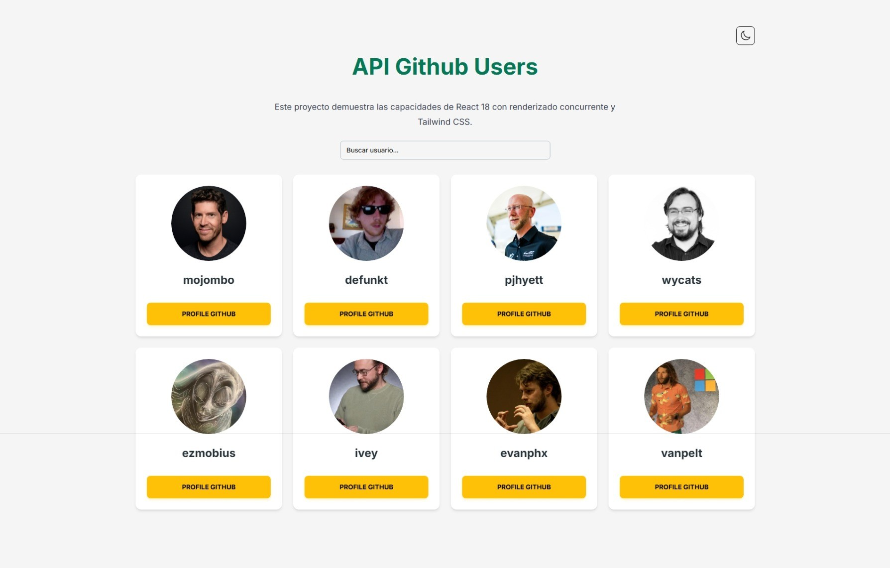

# Proyecto: Visor de Usuarios de GitHub con React

## 1. Demo en Vivo

Puedes ver la aplicación funcionando en el siguiente enlace:

[https://slinkter.github.io/myprojectapi01/](https://slinkter.github.io/myprojectapi01/)



---

## 2. Descripción General

Esta es una aplicación web de página única (SPA) desarrollada con React que consume la API pública de GitHub para obtener y mostrar una lista de usuarios. La aplicación permite filtrar los usuarios en tiempo real y presenta una interfaz de usuario moderna, reactiva y con un tema claro/oscuro.

El proyecto está diseñado siguiendo las mejores prácticas de la industria, con un enfoque en un código limpio, escalable y mantenible a través de una arquitectura robusta.

---

## 3. Características Principales

-   **Visualización de Usuarios:** Carga y muestra una lista de usuarios desde la API de GitHub.
-   **Búsqueda en Tiempo Real:** Filtra la lista de usuarios de forma instantánea a medida que el usuario escribe.
-   **Tema Claro/Oscuro:** Permite al usuario cambiar entre un tema claro y uno oscuro. La aplicación detecta la preferencia del sistema operativo en la primera visita y guarda la selección en `localStorage`.
-   **Carga Asíncrona Optimizada:** Muestra una animación de "esqueleto" (skeleton) mientras se cargan los datos.
-   **Animaciones Fluidas:** Utiliza animaciones sutiles para la aparición de elementos, como un efecto de cascada al mostrar la lista y efectos de entrada al hacer scroll.
-   **Manejo de Errores:** Presenta un mensaje de error claro y un botón para reintentar la carga en caso de fallo.
-   **Diseño Responsivo:** La interfaz se adapta correctamente a diferentes tamaños de pantalla.

---

## 4. Arquitectura y Estructura del Proyecto

La arquitectura de este proyecto es uno de sus puntos más fuertes y se basa en los siguientes patrones y principios:

### a. Arquitectura Basada en Componentes

Siguiendo la filosofía de React, la aplicación se construye como un árbol de componentes reutilizables y bien definidos, ubicados en `src/components`.

### b. Patrón Contenedor/Presentacional

Se ha separado la lógica del aspecto visual:

-   **Componente Contenedor (Inteligente):** `App.jsx` actúa como el orquestador principal. Se encarga de despachar acciones a Redux y seleccionar el estado global, pero delega el renderizado a otros componentes.
-   **Componentes Presentacionales (Visuales):** La mayoría de los componentes (dentro de `src/components/layout`, `UserCard.jsx`, etc.) son puramente visuales. Reciben datos a través de props y los muestran, sin contener lógica de negocio.

### c. Gestión de Estado Centralizada con Redux Toolkit

Se utiliza **Redux Toolkit** para un manejo de estado predecible y escalable:

-   **Store Único:** `src/app/store.js` configura un único "store" que sirve como la fuente de verdad para toda la aplicación.
-   **Slices:** El estado se divide en "slices" por funcionalidad en la carpeta `src/features`:
    -   `usersSlice.js`: Gestiona todo lo relacionado con la API (la lista de usuarios, el estado de carga y los errores). Utiliza `createAsyncThunk` para manejar la llamada asíncrona.
    -   `searchSlice.js`: Gestiona el estado de la UI, como el término de búsqueda del input.

### d. Hooks Personalizados

Se han creado hooks personalizados en `src/hooks` para encapsular y reutilizar lógica:

-   `useTheme.js`: Abstrae la lógica para el manejo del tema.
-   `useIntersectionObserver.js`: Permite aplicar animaciones cuando un elemento entra en el campo de visión.

---

## 5. Tecnologías Utilizadas

-   **React 18:** Para la construcción de la interfaz de usuario.
-   **Vite:** Como herramienta de empaquetado y servidor de desarrollo.
-   **Redux Toolkit:** Para la gestión del estado global de la aplicación.
-   **Tailwind CSS:** Para un desarrollo de estilos rápido y personalizable.
-   **Material Tailwind:** Como librería de componentes base para la UI.
-   **ESLint:** Para mantener un código limpio y consistente, incluyendo el plugin `jsx-a11y` para reforzar la accesibilidad.

---

## 6. Optimizaciones de Rendimiento y UX

1.  **Code Splitting con `React.lazy` y `Suspense`**: El código del componente `UserCard` no se incluye en el paquete inicial. Se descarga automáticamente solo cuando es necesario, reduciendo el tamaño del JavaScript inicial.
2.  **Memoización con `useMemo` y `React.memo`**:
    -   `useMemo` se usa para calcular `filteredUsers`, asegurando que el filtrado solo se re-ejecute si los datos relevantes cambian.
    -   `React.memo` en `UserCard` previene que las tarjetas se vuelvan a renderizar innecesariamente.
3.  **Observación de Intersección para Animaciones**: En lugar de usar eventos de scroll costosos, `IntersectionObserver` es una solución nativa y de alto rendimiento para activar animaciones.
4.  **Gestión de Estado Eficiente**: Redux Toolkit gestiona las actualizaciones de estado de forma optimizada, previniendo re-renderizados innecesarios en componentes no afectados.

---

## 7. Cómo Ejecutar el Proyecto Localmente

1.  Clona el repositorio:

    ```bash
    git clone https://github.com/Slinkter/myprojectapi01.git
    cd myprojectapi01
    ```

2.  Instala las dependencias (se recomienda `pnpm`):

    ```bash
    pnpm install
    ```

3.  Inicia el servidor de desarrollo:

    ```bash
    pnpm dev
    ```

4.  Abre http://localhost:5173 en tu navegador.

### Scripts Disponibles

-   `pnpm dev`: Inicia el servidor de desarrollo.
-   `pnpm build`: Compila la aplicación para producción.
-   `pnpm preview`: Previsualiza la build de producción.
-   `pnpm deploy`: Despliega la aplicación en GitHub Pages.