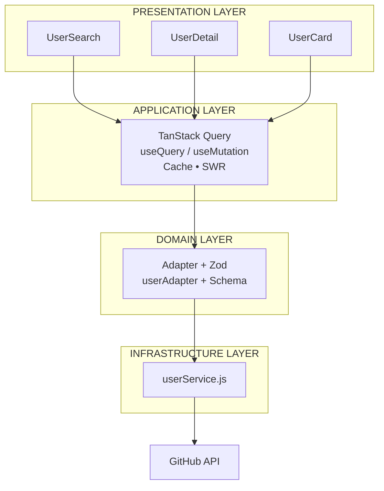
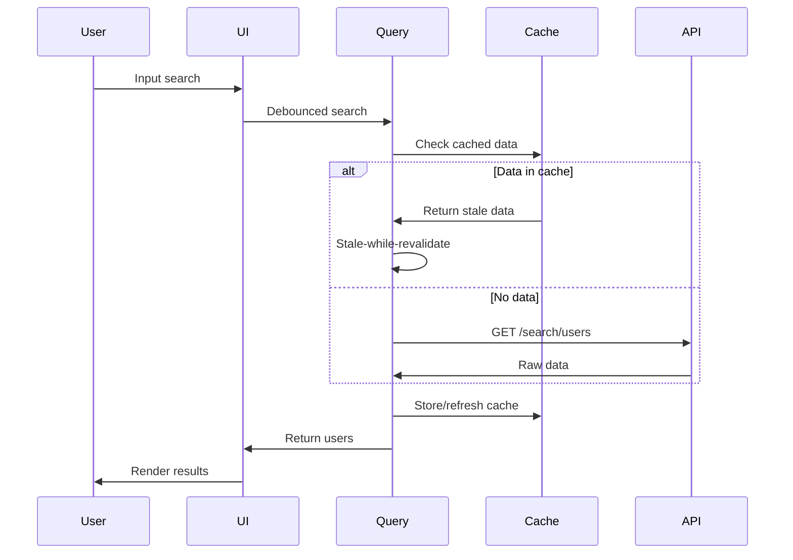
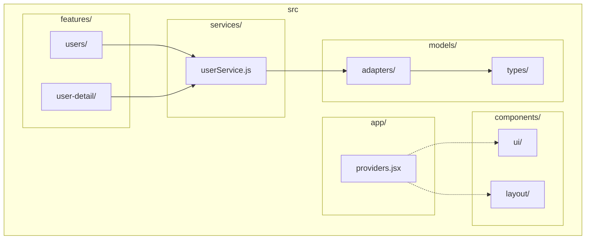

# 🚀 myprojectapi01 - GitHub User Explorer


> **React SPA de alto rendimiento para explorar perfiles de GitHub, construida con estándares modernos de arquitectura y diseño.**

---

## 🏗️ Arquitectura

Proyecto implementado con **Feature-Sliced Design (FSD)** y patrones de diseño:

1. **Adapter Pattern:** Normalización de datos de la API de GitHub al modelo interno de la app.
2. **Facade Pattern:** Encapsulación de TanStack Query en hooks semánticos (`useUserSearchFacade`).
3. **Validation Layer:** Esquemas Zod para integridad de datos en runtime.
4. **Offline-First Dev:** MSW para desarrollo sin dependencia de la API real.

---

## 🛠️ Stack Tecnológico

| Categoría | Tecnología |
|-----------|------------|
| **Core** | React 18.3, Vite 5.4 |
| **Estado** | TanStack Query v5 |
| **Estilos** | Tailwind CSS v4, clsx, tailwind-merge |
| **Iconos** | Lucide-React |
| **Toasts** | Sonner |
| **Animaciones** | Motion v12 |
| **Validación** | Zod |
| **Mocking** | MSW |
| **Routing** | React Router v7 |

---

## 🚀 Instalación y Comandos

```bash
# Instalar dependencias
pnpm install

# Desarrollo
pnpm dev          # http://localhost:5173
pnpm build        # Build producción
pnpm preview      # Preview build

# Linting
pnpm lint         # ESLint

# Despliegue
pnpm deploy       # GitHub Pages
pnpm py           # Servidor Python local (puerto 5000)
```

---

## 📁 Estructura del Proyecto

```
src/
├── app/              # Providers globales
├── components/       # Componentes reutilizables (ui, layout)
├── features/        # Módulos de negocio (FSD)
│   ├── users/       # Búsqueda de usuarios
│   └── user-detail/ # Detalle de perfil
├── hooks/           # Hooks globales
├── lib/             # Utilidades (cn, utils)
├── models/          # Adaptadores y esquemas Zod
├── services/        # Capa de API
└── docs/            # Documentación técnica
```

---

## 🏗️ Arquitectura - Diagrama de Capas


```mermaid
flowchart TB
    subgraph PRESENTATION["PRESENTATION LAYER"]
        A1[UserSearch]
        A2[UserDetail]
        A3[UserCard]
    end

    subgraph APPLICATION["APPLICATION LAYER"]
        B[TanStack Query<br/>useQuery / useMutation<br/>Cache • SWR]
    end

    subgraph DOMAIN["DOMAIN LAYER"]
        C[Adapter + Zod<br/>userAdapter + Schema]
    end

    subgraph INFRASTRUCTURE["INFRASTRUCTURE LAYER"]
        D[userService.js]
    end

    E[GitHub API]

    A1 --> B
    A2 --> B
    A3 --> B
    B --> C
    C --> D
    D --> E
```

---

## 🔄 Flujo de Datos


```mermaid
sequenceDiagram
    participant User
    participant UI
    participant Query
    participant Cache
    participant API
    
    User->>UI: Input search
    UI->>Query: Debounced search
    Query->>Cache: Check cached data
    
    alt Data in cache
        Cache->>Query: Return stale data
        Query->>Query: Stale-while-revalidate
    else No data
        Query->>API: GET /search/users
        API->>Query: Raw data
    end
    
    Query->>Cache: Store/refresh cache
    Query->>UI: Return users
    UI->>User: Render results
```

---

## 🗂️ Estructura FSD


```mermaid
flowchart TB
    subgraph src
        subgraph app["app/"]
            APP[providers.jsx]
        end
        
        subgraph components["components/"]
            C1[ui/]
            C2[layout/]
        end
        
        subgraph features["features/"]
            F1[users/]
            F2[user-detail/]
        end
        
        subgraph services["services/"]
            S[userService.js]
        end
        
        subgraph models["models/"]
            M1[adapters/]
            M2[types/]
        end
    end
    
    F1 --> S
    F2 --> S
    S --> M1
    M1 --> M2
    APP -.-> C1
    APP -.-> C2
```

---

## 📖 Documentación

Explora la documentación técnica en [`src/docs/`](./src/docs/):

### Fundamentos
| Documento | Descripción |
|-----------|-------------|
| [`00-diagnostico-tecnico.md`](./src/docs/00-diagnostico-tecnico.md) | Estado actual del proyecto |
| [`01-overview-del-sistema.md`](./src/docs/01-overview-del-sistema.md) | Filosofía y objetivos |
| [`02-arquitectura.md`](./src/docs/02-arquitectura.md) | Patrones técnicos (FSD, Adapter, Facade) |

### Desarrollo
| Documento | Descripción |
|-----------|-------------|
| [`03-casos-de-uso.md`](./src/docs/03-casos-de-uso.md) | Casos de uso |
| [`04-requerimientos.md`](./src/docs/04-requerimientos.md) | RF y RNF |
| [`05-flujo-de-datos.md`](./src/docs/05-flujo-de-datos.md) | Ciclo de datos |
| [`06-guia-para-desarrolladores.md`](./src/docs/06-guia-para-desarrolladores.md) | Setup, MSW, Zod, convenciones |

### Proyecto
| Documento | Descripción |
|-----------|-------------|
| [`07-calidad-y-riesgos.md`](./src/docs/07-calidad-y-riesgos.md) | Deuda técnica y riesgos |
| [`08-cierre-del-proyecto.md`](./src/docs/08-cierre-del-proyecto.md) | Hitos alcanzados |
| [`09-auditoria-diseño.md`](./src/docs/09-auditoria-diseño.md) | Sistema de diseño Minimalist v3 |

### Aprendizaje
| Documento | Descripción |
|-----------|-------------|
| [`GUIA_ESTUDIO.md`](./src/docs/GUIA_ESTUDIO.md) | 📚 Guía de estudio completa (Libro + Cornell) |
| [`PRUEBA_TECNICA.md`](./src/docs/PRUEBA_TECNICA.md) | 📝 Simulación de entrevista técnica React |
| [`prompt-docs.md`](./src/docs/prompt-docs.md) | 🤖 Prompt para generar guías similares |

---

## 🔌 MSW: Desarrollo Offline

El proyecto usa **Mock Service Worker** para interceptar peticiones HTTP en el navegador.

- Se activa automáticamente en modo desarrollo (`import.meta.env.MODE === 'development'`)
- Handlers en `src/mocks/handlers.js`
- Permite desarrollar sin conexión a la API de GitHub

---

## 📝 Licencia

MIT © 2026 LJCR Engineering
