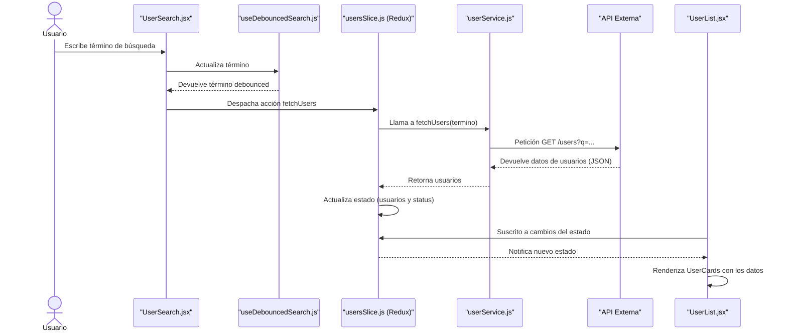

```mermaid
sequenceDiagram
    actor Usuario
    participant UserSearch as "UserSearch.jsx"
    participant useDebouncedSearch as "useDebouncedSearch.js"
    participant usersSlice as "usersSlice.js (Redux)"
    participant userService as "userService.js"
    participant APIExterna as "API Externa"
    participant UserList as "UserList.jsx"

    Usuario->>UserSearch: Escribe término de búsqueda
    UserSearch->>useDebouncedSearch: Actualiza término
    useDebouncedSearch-->>UserSearch: Devuelve término debounced
    UserSearch->>usersSlice: Despacha acción fetchUsers
    usersSlice->>userService: Llama a fetchUsers(termino)
    userService->>APIExterna: Petición GET /users?q=...
    APIExterna-->>userService: Devuelve datos de usuarios (JSON)
    userService-->>usersSlice: Retorna usuarios
    usersSlice->>usersSlice: Actualiza estado (usuarios y status)
    UserList->>usersSlice: Suscrito a cambios del estado
    usersSlice-->>UserList: Notifica nuevo estado
    UserList->>UserList: Renderiza UserCards con los datos
```
