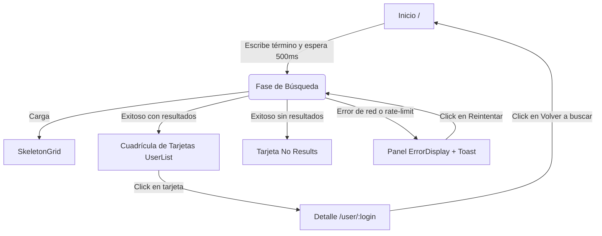
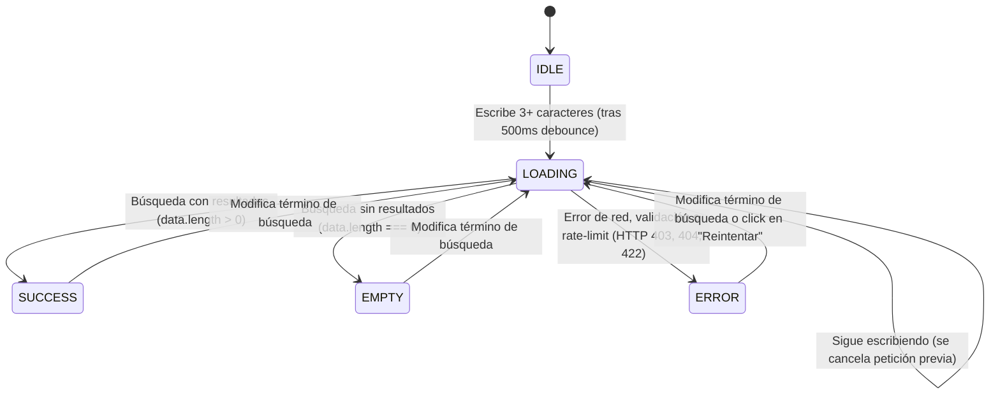

# 4. App Flow and State Transitions — GitExplorer

Este documento detalla los flujos de navegación, el ciclo de vida de la interfaz y la especificación de casos de uso interactivos de **GitExplorer**.

---

## 1. Mapa de Flujo de Navegación (App Navigation Map)

El flujo de navegación del usuario es simple e inmersivo, optimizado para no requerir menús pesados:

---

## 2. Ciclo de Vida de los Estados de Búsqueda

El estado del buscador en la pantalla principal transiciona de manera estricta entre 5 estados manejados por la Facade:

| Estado | Descripción Visual y Comportamiento | Componente Renderizado |
| :--- | :--- | :--- |
| **IDLE** | Estado inicial limpio. El input de búsqueda está vacío. | Hero principal con campo de búsqueda. |
| **LOADING** | Fetch de datos en curso. Las llamadas previas no completadas se abortan automáticamente. | [SkeletonGrid](./src/widgets/search-results/SkeletonGrid.jsx) (tarjetas grises pulsantes). |
| **SUCCESS** | Datos de usuarios validados por Zod y listos en pantalla. | [UserList](./src/widgets/search-results/UserList.jsx) con cuadrícula de tarjetas. |
| **EMPTY** | Respuesta de red exitosa pero con 0 resultados en la colección. | [NoResults](./src/widgets/search-results/ui/NoResults.jsx) ("Sin resultados"). |
| **ERROR** | Fallo en la API (pérdida de internet, rate-limit de IP o error 422). | [ErrorDisplay](./src/shared/ui/ErrorDisplay/ErrorDisplay.jsx) con botón de reintento. |

---

## 3. Especificación de Casos de Uso Críticos (ECUS)

### ECUS-01: Buscar usuarios de GitHub
* **Actor:** Visitante de la aplicación (usuario no autenticado).
* **Flujo Principal:**
  1. El usuario accede a la URL raíz `/` y visualiza la barra de búsqueda en el centro.
  2. El usuario introduce un término de búsqueda (ej: `"wycats"`).
  3. El sistema activa un temporizador de debounce de 500ms. Si el usuario escribe otro caracter antes, el temporizador anterior se cancela (`clearTimeout`).
  4. Transcurridos los 500ms sin actividad de escritura, el término debounced cambia.
  5. TanStack Query evalúa la clave de caché `["users", debouncedSearchTerm]`:
     - *Si existe caché fresca (menor a 5 minutos):* Devuelve los datos de forma instantánea sin peticiones de red.
     - *Si no existe caché:* Inicia una petición HTTP GET con `AbortSignal` al endpoint de búsqueda de GitHub.
  6. El sistema muestra la cuadrícula de tarjetas de usuario procesadas y normalizadas.
* **Excepciones:**
  * **HTTP 403 (Límite excedido):** Muestra el panel RateLimitPane informando al usuario que ha excedido el límite de 60 peticiones/hora y dispara una alerta toast (Sonner) de advertencia.
  * **Error de conexión (Offline):** Muestra el panel con mensaje "Error de conexión" y habilita un botón de reintento que fuerza el refresco (`refetch`) de la consulta.

### ECUS-02: Ver detalle en Bento Grid
* **Actor:** Usuario no autenticado.
* **Flujo Principal:**
  1. El usuario hace click en la tarjeta de un desarrollador (ej: `"octocat"`).
  2. El sistema cambia la ruta del navegador a `/user/octocat`.
  3. El componente `UserDetail` monta y dispara la query `["user-detail", "octocat"]`.
  4. Mientras carga, muestra un esqueleto bento estructurado (`UserDetailSkeleton`).
  5. Los datos detallados del perfil se descargan, se validan con Zod y se mapean en el Bento Grid asimétrico.
  6. Al cargar, las estadísticas de repositorios, seguidores y seguidos se animan mediante un contador elástico que incrementa desde cero hasta el valor real.
* **Flujo de Retorno:**
  * Al hacer click en "Volver a buscar", el sistema cambia la ruta a `/` y la fachada del buscador carga los resultados del último término ingresado previamente de la caché de TanStack Query sin recargar la red.
