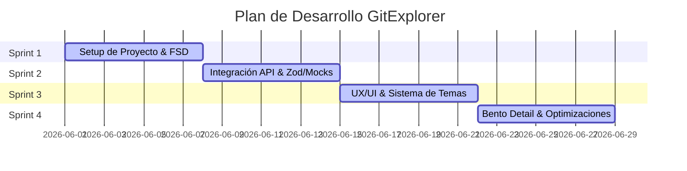

# 6. Plan de Implementación y Roadmap — GitExplorer

Este documento define la planificación del proyecto, historial de sprints simulados, comandos de desarrollo y la hoja de ruta para futuras expansiones de **GitExplorer**.

---

## 1. Planificación de Sprints de Desarrollo

El desarrollo del proyecto se ejecutó en 4 Sprints iterativos con entregables claros en cada etapa:

### Detalle de Sprints
* **Sprint 1: Cimientos de Ingeniería (Setup y FSD):**
  * Estructuración inicial de carpetas siguiendo el estándar de Feature-Sliced Design.
  * Configuración del enrutamiento dinámico React Router v7 con lazy loading.
* **Sprint 2: Infraestructura y Modelos de Datos:**
  * Implementación de esquemas Zod de validación y adaptador de perfiles.
  * Configuración de TanStack Query para el manejo de caché y reintentos.
  * Setup de Mock Service Worker (MSW) para el entorno offline.
* **Sprint 3: Branding y Experiencia de Usuario:**
  * Maquetación del Héroe y del sistema de estilos centralizado de Tailwind CSS v4.
  * Creación del interruptor de tema con guardado automático en `localStorage`.
* **Sprint 4: Detalle Bento y Puesta a Punto:**
  * Creación del Dashboard del Perfil detallado utilizando la distribución asimétrica Bento.
  * Optimización de accesibilidad WCAG y limpieza final de código muerto.
  * Pruebas de integración, testing unitario en adapter y despliegue a producción.

---

## 2. Comandos de Consola de Desarrollo (CLI Reference)

Para interactuar con el repositorio local y ejecutar validaciones de calidad:

| Acción | Comando | Propósito / Resultado |
| :--- | :--- | :--- |
| **Instalación** | `pnpm install` | Descarga de forma optimizada todas las dependencias del proyecto. |
| **Iniciar Dev** | `pnpm dev` | Inicia el servidor de desarrollo local en `http://localhost:5173`. MSW se activa de forma automática. |
| **Linter** | `pnpm lint` | Valida sintaxis, guías de estilo de código y estándares de accesibilidad JSX. |
| **Pruebas** | `pnpm test:run` | Ejecuta las suites de pruebas unitarias sobre adaptadores de datos mediante Vitest. |
| **Build** | `pnpm build` | Compila y empaqueta la aplicación de forma optimizada en la carpeta `/dist/` con hash único de caché. |
| **Despliegue** | `pnpm deploy` | Empuja los archivos estáticos de la carpeta `/dist/` a la rama `gh-pages` para su publicación. |

---

## 3. Roadmap y Futuras Mejoras (Próximos Sprints)

### Sprint 5: Expansión de Perfil (Repositorios y Contribuciones)
* **Visualización de Repositorios:** Agregar una subsección dentro del Bento Grid para listar los 5 repositorios públicos más populares del usuario ordenados por estrellas.
* **Mapeo de Lenguajes:** Mostrar un gráfico circular simple detallando los lenguajes de programación más utilizados por el desarrollador en base a sus repositorios.

### Sprint 6: Productivización y Robustez
* **Integración CI/CD:** Configurar GitHub Actions para que compile la aplicación, valide el linter (`pnpm lint`), corra los tests unitarios (`pnpm test:run`) de forma automática en cada Pull Request a la rama `main`.
* **Caché Persistente en IndexedDB:** Habilitar sincronización offline avanzada para persistir los perfiles cacheados de TanStack Query a nivel de disco local del usuario, de modo que persistan incluso tras cerrar la pestaña del navegador.
