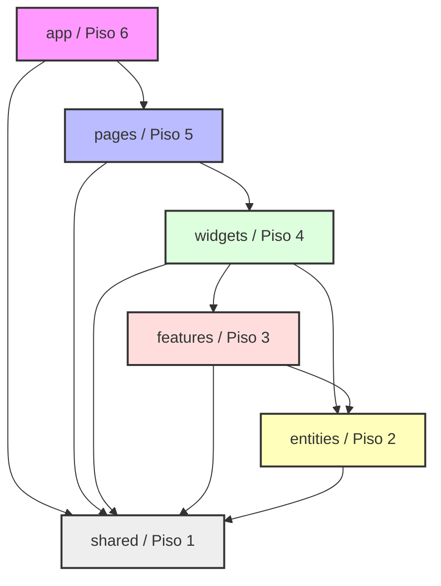
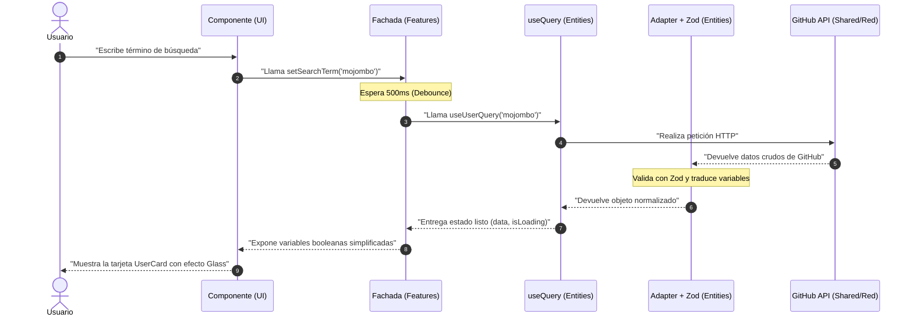

# 🐣 Guía FSD: ¡Arquitectura Explicada Nivel Pollito! 🐥

¡Bienvenido! Si estás dando tus primeros pasos en la programación o en la arquitectura de software, no te asustes por los nombres raros. Esta guía fue hecha para que entiendas **Feature-Sliced Design (FSD)** de manera visual, simple y con manzanas.

---

## 🎂 1. La Analogía del Pastel de Bodas

FSD organiza tu código en **6 pisos (capas)**. La regla más importante de este pastel es la **Gravedad**:
* Puedes bajar a buscar cosas a los pisos inferiores.
* **NUNCA** puedes subir a buscar cosas a los pisos superiores.

```text
       ┌───────────────┐
       │      app      │  🚀 Piso 6: El pegamento (Rutas, Providers)
       └───────┬───────┘
               ▼
       ┌───────────────┐
       │     pages     │  📄 Piso 5: Las pantallas completas
       └───────┬───────┘
               ▼
       ┌───────────────┐
       │    widgets    │  🧱 Piso 4: Orquestadores grandes autónomos
       └───────┬───────┘
               ▼
       ┌───────────────┐
       │   features    │  ⚙️ Piso 3: Acciones e interacciones del usuario
       └───────┬───────┘
               ▼
       ┌───────────────┐
       │   entities    │  🛡️ Piso 2: Conceptos de negocio (Usuario, Card)
       └───────┬───────┘
               ▼
       ┌───────────────┐
       │    shared     │  🔌 Piso 1: Herramientas genéricas (Cliente HTTP)
       └───────────────┘
```

---

## 🗺️ 2. Mapa del Flujo de Importaciones (Mermaid)

Este diagrama muestra cómo se permite importar código entre las diferentes capas. Nota cómo las flechas van exclusivamente hacia abajo:



---

## 🌊 3. El Camino que recorren los Datos (Pipeline)

Cuando buscas un usuario en la UI, los datos viajan a través de las capas de la siguiente manera:



---

## 🏠 4. Vista Isometrica del Proyecto (ASCII Art)

Imagínalo como carpetas físicas organizadas en estantes tridimensionales:

```text
                      
                      ┌───────────────────────────────┐
                     /              app              /  Piso 6 (Rutas y App.jsx)
                    /───────────────────────────────/ │
                   ┌───────────────────────────────┐  │
                  /             pages             / ──┼  Piso 5 (SearchPage.jsx)
                 /───────────────────────────────/ │  │
                ┌───────────────────────────────┐  │  │
               /            widgets            / ──┼──┼  Piso 4 (SearchResults.jsx)
              /───────────────────────────────/ │  │  │
             ┌───────────────────────────────┐  │  │  │
            /           features            / ──┼──┼──┼  Piso 3 (useUserSearchFacade.js)
           /───────────────────────────────/ │  │  │  │
          ┌───────────────────────────────┐  │  │  │  │
         /           entities            / ──┼──┼──┼──┼  Piso 2 (userAdapter.js, UserCard.jsx)
        /───────────────────────────────/ │  │  │  │  │
       ┌───────────────────────────────┐  │  │  │  │  │
      /            shared             / ──┴──┴──┴──┴──┘  Piso 1 (httpClient.js, useTheme.js)
     /───────────────────────────────/
     
```

---

## 💡 5. Las 3 Reglas de Oro del Buen Programador FSD

1. **La regla de la frontera:** Nunca importes un archivo interno directamente (ej: `import X from '@/entities/user/ui/UserCard'`). Siempre importa desde el index principal del slice (ej: `import { UserCard } from '@/entities/user'`).
2. **La regla de la flecha única:** Si estás escribiendo código en `entities`, no puedes importar nada que esté en `features`, `widgets`, `pages` ni `app`.
3. **No repitas lógica (DRY):** Las herramientas que uses en más de dos lugares del pastel de bodas van en la base: la capa `shared`.

---

## 📡 6. El Detective de Código: ¡El Logger de 9 Pasos! 🔍

Para saber qué está pasando en cada piso de nuestro pastel, hemos contratado a un "detective" (el **logger**). Si abres la consola de tu navegador (F12), verás cómo el detective te cuenta el viaje de los datos paso a paso:

1. **Paso 1:** ¡Poniendo los cimientos! (Mounting)
2. **Paso 2:** Armando el armazón de la casa. (Shell)
3. **Paso 3:** Entrando a una habitación. (Pages)
4. **Paso 4:** Encendiendo la televisión. (Widgets)
5. **Paso 5:** Eligiendo qué película ver. (Factory)
6. **Paso 6:** El control remoto inteligente. (Facade)
7. **Paso 7:** Buscando la señal de cable. (Query Hook)
8. **Paso 8:** La antena recibiendo la señal. (Service)
9. **Paso 9:** Decodificando la imagen para que se vea bien. (Adapter)

¡Si sigues estos números en la consola, nunca te perderás en el código! 🚀
