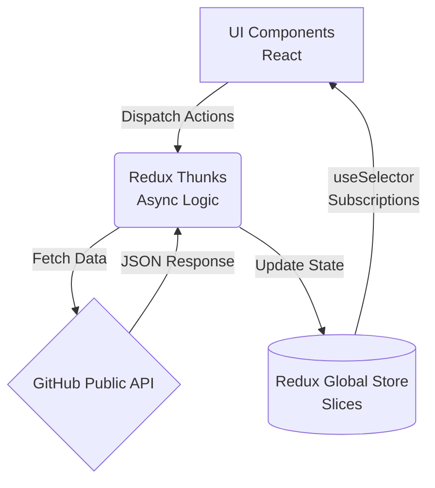

# 00 - Diagnóstico Técnico y Plan de Refactorización (Fase Forense)

## 📋 Resumen Ejecutivo

Este documento representa la Fase 1 (Code Mining) del proceso de auditoría forense y estructuración a **Nivel Empresarial** del proyecto `myprojectapi01`. Actualmente, se trata de una SPA en React 18 / Vite con Redux. Sin embargo, su capa de presentación acusa deuda técnica debido a la dependencia de librerías UI externas (`@material-tailwind/react`) que restan flexibilidad y complican la escalabilidad hacia una arquitectura puramente "Utility-First" con Tailwind CSS v4.

Nuestro objetivo es convertirlo en una **arquitectura Cliente Puro Frontend** altamente desacoplada y libre de dependencias esclavas en la presentación.

## 🛠️ Inventario del Stack Tecnológico Actual

| Capa                 | Tecnología Actual                        | Estado y Decisión Arquitectónica                                                                       |
| :------------------- | :--------------------------------------- | :----------------------------------------------------------------------------------------------------- |
| **Core Framework**   | React 18.3 & Vite 5.x                    | **Aprobado**. Óptimo para FSD.                                                                         |
| **State Management** | Redux Toolkit                            | **Aprobado**. Ideal para arquitecturas complejas.                                                      |
| **UI Framework**     | Tailwind CSS v3.4 + `@material-tailwind` | ❌ **CRÍTICO**. Se removerá `@material-tailwind` y se forzará la migración a **Tailwind CSS v4 puro**. |
| **Animaciones**      | Framer Motion (v12)                      | **Aprobado**. Excelente para el diseño premium.                                                        |
| **Data Fetching**    | Fetch API Nativo / Thunks                | **Aprobado**. Al no haber serveless (Firebase), el cliente es el rey.                                  |

## 💀 Targets de Purga (Plan de Limpieza)

Para garantizar el principio "KISS" y evitar superposiciones de estilos, las siguientes dependencias serán **depuradas y desinstaladas**:

1. `@material-tailwind/react`
2. El wrap `withMT()` en la configuración de Tailwind.

## 🏛️ Topología del Estado (Arquitectura Cliente Puro)

Al no existir Backend-as-a-Service integrado (Serverless), toda la responsabilidad recae en la hidratación de datos del cliente.

**Diagrama de Arquitectura de Estado Actual (Mermaid):**



## 🔍 Problemas Críticos Identificados (Deuda Técnica)

1. **Acoplamiento de UI**: Componentes (como `UserCard`, `PageHeader`, `ErrorDisplay`, `ThemeToggle`) dependen fuertemente de envolturas generadas por Material Tailwind.
2. **Uso Antiguo de Tailwind Config**: Uso de `.cjs` y configuraciones que no son nativas de la filosofía de Tailwind CSS v4, que propone un motor CSS-only (`@theme`).
3. **Violación "DRY" en Clases Dinámicas**: Muchas clases son concatenadas con templates strings anticuados en vez de usar utilitarios robustos como `cn()` (Tailwind Merge).

## 🌳 Grafo ASCII de Dependencias Esperadas (Post-Refactor)

A continuación, esquematizamos visualmente en ASCII cómo debe quedar la invocación de estilos sin `@material-tailwind`:

```text
[ Feature Component ] (Ej: UserProfile.jsx)
        │
        ├─▶ [ UI Primitives ] (Ej: Button.jsx)
        │         └─▶ <button className={cn("bg-accent-500", customStyles)}>
        │
        └─▶ [ Store Selector ]
                  └─▶ Redux state.user.data
```

## 📜 Recomendación de Siguiente Fase (Fase 2 y 3)

El **Tech Lead Frontend** autoriza proceder con la **Fase 2 y Fase 3**:

- Rediseño arquitectónico aislando en `src/features/`.
- Eliminación en comando de `@material-tailwind/react`.
- Refactor puro a "Tailwind Utility-first" nativo en los componentes.
