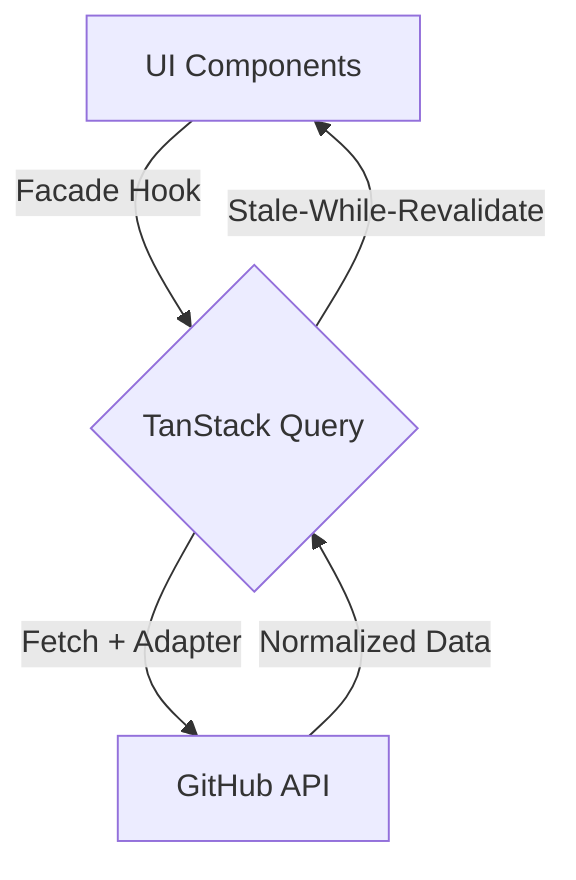

# 00 - Diagnóstico Técnico y Plan de Refactorización (EJECUTADO)

## 📋 Resumen Ejecutivo (Post-Auditoría)

Este documento, originalmente creado para la fase forense, ha sido **completado con éxito**. El proyecto `myprojectapi01` ha sido transformado de una SPA con deuda técnica de UI (`@material-tailwind`) a una arquitectura de **Clase Mundial** fundamentada en el **Esencialismo Técnico** y **TanStack Query**.

## 🛠️ Inventario del Stack Tecnológico Final (v3)

| Capa               | Tecnología Implementada              | Estatus                                                                           |
| :----------------- | :----------------------------------- | :-------------------------------------------------------------------------------- |
| **Core Framework** | React 18.3 & Vite 5.x                | **Mantenido**. Base sólida para concurrencia.                                     |
| **Server State**   | TanStack Query (React Query)         | **Novedad v3**. Reemplaza Thunks para una gestión de caché premium.               |
| **UI Engine**      | Tailwind CSS v4 Puro / Minimalist v3 | **Migrado**. Eliminado Vendor Lock-in. Diseño basado en variables CSS semánticas. |
| **Animaciones**    | Motion (v12)                         | **Optimizado**. Micro-interacciones sutiles aceleradas por hardware.              |
| **Arquitectura**   | Feature-Sliced Design (FSD)          | **Implementado**. Modularidad total en `src/features/`.                           |

## 💀 Targets de Purga (Completados)

Se han eliminado satisfactoriamente:

1. `@material-tailwind/react` (Eliminación completa de la dependencia).
2. Lógicas de Thunks redundantes para búsqueda.
3. Funciones, variables e iconos huerfanos detectados por `pnpm lint`.

## 🏛️ Topología del Estado Final (React Query + Facade)

## 📜 Conclusión de Fase

El **Plan de Refactorización** ha sido cerrado. Todas las debilidades identificadas (acoplamiento de UI, configuraciones antiguas de Tailwind, violación de DRY) han sido resueltas bajo el estándar de **Maestría en Software**.
