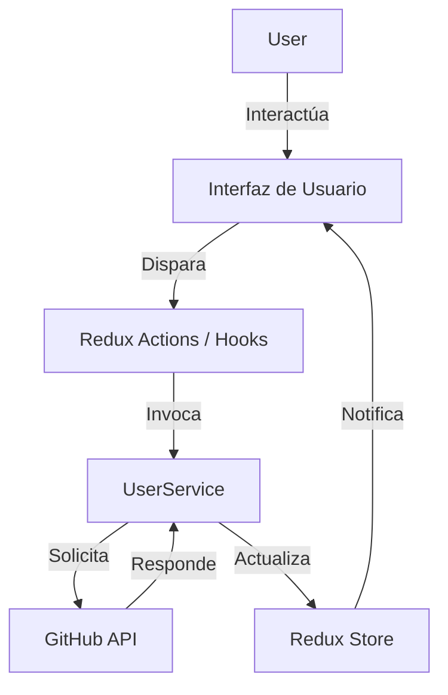

# Overview del Sistema

## 1. Propósito del Proyecto
La aplicación **"API - GitHub Users"** tiene como objetivo proporcionar una interfaz moderna, eficiente y visualmente atractiva para buscar y explorar perfiles de usuarios de GitHub. Su propósito técnico es demostrar la implementación de una **Single Page Application (SPA)** robusta utilizando React, Redux Toolkit y estrategias de optimización de rendimiento en un entorno de **Arquitectura Cliente Pura**.

## 2. Alcance Funcional
El sistema permite a los usuarios:
- Buscar usuarios de GitHub en tiempo real (con optimización *debounce*).
- Visualizar resultados en tarjetas interactivas con carga perezosa (*lazy loading*).
- Gestionar estados de carga, error y "no encontrado" de manera fluida.
- Alternar entre modos Claro y Oscuro para mejorar la experiencia de usuario.

## 3. Tecnologías Utilizadas
### Core
- **React 18**: Librería principal de UI.
- **Vite**: Herramienta de build y servidor de desarrollo rápido.

### UI & Estilos
- **Tailwind CSS**: Framework de utilidades para estilos.
- **Material Tailwind**: Componentes pre-diseñados (Cards, Buttons).
- **React Icons**: Iconografía vectorizada.

### Estado & Lógica
- **Redux Toolkit**: Gestión de estado global (usuarios, status, errores).
- **React Hooks**: Implementación de lógica encapsulada (`useTheme`, `useDebouncedSearch`, `useIntersectionObserver`).

### Integraciones
- **GitHub API**: Fuente de datos externa (REST).

## 4. Arquitectura General
El proyecto sigue una arquitectura **Client-Side Rendering (CSR)** desacoplada, donde la UI reacciona a los cambios en el estado global gestionado por Redux. La lógica de negocio (búsqueda, integraciones) está separada de los componentes visuales mediante *Custom Hooks* y *Services*.

## 5. Flujo Principal
1. **Inicio:** Carga inicial de usuarios por defecto.
2. **Búsqueda:** El usuario escribe -> *Debounce* -> Petición API.
3. **Renderizado:** Los datos fluyen del Store a la lista de usuarios.
4. **Optimización:** Las imágenes y tarjetas se cargan solo cuando son visibles (*Intersection Observer*).
