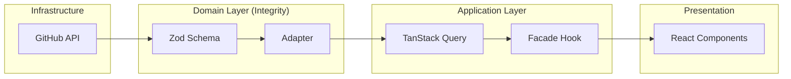

# 01 - System Overview: The Senior React Artifact

## 🏛️ Core Philosophy

`myprojectapi01` is not just a search tool; it is a **Senior React Artifact** designed to showcase high-level architectural patterns in a modern SPA environment. It prioritizes **Structural Integrity**, **Predictable State**, and **Domain Decoupling** over simple feature implementation.

## 🎯 Engineering Objectives

- **Zero-Trust Data Layer**: Runtime validation via Zod ensures the application never processes malformed external data.
- **Strict Decoupling (FSD-lite)**: Clear separation between infrastructure (Services), domain (Adapters/Models), and presentation (Features).
- **High-Fidelity Observability**: Integrated logging system for tracking data transformations and lifecycle events.
- **Resilient UX**: "Essentialism" design philosophy focused on performance, accessibility, and high-quality feedback loops.

## 🛠️ Tech Stack (The Senior Selection)

| Tier            | Technology             | Rationale                                                                 |
| --------------- | ---------------------- | ------------------------------------------------------------------------- |
| **Runtime**     | React 18 + Vite        | Concurrent rendering and optimized build pipeline.                         |
| **Validation**  | Zod                    | Schema-first integrity layer for external API contracts.                  |
| **Data Flow**   | TanStack Query v5      | Declarative server-state management with robust caching and invalidation. |
| **Architecture**| Facade + Adapter       | Encapsulation of complexity and protection of the internal domain.        |
| **Styling**     | Tailwind CSS v4        | Zero-runtime CSS-in-JS alternative with native performance.               |

## 🗺️ High-Level Topology

## 🚀 Execution Standards

1.  **Validated Fetching**: No data enters the system without passing through the Zod integrity gate.
2.  **Facade Communication**: UI components only talk to Facades, never directly to services or raw query hooks.
3.  **Normalized State**: The UI consumes a clean, internal domain model, making it agnostic to API changes.
