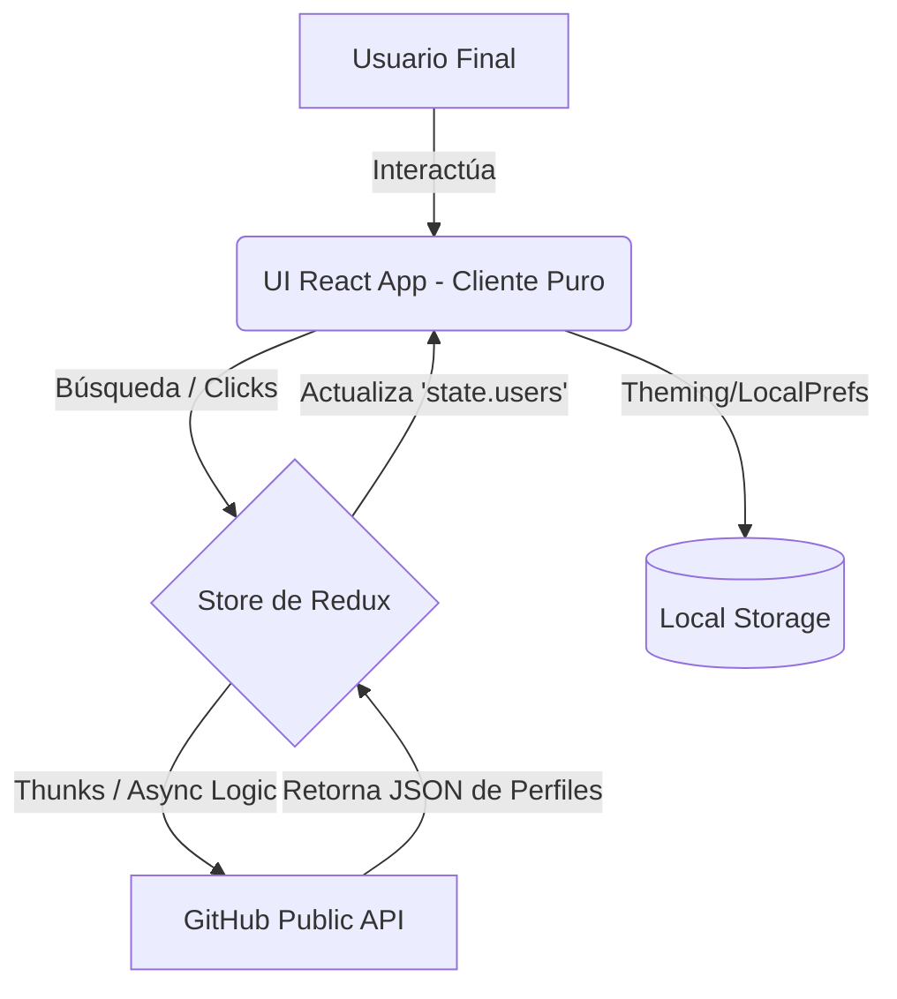

# 01 - Overview del Sistema

## 📖 Propósito del Proyecto

El proyecto `myprojectapi01` es una **Single Page Application (SPA) - Cliente Puro**, diseñada como un buscador y visor de perfiles técnicos expuestos por la API pública de GitHub. Su intención central es demostrar el dominio avanzado sobre arquitecturas modernas de Frontend (React 18), la gestión robusta del estado y transiciones fluidas de interfaz.

Tras la Auditoría y Refactorización, este proyecto persigue el estándar **Clean Code** y **Feature-Sliced Design (FSD)** apoyado puramente por **Tailwind CSS v4 (Utility-first nativo)** sin dependencias de UI anticuadas.

## 🚀 Alcance Funcional

- **Búsqueda en Tiempo Real**: Debounce sobre el input de búsqueda.
- **Renderizado Dinámico**: Visualización de cards por usuario y perfiles de detalle profundos (bio, repos, seguidores, etc).
- **Manejo de Estados de Red**: Skeletons adaptativos en tiempos de carga y manejo de NotFound/Errors amigable.
- **Theming**: Toggle funcional entre Light Mode y minimalista Dark Mode.

## 🛠️ Tecnologías Principales (Refactorizado)

| Capa           | Herramienta          | Razón de Elección (Senior Level)                                   |
| -------------- | -------------------- | ------------------------------------------------------------------ |
| **Core**       | React 18, Vite       | HMR instantáneo y hooks concurrente.                               |
| **State**      | RTK (Redux Toolkit)  | Centralización para thunks y el fetching state.                    |
| **Styling**    | Tailwind CSS v4 Puro | Sin `@material-tailwind`. Diseño cohesivo, Cero UI Vendor Lock-in. |
| **Animations** | Framer Motion 12     | Flujo interactivo complejo (layout shifts, hover bounds).          |

## 📐 Diagrama de Arquitectura de Alto Nivel (Mermaid)

## 🌊 Flujo Principal de la Aplicación

1. **Punto de Entrada (`/`)**: Renderiza el Layout y el Input de Búsqueda de `features/users`.
2. **Obtención de datos (`fetching`)**: Al tipear, se abortan llamadas redundantes y Redux asume el status de carga.
3. **Pintado de Pantalla (`rendering`)**: Tailwind re-calcula las proporciones CSS-Grid nativamente y dibuja los `UserCard`.
4. **Navegación Profunda (`/user/:login`)**: `react-router-dom` intercepta el mount y gatilla el useEffect para detalles atómicos del perfil.
