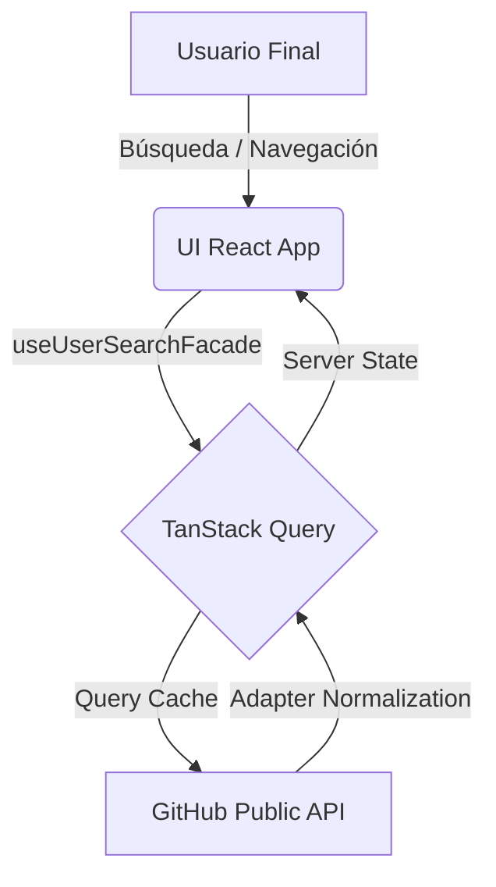

# 01 - Overview del Sistema

## 📖 Propósito del Proyecto

El proyecto `myprojectapi01` es una **Single Page Application (SPA) - Cliente Puro**, diseñada para la exploración de perfiles técnicos a través de la API de GitHub. El objetivo es demostrar un dominio de nivel Senior en el ecosistema React moderno, priorizando la **Simplicidad Arquitectónica**, la **Performance de Carga** y una **UX Minimalista de Alta Gama**.

## 🚀 Alcance Funcional

- **Búsqueda con Caché Inteligente**: Implementación de TanStack Query para evitar re-peticiones de red innecesarias.
- **UX Minimalista v3**: Interfaz limpia (Essentialism) con enfoque en la legibilidad y el rendimiento percibido.
- **Normalización de Datos**: Aplicación estricta del Patrón Adapter para desacoplar la API de la UI.
- **Theming OLED**: Modo oscuro optimizado para pantallas de alta fidelidad y modo claro estilo Apple.

## 🛠️ Tecnologías Principales (Refactor v3)

| Capa            | Herramienta            | Razón de Elección (Senior Level)                                    |
| --------------- | ---------------------- | ------------------------------------------------------------------- |
| **Core**        | React 18, Vite         | Estándar de la industria por velocidad y concurrencia.              |
| **Data/Server** | TanStack (React Query) | El mejor motor de sincronización y caché para estados de servidor.  |
| **State (UI)**  | RTK / Custom Hooks     | Manejo ligero de preferencias locales y estados de UI persistentes. |
| **Styling**     | Tailwind CSS v4 (Min)  | CSS Utility-first sin configuraciones pesadas de JS.                |
| **Animations**  | Motion v12             | Micro-interacción fluida sin penalización de performance.           |

## 📐 Diagrama de Arquitectura (Mermaid)

## 🌊 Flujo Principal (Minimalist v3)

1. **Input Dinámico**: El usuario escribe; el sistema espera 500ms (debounce) para estabilizar la intención.
2. **Hit de Caché**: Si el término ya fue buscado en los últimos 5 minutos, los resultados aparecen de inmediato.
3. **Pintado Geométrico**: Se utiliza un Grid System sincronizado entre Skeletons y Cards para evitar Layout Shifts.
4. **Navegación Atómica**: El detalle del usuario se carga bajo demanda, manteniendo la fluidez mediante transiciones de opacidad.
