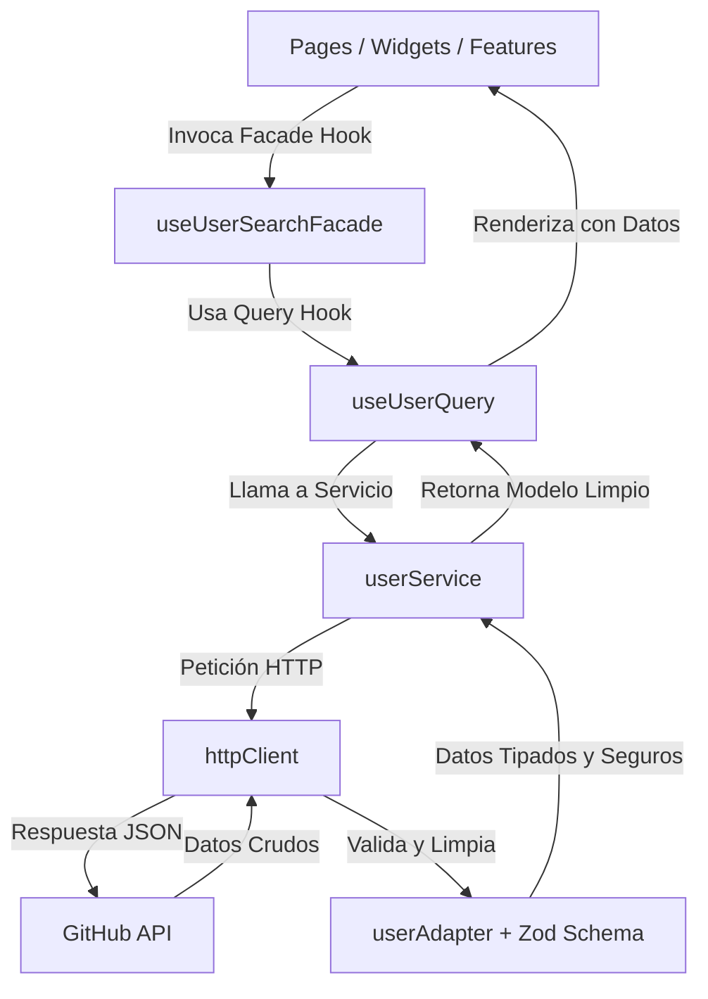

# 02 - Arquitectura FSD (Feature-Sliced Design) y Patrones Explicados

Este proyecto utiliza **Feature-Sliced Design (FSD)** como su única y estricta arquitectura. FSD organiza el código en capas (Layers), rebanadas (Slices) y segmentos (Segments) para maximizar la mantenibilidad, escalabilidad y legibilidad de la aplicación.

---

## 🏗️ Capas de la Arquitectura FSD (Layers)

La aplicación se estructura en 6 capas verticales respetando la regla inquebrantable de dependencias: **Un elemento de una capa superior puede importar elementos de cualquier capa inferior, pero un elemento de una capa inferior jamás puede importar de una capa superior.**

```
 ┌────────────────────────────────────────────────────────┐
 │ 1. app (Configuración global, Ruteo, Proveedores)       │
 └───────────┬────────────────────────────────────────────┘
             ▼
 ┌────────────────────────────────────────────────────────┐
 │ 2. pages (Composiciones completas de páginas)          │
 └───────────┬────────────────────────────────────────────┘
             ▼
 ┌────────────────────────────────────────────────────────┐
 │ 3. widgets (Bloques autónomos y auto-contenidos de UI) │
 └───────────┬────────────────────────────────────────────┘
             ▼
 ┌────────────────────────────────────────────────────────┐
 │ 4. features (Interacciones con valor de negocio)       │
 └───────────┬────────────────────────────────────────────┘
             ▼
 ┌────────────────────────────────────────────────────────┐
 │ 5. entities (Modelos de dominio, lógica y UI básica)   │
 └───────────┬────────────────────────────────────────────┘
             ▼
 ┌────────────────────────────────────────────────────────┐
 │ 6. shared (Código técnico común y reutilizable)        │
 └────────────────────────────────────────────────────────┘
```

---

## 📂 Estructura Detallada del Proyecto por Capas

### 1. `app/`
El punto de entrada del sistema. Inicializa el enrutador y los estilos globales.
*   `App.jsx`: Componente raíz y definición de rutas.
*   `main.jsx`: Punto de entrada de React 18 que inicializa MSW y monta la app.

### 2. `pages/`
Composiciones de nivel de página que cargan widgets o features.
*   `search-page/`: Página principal de búsqueda de usuarios.
*   `detail-page/`: Página de visualización del perfil en formato Bento Grid.
*   `not-found/`: Página de error 404 amigable.

### 3. `widgets/`
Organiza features y entities en componentes complejos y auto-contenidos de UI.
*   `search-results/`: Gestiona la visualización condicional de los resultados (cargando, error, lista, no encontrado).
*   `user-profile-bento/`: Dashboard Bento ultra-premium para detalles del usuario.

### 4. `features/`
Acciones interactivas que aportan valor directo al usuario.
*   `search-user/`: Barra de búsqueda, debouncing, y estado de búsqueda a través de la Fachada (`useUserSearchFacade.js`).

### 5. `entities/`
Conceptos de negocio (en este caso, el `user`). Define schemas, adaptadores, llamadas de servicio, hooks de consulta y componentes de UI puros (como tarjetas individuales o esqueletos).
*   `user/api/`: Servicios HTTP (`userService.js`) y hooks de TanStack Query (`useUserQuery.js`, `useUserDetailQuery.js`).
*   `user/model/`: Validación en tiempo de ejecución (`schema.js`) con Zod y traducción de datos (`adapter.js`).
*   `user/ui/`: Componentes básicos (`UserCard.jsx`, `ResultFactory.jsx`, `SkeletonCard.jsx`, `UserDetailSkeleton.jsx`).

### 6. `shared/`
Contenedor transversal de herramientas técnicas, estilos y componentes atómicos.
*   `api/`: Cliente HTTP genérico (`httpClient.js`) y clase `ApiError.js`.
*   `lib/hooks/`: Hooks reutilizables independientes del dominio (`useTheme.js`, `useIntersectionObserver.js`, `useDebouncedSearch.js`).
*   `lib/utils/`: Utilidades genéricas de formateo o CSS (`utils.js` con el helper `cn`).
*   `ui/`: Componentes genéricos de UI (`ErrorBoundary.jsx`, `ErrorDisplay.jsx`, `ThemeToggle.jsx`).
*   `styles/`: Estilos base de Tailwind CSS v4 (`index.css`) y tokens de temas (`theme.js`).
*   `config/`: Configuración y constantes de red (`config.js`).
*   `mocks/`: Manejadores de Service Worker de MSW para desarrollo offline.

---

## 🗺️ Mapa de Flujo de Datos

El flujo de información se desplaza de forma estructurada e unidireccional:



---

## 💎 Patrones de Diseño Integrados en FSD

Para garantizar la calidad de la arquitectura a nivel "Senior", aplicamos tres patrones clásicos integrados en las capas de FSD:

### 1. El Patrón Adapter (GoF - Estructural)
*   **Ubicación:** `src/entities/user/model/adapter.js`
*   **Función:** La API de GitHub devuelve una estructura compleja con propiedades variables (`avatar_url`, `html_url`). El adaptador las traduce al modelo estandarizado `UserProfile` con tipados limpios (`photo`, `username`, `repos`). A la vez, se realiza una validación estricta usando **Zod** para fallar inmediatamente si el contrato de la API cambia.

### 2. El Patrón Facade (GoF - Estructural)
*   **Ubicación:** `src/features/search-user/model/useUserSearchFacade.js`
*   **Función:** Centraliza la complejidad de coordinar el debounce, llamar a TanStack Query, despachar toasts ante límites de API, y manejar el estado de error. Los componentes visuales solo consumen esta fachada y se mantienen puros.

### 3. El Patrón Factory (GoF - Creacional)
*   **Ubicación:** `src/entities/user/ui/ResultFactory.jsx`
*   **Función:** Instancia dinámicamente componentes basándose en el tipo de entidad que recibe de la API. Decide si renderizar una tarjeta de organización (`OrganizationCard`) o de usuario estándar (`UserCard`), encapsulando las decisiones de renderizado.
