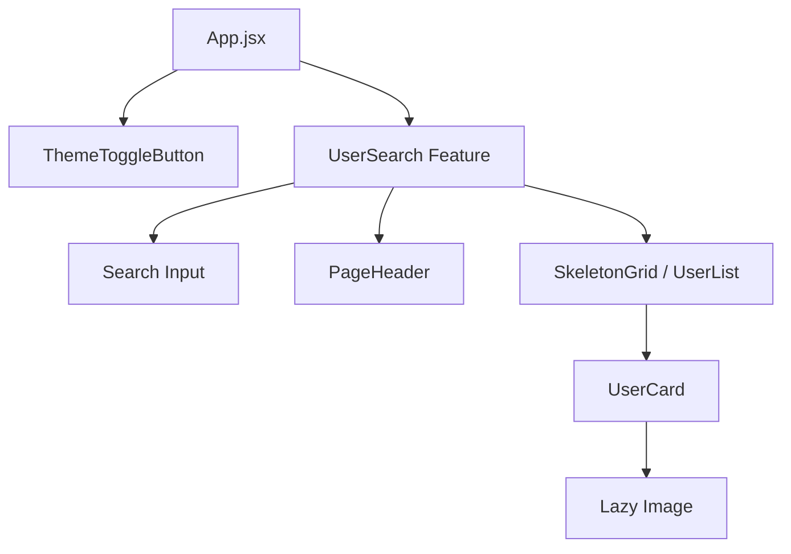

# Arquitectura del Sistema

## 1. Estructura de Carpetas (Feature-Based Híbrida)
El proyecto implementa una estructura modular orientada a características (*features*), facilitando la escalabilidad y el mantenimiento.

```
src/
├── app/                # Configuración global del Store (Redux)
├── components/         # Componentes UI reutilizables y Layouts
│   ├── layout/         # Componentes estructurales (Header, Grid)
│   └── UserCard.jsx    # Componente de presentación principal
├── docs/               # Documentación centralizada del proyecto
├── features/           # Módulos de dominio (Lógica + UI específica)
│   ├── users/          # Feature: Gestión de Usuarios (Search, List, Slice)
│   └── search/         # (Futuro/Refactor) Lógica de búsqueda
├── hooks/              # Custom Hooks globales (Theme, Debounce, Observer)
├── services/           # Capa de integración con APIs externas
└── main.jsx            # Punto de entrada de la aplicación
```

## 2. Capas de Responsabilidad

### Capa de Presentación (Components & Features UI)
- Responsable solo de renderizar datos y capturar eventos.
- **Patrón:** *Container/Presenter* (implícito). `UserSearch` actúa como contenedor que conecta con Redux, mientras que `UserCard` es un componente presentacional puro optimizado con `React.memo`.

### Capa de Lógica de Estado (Redux & Hooks)
- Mantiene la verdad única del estado de la aplicación.
- `usersSlice.js`: Maneja el estado de la lista de usuarios, flags de carga (`status`) y errores.
- Custom Hooks: Encapsulan lógica reutilizable como el *theme switching* o la detección de visibilidad.

### Capa de Servicios (Services)
- `userService.js`: Abstrae la comunicación con la API de GitHub.
- Desacopla la lógica de red de los componentes React. Si la API cambia, solo se modifica este archivo.

## 3. Patrones de Diseño Aplicados

### Custom Hooks
- **`useDebouncedSearch`**: Implementa el patrón *Debounce* para optimizar llamadas a la API.
- **`useTheme`**: Gestiona la persistencia y cambio de tema (Light/Dark).
- **`useIntersectionObserver`**: Implementa *Lazy Loading* visual de componentes.

### Optimización de Renderizado
- **`React.memo`**: Previene re-renderizados innecesarios en `UserCard`.
- **Lazy Loading**: Imágenes y componentes se cargan bajo demanda.

## 4. Diagrama de Componentes


## 5. Nota sobre Arquitectura Serverless
**No aplica.** Este proyecto utiliza una **Arquitectura Cliente Pura**. No existe backend propio ni integración con servicios como Firebase o Supabase. Toda la persistencia es local (`localStorage` para tema) o efímera (estado Redux).
