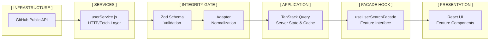

# 🏗️ Software Architecture: The Senior Core

## 1. Architectural Strategy (FSD-lite)

The system implements a refined **Feature-Sliced Design (FSD)**, prioritizing strict boundaries between infrastructure and domain. This architecture ensures the application remains resilient to external changes (API shifts) and maintainable over time.

---

## 2. Structural Patterns (Integrity & Decoupling)

### A. Pattern: Adapter + Zod (The Integrity Gate)

The **Adapter Pattern** (`src/models/adapters/`) has been evolved with **Zod Integration**. It acts as a bidirectional protection layer for our internal domain.

- **Data Validation:** Zod schemas (`GitHubUserSchema`) perform runtime type checking, ensuring "Zero-Trust" data intake.
- **Normalization:** The Adapter transforms validated API payloads into a clean, application-optimized **Internal Model**.
- **Fail-Fast:** Any API contract violation is caught immediately at the entry point, preventing state corruption in the UI.

### B. Pattern: Facade (Encapsulation Layer)

Features (`src/features/`) expose a **Facade Hook** (`useUserSearchFacade`).

- **Internal Complexity:** Encapsulates TanStack Query state, debounce logic, and side effects.
- **Public API:** The UI component only consumes semantic props (e.g., `results`, `isSearching`), remaining unaware of the underlying fetching mechanism.

### C. Pattern: Factory (Result Handling)

Centralized `ResultFactory` handles polymorphism in the search results (Loading, Empty, Error, Success), ensuring consistent layout management.

---

## 3. Data Flow Architecture

---

## 4. Key Architectural Decisions (ADR)

1.  **Zod over TypeScript Interfaces for Validation**: While TS provides build-time safety, Zod ensures **runtime safety** when dealing with untrusted external APIs.
2.  **TanStack Query as State Manager**: Replaces Redux for server-state to reduce boilerplate and gain native caching/invalidation.
3.  **High-Fidelity Logging**: A centralized logger (`src/app/logger.js`) provides visibility into the Adapter's transformation and the Query lifecycle.
4.  **Zero-Configuration Tailwind v4**: Optimized for high-performance rendering and consistent design system enforcement without JS overhead.
