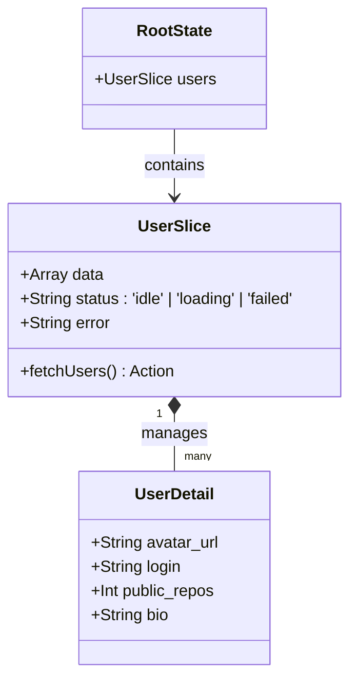

# 02 - Arquitectura

## 🏢 Estructura de Carpetas (Feature-Sliced Design)

La migración promueve la separación de la lógica del negocio frente a la infraestructura técnica. El proyecto ha sido moldeado bajo un FSD estricto, logrando que el equipo escale en features sin pisar dominios ajenos.

```text
src/
├── app/                  # Orquestador: store.js (Redux root)
├── features/             # Slices de Negocio Aisladas
│   ├── users/            # (Search, UI lists genéricas, actions)
│   └── user-detail/      # (Single User View profile route)
├── components/           # UI Compartida agnóstica de negocio
│   ├── layout/           # (ErrorDisplay, NotFound, PageHeader)
│   └── ui/               # (ThemeToggle, Modals, Primates HTML)
├── hooks/                # Reglas reactivas custom (ej. useTheme)
├── services/             # Abstracción limpia (endpoints APIs)
├── routes/               # Declaración de react-router (opcional por ahora)
├── utils/                # Funciones agnósticas (clsx + twMerge, formats)
└── docs/                 # "La Biblia del Proyecto"
```

## 🧩 Patrones Utilizados

- **Feature-Based Architecture:** La carpeta `users/` contiene tanto su UI, como su slice the Redux (logic), sus componentes atómicos, aislando todo su dominio.
- **Container/Presenter Pattern:** Redux o Hooks manejan el estado y lo inyectan hacia `UserCard` (Presenter), garantizando que el diseño visual pueda testearse aislado de la Red.
- **Utility-First (Tailwind Puro):** Todo elemento UI hereda y compone clases CSS estandarizadas mediante `className={cn(...)}`, mitigando la colisión de nombres CSS e imposibilitando la fragmentación visual que provocaba el BEM legacy o las UI externas de Material Tailwind.

## 📐 Diagrama de Clases UML del Store/Context (Mermaid)



## 🗺️ Mapeo Estructural y Dependencias (ASCII)

```text
 [ Redux Provider ] (Capa Superior)
         │
         ▼
 [ App Router ] (Intercepta URLs)
         │
         ├─ /         ─▶ [ UserSearchContainer ] ─▶ (Fetch GitHub)
         │                       └─▶ [ UserCard List (Tailwind) ]
         │
         └─ /user/:id ─▶ [ UserDetailFeature ]
                                 └─▶ (Fetch Single User API Endpoint)
```
