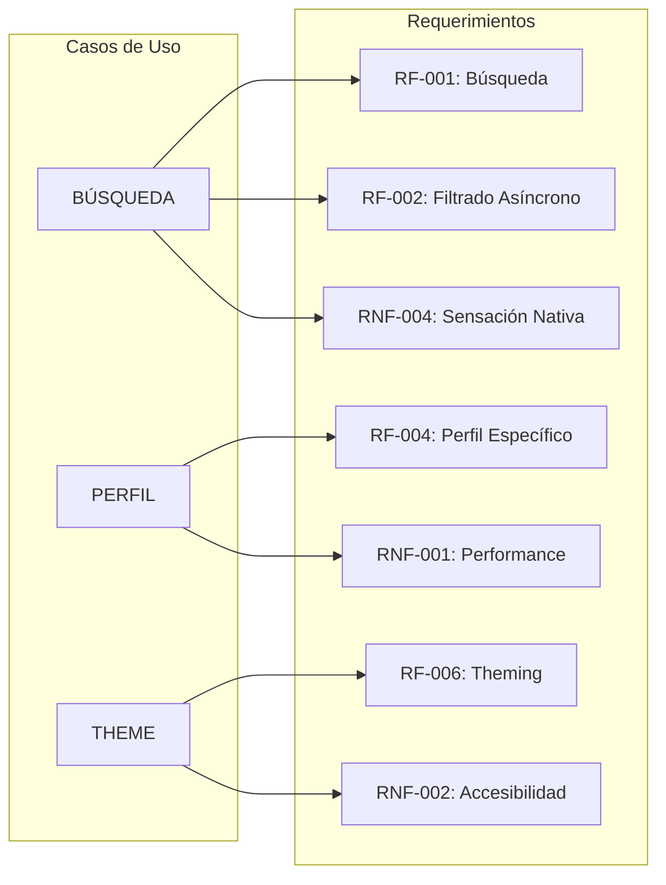

# 04 - Requerimientos Funcionales y No Funcionales

## 📊 Requerimientos Funcionales (RF)

| ID         | Área               | Descripción                                                                                                                         | Prioridad |
| ---------- | ------------------ | ----------------------------------------------------------------------------------------------------------------------------------- | --------- |
| **RF-001** | Búsqueda           | El sistema DEBE buscar usuarios en base a un input libre utilizando la API de GitHub (`/search/users`).                             | Alta      |
| **RF-002** | Filtrado Asíncrono | El *fetching* DEBE implementarse en tiempo real aplicando un debounce inteligente (~300-500ms) para proteger *rate limits*.          | Alta      |
| **RF-003** | Visualización      | El grid de perfiles DEBE pintar los avatares y usernames usando variantes de tarjetas (Glass, Minimal, Accent-Glow).                | Alta      |
| **RF-004** | Perfil Específico  | La ruta `/user/:login` DEBE aislar el contexto y pintar Repos y Seguidores con transiciones fluidas de Motion.                      | Crítica   |
| **RF-005** | Fallback & Feedback| El sistema DEBE ofrecer *Skeletons* ante red lenta y **Sonner Toasts** para confirmar el éxito o fracaso de las búsquedas.          | Alta      |
| **RF-006** | Theming            | El usuario DEBE poder alternar entre Light y Dark Mode con persistencia en LocalStorage y transición suave de luminancia.           | Media     |

## 🏗️ Requerimientos No Funcionales (RNF)

| ID          | Criterio (Atributos de Calidad) | Descripción y Constreñimientos Arquitectónicos (El Refactor v4)                                                                                      |
| ----------- | ------------------------------- | ---------------------------------------------------------------------------------------------------------------------------------------------------- |
| **RNF-001** | **Performance (Lighthouse)**    | El ecosistema DEBE optimizar el uso de **Motion v12** para lograr animaciones a 60 FPS sin degradar el puntaje Lighthouse (>95).                     |
| **RNF-002** | **Accesibilidad (A11y)**        | Todos los botones y acciones DEBEN contar con `aria-label`. El uso de **Lucide-React** garantiza una iconografía legible y consistente.              |
| **RNF-003** | **Coherencia Visual (DRY)**     | No DEBEN existir estilos redundantes. Se rige por la composición de **Tokens Semánticos** y variantes de componentes en CSS v4.                      |
| **RNF-004** | **Sensación Nativa (Premium)**  | Obligatoriedad de usar layouts tácticos y transiciones de elementos compartidos (Shared Element Transitions) para una UX de alta fidelidad.          |
| **RNF-005** | **Arquitectura de Estado**      | La persistencia debe ser puramente efímera (TanStack Query/LocalStorage). Toda la lógica de UI debe ser reactiva y libre de side-effects pesados.             |

## 📐 Relación de Casos vs Requerimientos

