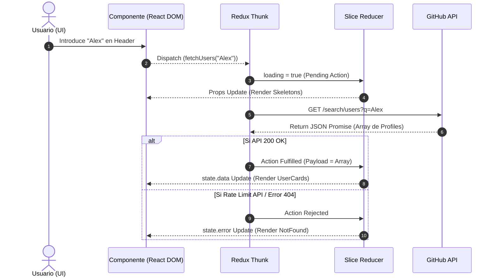

# 05 - Arquitectura de Flujo de Datos

## 🌊 Arquitectura de Estado

Este proyecto utiliza una **Arquitectura Cliente Pura**. El estado es alojado cien por ciento de manera local o cliente mediante:

- **Redux Toolkit**: Concentración del App State macro, inyectado mediante Provider a toda la jerarquía de UI.
- **LocalStorage**: Memoria precaria de corto alcance para preferencias frígidas (Theming Light/Dark).

**No aplica:**

- ❌ Bases de datos remotas.
- ❌ Firebase/Supabase (Serverless auth/functions).
- ❌ Mutación asincróna (Solo se lee - _GET_ Data de Github, no POST).

## ⏱️ Diagrama de Secuencia Asíncrona (Mermaid)



## 🌳 Grafo de Árbol de Invocaciones (Props Tree) - ASCII Art

El Flujo de datos asienta las responsabilidades usando el patrón funcional React clásico. Un contenedor inteligente habla con el store, las piezas tontas solo mapean las _Props_.

```text
<App> (Inyecta Redux Store + Rutas)
  │
  ├─ <ThemeToggle> --------- (Lee y Escribe Context/Local Storage: "DarkMode")
  │
  ├─ <Home (Search View)> -- (Suscripto a state.users.data)
  │   │
  │   ├─ <PageHeader> ------ (Recibe handleSearch() / Devuelve eventOnChange)
  │   │
  │   └─ <UserCard> x N ---- (Componente Tonto. Recibe `user={avatar, login}` puramente visual Tailwind v4)
  │
  └─ <UserDetail> ---------- (Recibe route Param /user/:login)
      │
      └─ Fetch Effect ------ (Busca Independientemente en API)
```
