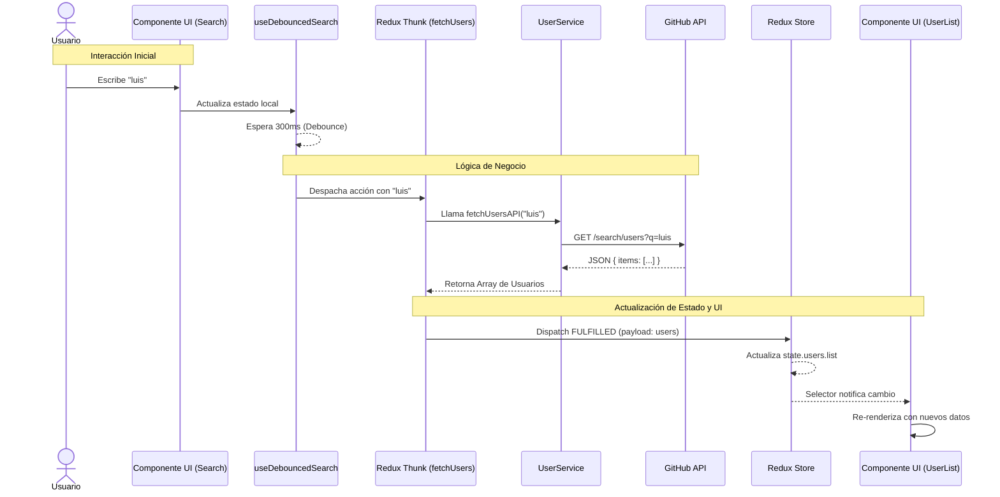

# Flujo de Datos y Estado

## 1. Arquitectura de Estado
Este proyecto utiliza una **arquitectura cliente pura** sin backend propio.
El estado es gestionado de manera híbrida:
- **Global:** Redux Toolkit (`usersSlice`) para datos de dominio (Usuarios, Status API).
- **Local:** `useState` para inputs, interactividad efímera y lógica de UI.
- **Persistente:** `localStorage` para preferencias de usuario (Tema).

**No aplica:**
- ❌ Integración con Firebase/Supabase
- ❌ Base de datos remota propia

## 2. Diagrama de Flujo de Datos (Data Flow)

El siguiente diagrama detalla cómo viaja la información desde la interacción del usuario hasta la actualización de la UI.



## 3. Modelo de Datos (Store)

El *Slice* de usuarios (`usersSlice`) mantiene la siguiente estructura:

```javascript
{
  users: [
    {
      id: 123,
      login: "usuario",
      avatar_url: "https://...",
      html_url: "https://..."
    },
    // ... más usuarios
  ],
  status: "idle" | "loading" | "succeeded" | "failed",
  error: null | { message: string, status: number }
}
```
