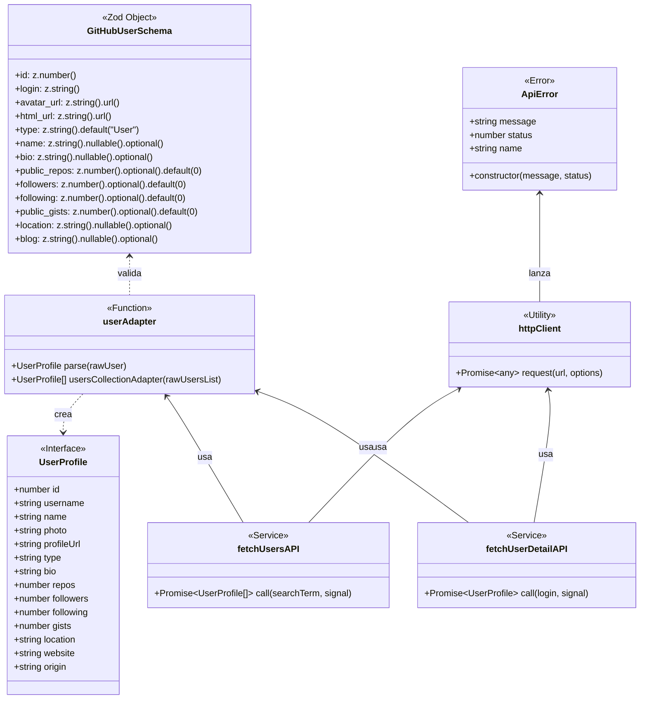
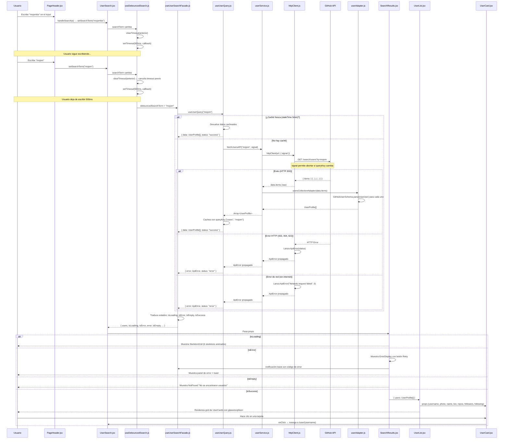

# Artefactos de Ingeniería de Software — GitExplorer

> **Documento técnico y de gestión** que describe la función, arquitectura, diseño y proceso de desarrollo del proyecto GitExplorer bajo estándares de ingeniería de software, patrones GoF y metodología ágil Scrum.

---

## 📋 Índice

1. [Plan de Investigación y Modelado](#1-plan-de-investigación-y-modelado)
2. [Requisitos del Sistema](#2-requisitos-del-sistema)
3. [Diseño y Arquitectura (React)](#3-diseño-y-arquitectura-react)
4. [Artefactos de Diseño Específicos](#4-artefactos-de-diseño-específicos)
5. [Enfoque Ágil — Scrum + ATDD](#5-enfoque-ágil--scrum--atdd)

---

## 1. Plan de Investigación y Modelado

### 1.1 Formulación del Problema

La interfaz nativa de GitHub (github.com) está diseñada para la gestión de repositorios, issues, pull requests y colaboración en equipo. Como consecuencia, **no está optimizada para la exploración rápida de perfiles de usuario**. Sus limitaciones específicas son:

| Problema | Impacto |
|----------|---------|
| **Sin búsqueda predictiva**: no hay sugerencias ni autocompletado al escribir un username | El usuario debe navegar manualmente a `github.com/{username}` o usar el search global, que mezcla repos, issues, código y usuarios |
| **Latencia de carga**: cada página de perfil requiere una navegación completa sin SPA | Tiempos de carga de 2-5 segundos incluso con conexión rápida |
| **Sin caché local**: cada visita a un mismo perfil descarga los mismos datos de la API | Consumo innecesario de ancho de banda y límite de rate-limit de GitHub (60 req/h sin autenticación) |
| **Interfaz densa**: el perfil de GitHub muestra múltiples secciones (repos, contribuciones, activity, organizaciones) | El usuario tarda en encontrar la información que busca (bio, followers, repos totales) |
| **Sin modo oscuro nativo** (hasta fechas recientes) y sin personalización visual | Fatiga visual en sesiones prolongadas |
| **Sin una arquitectura que sirva como caso de estudio**: GitHub.com es un monolito Ruby on Rails | Los desarrolladores junior no pueden inspeccionar el código para aprender buenas prácticas |

**GitExplorer resuelve esto** ofreciendo una SPA React liviana con búsqueda con debounce, caché inteligente (TanStack Query), validación de datos en runtime (Zod), diseño glassmorphism con tema dual (claro/oscuro) y una arquitectura de 4 capas que sirve como modelo de referencia para ingeniería de software frontend.

### 1.2 Objetivos

#### Objetivo General

Construir una aplicación web SPA (Single Page Application) en React 18 que permita a desarrolladores explorar perfiles de GitHub con una experiencia de usuario rápida, visualmente moderna y técnicamente ejemplar, aplicando Clean Architecture, TanStack Query, Zod y patrones de diseño GoF (Adapter, Facade, Factory) bajo metodología Scrum.

#### Objetivos Específicos

| # | Objetivo | Indicador de Éxito |
|---|----------|-------------------|
| OE-1 | Implementar un sistema de búsqueda con debounce de 500ms y TanStack Query que reduzca las llamadas a la API de GitHub y cachee resultados con staleTime de 5 minutos | Las búsquedas repetidas del mismo término son instantáneas (0ms de red), el rate-limit de GitHub no se excede |
| OE-2 | Aplicar los patrones estructurales Adapter (para transformación de datos), Facade (para simplificación de lógica de UI) y Factory (para creación condicionada de componentes), documentándolos como caso de estudio para desarrolladores junior | Cada patrón está identificado con su archivo fuente, diagrama y explicación didáctica en la documentación |
| OE-3 | Diseñar un sistema de doble tema (claro "Holographic Terminal" / oscuro "Cyberpunk") con efecto glassmorphism basado en `backdrop-filter: blur(20px)` y variables CSS que se alternan mediante una clase `.dark` en `<html>`, sin condicionales en JSX | El toggle de tema persiste en localStorage, respeta `prefers-color-scheme` del sistema, y todos los componentes se repintan automáticamente sin props de tema |
| OE-4 | Documentar cada decisión técnica como material de estudio para programadores junior, incluyendo Clean Architecture, closures, hoisting, scope, inmutabilidad, DRY, SOLID y el ciclo Scrum completo con 4 sprints simulados | El proyecto contiene 7+ documentos técnicos en `src/docs/` y un README que funciona como guía de estudio integral |

### 1.3 Justificación y Alcance

#### Justificación

**Valor educativo**: El proyecto no resuelve un problema de negocio nuevo (explorar perfiles de GitHub), sino que **re-resuelve un problema conocido aplicando las mejores prácticas de la industria frontend**. Esto lo convierte en un recurso didáctico donde un desarrollador junior puede ver Clean Architecture, TanStack Query, Zod, patrones GoF, inmutabilidad, closures y Scrum aplicados en un código real y funcional.

**Valor técnico**:
- La arquitectura de 4 capas es _over-engineered_ para una app de búsqueda simple, pero deliberadamente así para demostrar escalabilidad
- TanStack Query con cache policy configurable muestra cómo manejar estado de servidor sin Redux
- Zod en runtime protege contra cambios silenciosos en la API de GitHub
- El sistema de temas basado 100% en CSS variables (sin JSX condicional) es un patrón reusable en cualquier proyecto React

**Valor de producto**: Un desarrollador puede buscar perfiles de GitHub y ver información clave (repos, followers, bio, ubicación) en 1-2 clics, con animaciones suaves, sin recargas de página y con una estética glassmorphism que prioriza legibilidad.

#### Alcance

| Incluye | No incluye |
|---------|------------|
| Búsqueda de usuarios de GitHub por username | Autenticación OAuth con GitHub |
| Visualización de resultados en tarjetas glass con foto, username, bio, repos, followers, following | Modificación de datos en GitHub (crear repos, issues, etc.) |
| Detalle de perfil con bento grid asimétrico | Base de datos propia (toda la data viene de GitHub API) |
| Tema claro "Holographic Terminal" y oscuro "Cyberpunk" | Soporte offline total (solo mocks en desarrollo con MSW) |
| MSW para mock de API en desarrollo | Server-Side Rendering (CSR puro) |
| Lazy loading de rutas con `React.lazy()` + `Suspense` | PWA con Service Workers |
| Caché con TanStack Query (staleTime 5min, gcTime 10min) | Testing automatizado (Vitest instalado pero sin tests) |
| Documentación completa como guía de estudio | Internacionalización (i18n) |
| Despliegue en GitHub Pages | Accesibilidad completa WCAG AAA (solo AA) |

### 1.4 Modelo de Negocio — CANVAS

> **Nota**: GitExplorer es un **proyecto educativo open-source sin fines de lucro**. El modelo CANVAS describe su propuesta de valor y segmento de usuarios, no un flujo de ingresos.

| Bloque CANVAS | Descripción |
|---------------|-------------|
| **Segmento de Clientes** | Desarrolladores de software juniors y trainees (1-2 años de experiencia) que quieren aprender React, Clean Architecture y buenas prácticas frontend con un proyecto real. Reclutadores técnicos que usan la app como entrevista práctica. Autodidactas que consumen documentación técnica |
| **Propuesta de Valor** | "Aprende React con buenas prácticas en un proyecto real documentado como estudio de caso" — cada línea de código, decisión arquitectónica y patrón de diseño está explicado en la documentación para que un junior lo entienda y lo replique |
| **Canales** | GitHub Pages (app desplegada), repositorio GitHub con 7+ documentos técnicos, README como guía de estudio integral, comunidad dev.to/Medium (artículos derivados) |
| **Relación con Clientes** | Open-source con issues y pull requests, documentación detallada en español, simulación Scrum completa para que el usuario entienda el proceso ágil |
| **Fuentes de Ingresos** | No aplica (proyecto educativo sin fines de lucro). El "retorno" es la mejora del portafolio técnico del autor y el aprendizaje de la comunidad |
| **Recursos Clave** | Código fuente documentado, 7 documentos técnicos en `src/docs/`, skills de opencode para IA, diseño glassmorphism con tema dual, API pública de GitHub (gratuita) |
| **Actividades Clave** | Desarrollo iterativo con Scrum (4 sprints), refactorización continua, documentación de cada patrón y decisión, publicación de artefactos de ingeniería |
| **Socios Clave** | GitHub (API pública gratuita), Vercel (Vite como bundler), Tailwind Labs (Tailwind CSS v4), TanStack (Query), la comunidad open-source |
| **Estructura de Costos** | Horas de desarrollo (proyecto personal), dominio GitHub Pages (gratuito), API de GitHub (gratuita hasta 60 req/h sin token) |

#### Flujo de Proceso de Negocio Clave

```
┌─────────────────────────────────────────────────────────────────────┐
│                      FLUJO DE EXPLORACIÓN                           │
├─────────────────────────────────────────────────────────────────────┤
│                                                                      │
│  Usuario                     Sistema                                 │
│    │                           │                                     │
│    ├── Accede a la app ──────► │  Carga SPA en el navegador          │
│    │                           │  Renderiza hero con input           │
│    │                           │  Carga tema desde localStorage      │
│    │                           │◄── Listo para buscar               │
│    │                           │                                     │
│    ├── Escribe username ──────►│  setSearchTerm(value)                │
│    │                           │  useEffect → setTimeout 500ms       │
│    │  (sigue escribiendo) ────►│  clearTimeout(anterior)             │
│    │                           │  nuevo setTimeout(500ms)            │
│    │                           │                                     │
│    │  (deja de escribir 500ms) │  debouncedSearchTerm cambia         │
│    │                           │  useUserQuery queryKey cambia       │
│    │                           │  ¿Caché fresca? → Sí: instantáneo   │
│    │                           │  ¿Caché fresca? → No: fetch API     │
│    │                           │  Aborta petición anterior (signal)  │
│    │                           │  httpClient hace GET a GitHub API   │
│    │                           │  ¿Error? → ErrorDisplay + toast     │
│    │                           │  ¿OK? → userAdapter + Zod parse     │
│    │                           │  TanStack cachea resultado          │
│    │                           │  Renderiza UserList + UserCards     │
│    │◄── Ve tarjetas glass ────│                                     │
│    │                           │                                     │
│    ├── Hace clic en tarjeta ──►│  Navega a /user/:login               │
│    │                           │  useUserDetailQuery(login)          │
│    │                           │  fetchUserDetailAPI con signal      │
│    │                           │  userAdapter + Zod parse            │
│    │                           │  Renderiza bento grid con stats     │
│    │◄── Ve perfil completo ────│                                     │
│    │                           │                                     │
│    ├── Toggle tema ───────────►│  toggleTheme() → .dark toggle       │
│    │                           │  CSS variables cambian automáticas  │
│    │                           │  localStorage.setItem("theme")      │
│    │◄── UI se repinta ────────│                                     │
│    │                           │                                     │
│    └── Cierra sesión ────────►│  (SPA: no hay cierre de sesión)     │
│                                                                      │
└─────────────────────────────────────────────────────────────────────┘
```

---

## 2. Requisitos del Sistema

### 2.1 Requerimientos Funcionales (RF)

| ID | Descripción | Prioridad | Dependencia |
|----|-------------|-----------|:-----------:|
| RF-01 | El sistema debe mostrar un campo de texto donde el usuario pueda escribir el nombre de un usuario de GitHub | Alta | — |
| RF-02 | El sistema debe implementar debounce de 500ms antes de ejecutar la búsqueda | Alta | RF-01 |
| RF-03 | El sistema debe consultar la API de GitHub (`/search/users`) con el término de búsqueda | Alta | RF-02 |
| RF-04 | El sistema debe cancelar la petición anterior si el usuario escribe un nuevo término antes de que se complete (AbortSignal) | Alta | RF-03 |
| RF-05 | El sistema debe mostrar un skeleton grid animado mientras se cargan los resultados | Alta | RF-03 |
| RF-06 | El sistema debe mostrar una tarjeta por cada usuario encontrado con: foto, username, nombre real, bio, repos, followers y following | Alta | RF-03 |
| RF-07 | El sistema debe mostrar un mensaje "No se encontraron usuarios" si la búsqueda no produce resultados | Alta | RF-03 |
| RF-08 | El sistema debe mostrar un panel de error con botón de reintento si la API falla o se excede el rate-limit | Alta | RF-03 |
| RF-09 | El sistema debe cachear los resultados usando TanStack Query con staleTime de 5 minutos y gcTime de 10 minutos | Alta | RF-03 |
| RF-10 | El sistema debe mostrar una notificación toast (Sonner) cuando ocurre un error de validación (422) o rate-limit (403) | Alta | RF-03 |
| RF-11 | El sistema debe permitir navegar al detalle de un usuario haciendo clic en su tarjeta | Alta | RF-06 |
| RF-12 | El sistema debe mostrar la página de detalle en un layout bento grid asimétrico con: avatar, nombre, bio, repos, followers, following, gists, ubicación, website, y enlace a GitHub | Alta | RF-11 |
| RF-13 | El sistema debe mostrar un skeleton de carga mientras se obtienen los datos del detalle | Alta | RF-12 |
| RF-14 | El sistema debe validar todos los datos entrantes de la API con Zod antes de renderizarlos | Alta | RF-03, RF-12 |
| RF-15 | El sistema debe tener un botón de cambio de tema (claro/oscuro) con animación de transición | Alta | — |
| RF-16 | El sistema debe persistir la preferencia de tema en localStorage | Alta | RF-15 |
| RF-17 | El sistema debe detectar la preferencia de tema del sistema (`prefers-color-scheme`) en la primera visita | Alta | RF-15 |
| RF-18 | El sistema debe aplicar el efecto glassmorphism (`backdrop-filter: blur(20px)`) en tarjetas, inputs y botones | Alta | — |
| RF-19 | El sistema debe cargar las rutas de forma diferida con `React.lazy()` + `Suspense` | Alta | — |
| RF-20 | El sistema debe usar path alias `@/*` para todas las importaciones internas | Alta | — |
| RF-21 | El sistema debe funcionar en modo desarrollo sin conexión a internet usando MSW (Mock Service Worker) | Media | RF-03 |
| RF-22 | El sistema debe desplegarse en GitHub Pages con base path `/myprojectapi01/` | Alta | — |
| RF-23 | El sistema no debe incluir navbar (UX inmersiva desde el hero) | Alta | — |
| RF-24 | El sistema debe animar la entrada de componentes con Motion v12 (spring physics: stiffness 120, damping 16) | Media | — |
| RF-25 | El sistema debe mostrar un contador animado (AnimatedCounter) para las estadísticas numéricas en el detalle | Media | RF-12 |
| RF-26 | El sistema debe ser responsive: layout adaptativo para mobile (stack), tablet y desktop (grid) | Alta | — |
| RF-27 | El sistema debe tener un logger visual en consola con ASCII art que muestre el flujo de datos | Baja | — |
| RF-28 | El sistema debe incluir PropTypes en todos los componentes para validación de props en desarrollo | Alta | — |

### 2.2 Requerimientos No Funcionales (RNF)

| ID | Descripción | Categoría | Métrica |
|----|-------------|-----------|---------|
| RNF-01 | La aplicación debe ser 100% web (SPA), funcionando exclusivamente en el navegador sin necesidad de instalación | Operativo | Sin binarios, sin plugins |
| RNF-02 | La aplicación debe funcionar correctamente en las últimas 2 versiones de Chrome, Firefox, Edge y Safari | Portabilidad | Cross-browser testing |
| RNF-03 | La aplicación debe ser responsive: mobile (< 480px), tablet (481-768px), desktop (> 768px) | Usabilidad | Layout no se rompe en ningún viewport |
| RNF-04 | El tiempo de carga inicial (First Contentful Paint) debe ser menor a 2 segundos en conexión 4G | Rendimiento | Lighthouse FCP < 2s |
| RNF-05 | El tiempo de búsqueda con caché caliente debe ser menor a 100ms (sin llamada de red) | Rendimiento | Network tab 0 requests |
| RNF-06 | El tamaño del bundle JS principal debe ser menor a 300 KB (gzipped) | Rendimiento | Build report |
| RNF-07 | La aplicación debe pasar ESLint con 0 warnings y 0 errores | Calidad | `pnpm lint --max-warnings 0` |
| RNF-08 | La aplicación no debe contener `console.log` en producción (solo logger con fines educativos desactivado en build) | Calidad | ESLint rule `no-console` |
| RNF-09 | La aplicación debe cumplir con criterios de accesibilidad WCAG 2.1 nivel AA | Accesibilidad | ESLint plugin jsx-a11y, atributos aria |
| RNF-10 | La aplicación debe validar todos los datos externos con Zod antes de usarlos | Seguridad | Ningún dato sin validar llega a un componente |
| RNF-11 | La aplicación debe usar TanStack Query para toda la comunicación con el servidor, no Redux | Arquitectura | Sin dependencia de Redux en package.json |
| RNF-12 | La aplicación debe seguir Clean Architecture de 4 capas: domain → infrastructure → application → presentation | Arquitectura | Las capas internas no importan de las externas |
| RNF-13 | La aplicación debe usar el patrón Facade para ocultar la complejidad de TanStack Query de los componentes | Arquitectura | Los componentes solo llaman a facades, no a queries directamente |
| RNF-14 | La aplicación debe usar el patrón Adapter para transformar datos de la API al modelo interno | Arquitectura | Ninguna propiedad de la API cruda llega a presentation |
| RNF-15 | La aplicación debe usar el patrón Factory para renderizar diferentes tipos de resultados (User vs Organization) | Arquitectura | `ResultFactory` decide qué componente renderizar según `data.type` |

#### Requerimientos de Hardware y Software

| Entorno | Componente | Especificación |
|---------|-----------|----------------|
| **Cliente (navegador)** | Sistema operativo | Windows 10+, macOS 11+, Linux (kernel 5.x+), Android 10+, iOS 14+ |
| **Cliente (navegador)** | Navegador | Chrome 100+, Firefox 100+, Edge 100+, Safari 15+ |
| **Cliente (navegador)** | Memoria RAM | 512 MB mínimo (navegador moderno con 1 pestaña) |
| **Cliente (navegador)** | Conexión | 1 Mbps mínimo (funciona offline con MSW en desarrollo) |
| **Servidor (hosting)** | Plataforma | GitHub Pages (CDN estático, sin servidor de aplicaciones) |
| **Servidor (hosting)** | Almacenamiento | < 5 MB (build de estáticos: HTML, JS, CSS) |
| **Servidor (API)** | Plataforma | API pública de GitHub (https://api.github.com) |
| **Servidor (API)** | Rate limit | 60 requests/hora sin autenticación, 5000 req/h con token |
| **Desarrollo** | Node.js | v18+ (LTS) |
| **Desarrollo** | Package manager | pnpm 9+ |
| **Desarrollo** | Editor | VS Code, WebStorm, o cualquier editor con soporte JSX |
| **Desarrollo** | RAM | 4 GB mínimo (para Vite HMR y ESLint) |

### 2.3 Casos de Uso del Sistema

#### Listado de Casos de Uso

| ID | Caso de Uso | Actor | RF Asociado | Prioridad |
|----|-------------|-------|:-----------:|:---------:|
| CU-01 | Buscar usuarios de GitHub | Usuario no autenticado | RF-01, RF-02, RF-03, RF-04, RF-09 | Alta |
| CU-02 | Ver resultados de búsqueda | Usuario | RF-05, RF-06, RF-07 | Alta |
| CU-03 | Manejar error de API | Usuario | RF-08, RF-10 | Alta |
| CU-04 | Reintentar búsqueda fallida | Usuario | RF-08 | Alta |
| CU-05 | Ver detalle de usuario | Usuario | RF-11, RF-12, RF-13 | Alta |
| CU-06 | Cambiar tema claro/oscuro | Usuario | RF-15, RF-16, RF-17 | Alta |
| CU-07 | Navegar con teclado (accesibilidad) | Usuario | RNF-09 | Media |
| CU-08 | Ver skeleton durante carga | Usuario | RF-05, RF-13 | Alta |
| CU-09 | Ver input de búsqueda vacío | Usuario | RF-01 | Alta |
| CU-10 | Ver animaciones de entrada | Usuario | RF-24 | Media |
| CU-11 | Ver logger de flujo en consola | Desarrollador | RF-27 | Baja |
| CU-12 | Usar MSW en desarrollo | Desarrollador | RF-21 | Media |
| CU-13 | Desplegar a GitHub Pages | Desarrollador | RF-22 | Alta |
| CU-14 | Validar código con ESLint | Desarrollador | RNF-07 | Alta |
| CU-15 | Construir proyecto para producción | Desarrollador | RNF-06 | Alta |

#### Especificación de Casos de Uso del Sistema (ECUS) — 3 Casos Críticos

---

##### ECUS-01: Buscar usuarios de GitHub

| Elemento | Descripción |
|----------|-------------|
| **ID** | CU-01 |
| **Nombre** | Buscar usuarios de GitHub |
| **Actor** | Usuario no autenticado (cualquier visitante de la aplicación) |
| **Descripción** | El usuario escribe un término de búsqueda (username de GitHub) en el campo de texto del hero. El sistema aplica debounce de 500ms, cancela la petición anterior si existe, consulta la API de GitHub, valida los datos con Zod, los cachea con TanStack Query y renderiza una cuadrícula de tarjetas glass con los resultados |
| **Precondición** | El usuario está en la página de inicio con el input de búsqueda visible y funcional |
| **Postcondición (éxito)** | Se muestra una cuadrícula con N tarjetas glass (0 ≤ N ≤ 30) con foto, username, nombre, bio, repos, followers y following de cada usuario encontrado |
| **Postcondición (fracaso)** | Se muestra ErrorDisplay con mensaje descriptivo y botón de reintento, más un toast notification con el código de error |

**Flujo Normal**:
```
1.  El usuario accede a la aplicación (GET /)
2.  El sistema renderiza PageHeader con el input de búsqueda
3.  El usuario comienza a escribir en el input
4.  El sistema actualiza el estado local searchTerm con cada carácter
5.  El sistema inicia un setTimeout de 500ms cada vez que searchTerm cambia
6.  Si el usuario escribe otro carácter antes de 500ms, el sistema cancela el setTimeout anterior (clearTimeout)
7.  PASO 6 se repite hasta que el usuario deja de escribir por 500ms consecutivos
8.  El sistema actualiza debouncedSearchTerm con el valor final
9.  El sistema detecta que el queryKey de useUserQuery cambió: ["users", debouncedSearchTerm]
10. El sistema verifica la caché de TanStack Query:
    a. Si hay datos frescos (staleTime 5min no vencido): salta al PASO 16
    b. Si no hay caché o está vencida: continúa al PASO 11
11. El sistema ejecuta queryFn con un AbortSignal
12. El sistema llama a fetchUsersAPI(searchTerm, signal) en userService.js
13. userService.js construye la URL: https://api.github.com/search/users?q={searchTerm}
14. userService.js llama a httpClient(url, { signal })
15. httpClient ejecuta fetch(url, { signal, headers })
    a. Si fetch lanza AbortError: la petición fue cancelada, fin del flujo
    b. Si response.ok es false: lanza ApiError(status)
    c. Si response.ok es true: parsea JSON y devuelve data
16. userService.js recibe data: { items: [...] } o lanza ApiError
17. Si data existe: userService.js llama a usersCollectionAdapter(data.items)
18. usersCollectionAdapter ejecuta userAdapter() para cada usuario crudo
19. userAdapter ejecuta GitHubUserSchema.parse(rawUser) (Zod)
    a. Si Zod pasa: transforma las propiedades al modelo UserProfile
    b. Si Zod falla (ZodError): userService.js captura y lanza ApiError(422)
20. userService.js devuelve Array<UserProfile>
21. TanStack Query cachea el resultado con queryKey ["users", debouncedSearchTerm]
22. useUserSearchFacade recibe { users, status, error, isFetching }
23. La facade traduce estados: isLoading, isError, isEmpty, isSuccess
24. SearchResults.jsx evalúa:
    a. isLoading === true → renderiza SkeletonGrid
    b. isError === true → renderiza ErrorDisplay + toast
    c. isEmpty === true → renderiza NotFound
    d. isSuccess === true → renderiza UserList con UserCards
25. El usuario ve los resultados en pantalla
```

**Flujo Alternativo**:
```
PASO 12a: El usuario escribe un nuevo término mientras se ejecuta la petición
           → TanStack Query detecta cambio en queryKey
           → Aborta la petición anterior automáticamente (AbortController)
           → Inicia nuevo flujo desde PASO 11 con el nuevo término

PASO 23a: searchTerm tiene menos de 3 caracteres
           → useUserQuery tiene enabled: false
           → No se ejecuta queryFn
           → El sistema no muestra resultados ni skeletons
```

**Excepciones**:
```
E-01: Rate limit excedido (HTTP 403)
      → userService.js lanza ApiError("HTTP Error: 403 Forbidden", 403)
      → useUserSearchFacade captura error.status === 403
      → toast.error("Límite excedido", { description: "Has hecho demasiadas peticiones..." })
      → SearchResults renderiza ErrorDisplay con mensaje específico de rate-limit

E-02: Error de red (sin conexión)
      → fetch lanza TypeError: Failed to fetch
      → httpClient captura y lanza ApiError("Network request failed", 0)
      → SearchResults renderiza ErrorDisplay con botón Retry

E-03: Datos inválidos de API (ZodError)
      → userAdapter ejecuta GitHubUserSchema.parse(rawUser)
      → Zod lanza ZodError (ej: avatar_url no es URL válida)
      → userService.js captura ZodError y lanza ApiError("Error de Validación...", 422)
      → toast.error("Error de Validación")
      → SearchResults renderiza ErrorDisplay
```

**Reglas de Negocio**:
```
RN-01: No se ejecuta búsqueda si searchTerm tiene menos de 3 caracteres
RN-02: La petición anterior se aborta si el queryKey cambia
RN-03: Los datos se consideran frescos por 5 minutos (staleTime)
RN-04: Los datos se mantienen en caché 10 minutos después de desuscribirse (gcTime)
RN-05: Se reintenta 1 vez automáticamente si la petición falla (retry: 1)
RN-06: No se re-ejecuta la query al volver a la pestaña (refetchOnWindowFocus: false)
```

**Requerimientos Asociados**: RF-01, RF-02, RF-03, RF-04, RF-05, RF-06, RF-07, RF-08, RF-09, RF-10, RF-14, RNF-10, RNF-11

**Diagrama de Flujo** (ver sección 4.1 — Diagrama de Secuencia para la representación UML completa)

---

##### ECUS-02: Ver detalle de usuario

| Elemento | Descripción |
|----------|-------------|
| **ID** | CU-05 |
| **Nombre** | Ver detalle de usuario |
| **Actor** | Usuario no autenticado |
| **Descripción** | El usuario hace clic en una tarjeta de resultado de búsqueda. El sistema navega a la ruta `/user/:login`, obtiene los datos detallados del usuario desde la API de GitHub, los valida con Zod, los cachea con TanStack Query y renderiza una página de perfil completa con layout bento grid asimétrico que incluye avatar, nombre, bio, estadísticas animadas (repos, followers, following, gists), ubicación, website y enlace externo a GitHub |
| **Precondición** | El usuario ha realizado una búsqueda exitosa (CU-01) y ve una cuadrícula de tarjetas de usuario |
| **Postcondición (éxito)** | Se muestra la página de detalle del usuario con bento grid de 5 cards (repos doble ancho, followers, following, gists, terminal simulada), footer con ubicación, website y enlace a GitHub. Las estadísticas tienen contadores animados con spring physics |
| **Postcondición (fracaso)** | Se muestra una pantalla de error con mensaje descriptivo y enlace "Regresar al Buscador" |

**Flujo Normal**:
```
1.  El usuario visualiza la cuadrícula de resultados de búsqueda
2.  El usuario hace clic en una tarjeta UserCard
3.  El sistema captura el evento onClick y navega a /user/{username}
4.  React Router detecta el cambio de ruta y renderiza el componente UserDetail
5.  UserDetail ejecuta useParams() para obtener { login: username }
6.  UserDetail ejecuta useUserDetailQuery(login) con enabled: !!login
7.  El sistema verifica la caché de TanStack Query con queryKey ["user-detail", login]
    a. Si hay datos frescos: salta al PASO 12
    b. Si no: continúa al PASO 8
8.  El sistema ejecuta queryFn con AbortSignal
9.  fetchUserDetailAPI(login, signal) construye URL: https://api.github.com/users/{login}
10. httpClient ejecuta fetch(url, { signal, headers })
11. Si la respuesta es exitosa: parsea JSON y devuelve rawUser
12. userAdapter(rawUser) ejecuta GitHubUserSchema.parse(rawUser)
13. Si Zod pasa: transforma al modelo UserProfile
14. userService.js devuelve UserProfile
15. TanStack Query cachea con queryKey ["user-detail", login]
16. UserDetail recibe { data: user, isLoading, isError, error }
17. Si isLoading: renderiza UserDetailSkeleton (6 áreas de carga animadas)
18. Si isError: renderiza pantalla de error con mensaje y enlace de retorno
19. Si user existe: renderiza el bento grid completo con:
    - Bloque de perfil: avatar circular con glow, nombre, username, bio con borde lateral accent
    - Bento 1 (doble ancho): repositorios con contador animado, barra de progreso gradiente
    - Bento 2: seguidores con contador animado
    - Bento 3: siguiendo con contador animado
    - Bento 4: gists públicos con contador animado
    - Bento 5: terminal simulada (Tailwind CLI) con líneas animadas en cascada
    - Footer: ubicación (MapPin), website (LinkIcon), botón "Ver en GitHub" (Globe)
20. Motion v12 anima la entrada: staggerChildren 0.06s, spring con stiffness 120, damping 16
21. AnimatedCounter anima cada estadística de 0 al valor final en 1.2s con easeOut
22. El usuario visualiza el perfil completo
```

**Flujo Alternativo**:
```
PASO 3a: El usuario navega directamente a /user/{username} sin pasar por búsqueda
          → El flujo continúa desde PASO 4 sin cambios
          → Si el usuario no existe, GitHub API devuelve 404
          → httpClient lanza ApiError(404)
          → UserDetail renderiza pantalla de error con mensaje "No pudimos encontrar el perfil"

PASO 17a: isLoading es true durante más de 5 segundos
          → TanStack Query timeout automático (no configurado explícitamente)
          → Se lanza error de timeout
          → UserDetail renderiza pantalla de error
```

**Excepciones**:
```
E-01: Usuario no encontrado (HTTP 404)
      → ApiError("HTTP Error: 404 Not Found", 404)
      → UserDetail muestra: "No pudimos encontrar el perfil de este desarrollador."
      + enlace "Regresar al Buscador"

E-02: Error de red
      → ApiError("Network request failed", 0)
      → UserDetail muestra mensaje genérico de error de conexión

E-03: Datos inválidos
      → ZodError → ApiError(422)
      → UserDetail muestra mensaje de error de validación
```

**Reglas de Negocio**:
```
RN-01: La query solo se ejecuta si login tiene valor (enabled: !!login)
RN-02: Los datos de detalle se cachean independientemente de los datos de búsqueda
       (queryKey diferente: ["user-detail", login] vs ["users", searchTerm])
RN-03: staleTime y gcTime aplican igual que en búsqueda (5min y 10min)
```

**Requerimientos Asociados**: RF-11, RF-12, RF-13, RF-14, RF-24, RF-25, RNF-10, RNF-11

---

##### ECUS-03: Cambiar tema claro/oscuro

| Elemento | Descripción |
|----------|-------------|
| **ID** | CU-06 |
| **Nombre** | Cambiar tema claro/oscuro |
| **Actor** | Usuario no autenticado |
| **Descripción** | El usuario hace clic en el botón de cambio de tema (ThemeToggle). El sistema alterna entre el tema claro "Holographic Terminal" (fondo #F0EDE8, acentos teal) y el tema oscuro "Cyberpunk" (fondo #0A0A0F, acentos cyan #00F0FF) añadiendo o removiendo la clase `.dark` del elemento `<html>`. Las variables CSS en `:root` y `.dark` cambian automáticamente, lo que provoca que todos los componentes se repinten con los nuevos colores sin necesidad de lógica condicional en JSX. La preferencia se persiste en localStorage |
| **Precondición** | La aplicación está renderizada con un tema activo (claro u oscuro). El botón ThemeToggle es visible y funcional |
| **Postcondición (éxito)** | La UI completa se repinta con los colores del tema alternativo. La preferencia se guarda en localStorage. El icono del botón cambia (sol ↔ luna) con animación de rotación |
| **Postcondición (fracaso)** | No aplica. El cambio de tema no depende de APIs externas ni de condiciones de red. El único caso de fracaso sería un error en JavaScript que impida la ejecución del event handler |

**Flujo Normal**:
```
1.  El usuario visualiza la interfaz con el tema actual (ej: claro "Holographic Terminal")
2.  El usuario hace clic en el botón ThemeToggle (icono de luna si está en claro, sol si está en oscuro)
3.  Motion v12 ejecuta whileTap: scale(0.95) para feedback táctil
4.  El sistema ejecuta toggleTheme() definido en useTheme.js
5.  toggleTheme() ejecuta: setTheme(prevTheme => prevTheme === "light" ? "dark" : "light")
6.  React actualiza el estado theme (nuevo valor: "dark")
7.  El useEffect de useTheme.js se ejecuta con [theme] como dependencia:
    a. Obtiene document.documentElement (la etiqueta <html>)
    b. theme === "dark" → root.classList.add("dark")
    c. theme === "light" → root.classList.remove("dark")
8.  El navegador detecta el cambio de clase en <html>
9.  Todas las variables CSS definidas en .dark {...} entran en vigencia:
    --glass-bg: rgba(255,255,255,0.04)  (antes 0.6)
    --accent: #00F0FF                    (antes #0D9488)
    --bg: #0A0A0F                        (antes #F0EDE8)
    --surface: #12121A                   (antes #FFFFFF)
    --text: #E8E8F0                      (antes #1A1A2E)
    --border: #1E1E2A                    (antes #E5E2DC)
10. Todos los componentes que usan var(--bg), var(--text), var(--accent), etc. se repintan automáticamente
11. El icono del botón cambia de luna a sol con animación de rotación (AnimatePresence mode="wait")
12. localStorage.setItem("theme", "dark") persiste la preferencia
13. El usuario visualiza la interfaz con el tema oscuro "Cyberpunk"
```

**Flujo Alternativo**:
```
No aplica. El caso de uso tiene una único flujo lineal sin bifurcaciones.

Variante: El usuario cierra el navegador y vuelve a abrir la aplicación
          → useTheme.js ejecuta el initialState:
            1. Busca localStorage.getItem("theme")
            2. Si existe: lo usa como tema inicial
            3. Si no existe: detecta prefers-color-scheme del sistema
            4. Si no hay preferencia del sistema: usa "light" por defecto
          → El tema se restaura automáticamente
```

**Excepciones**:
```
E-01: localStorage no disponible (navegador en modo incógnito restrictivo o bloqueado)
      → try/catch implicito: el error se silencia
      → El tema funciona durante la sesión, pero no persiste al recargar
      → El usuario vuelve al tema por defecto en cada carga

E-02: document.documentElement no disponible (ejecución en SSR o testing)
      → No aplica: la app es CSR pura, siempre hay document
```

**Reglas de Negocio**:
```
RN-01: El tema persiste en localStorage bajo la clave "theme"
RN-02: La prioridad de selección de tema inicial: 1) localStorage, 2) prefers-color-scheme, 3) "light"
RN-03: No se usa JavaScript para cambiar colores individuales — solo se togglea la clase .dark en <html>
RN-04: Todos los componentes usan var(--*) para colores, nunca valores hardcodeados
```

**Requerimientos Asociados**: RF-15, RF-16, RF-17, RNF-13 (sin condicionales en JSX)

**Diagrama de Transición de Estados** (ver sección 4.3)

### 2.4 Modelo de Clases del Dominio

#### Diagrama de Clases (Mermaid)



#### Entidades del Dominio

| Entidad | Propiedades | Descripción |
|---------|------------|-------------|
| **UserProfile** | id, username, name, photo, profileUrl, type, bio, repos, followers, following, gists, location, website, origin | Modelo interno estandarizado. No depende de la estructura de GitHub. Si la API cambia, solo se modifica el adapter |
| **GitHubUserSchema** | (Zod schema) | Define la estructura exacta que se espera de la API. Usa `.optional().default()` para campos que pueden faltar |
| **ApiError** | message, status, name | Error personalizado con código HTTP. Se usa en toda la cadena: httpClient → service → facade → UI |
| **Repository** | *(no implementado)* | name, description, stars, forks, language, url. Planeado para futura expansión del detalle de usuario |

---

## 3. Diseño y Arquitectura (React)

### 3.1 Descripción de la Plataforma de Desarrollo

GitExplorer es una **Single Page Application (SPA)** construida sobre un stack moderno que prioriza rendimiento, mantenibilidad y experiencia de desarrollador:

| Capa | Tecnología | Propósito |
|------|-----------|-----------|
| **Bundler** | Vite 5.4 | HMR instantáneo en desarrollo. Producción con code-splitting automático. Sin bundler en dev (ESM nativo) |
| **UI Framework** | React 18.3 | Componentes funcionales con hooks. Arquitectura declarativa. Sin clases |
| **Enrutamiento** | React Router v7 | SPA routing con lazy loading. `createBrowserRouter` con loaders |
| **Estado servidor** | TanStack Query v5 | Caché, fetching, sincronización y retry automático. Sin Redux |
| **Estilos** | Tailwind CSS v4 | Framework utilitario con diseño atómico. Variables CSS para el sistema de temas |
| **Animaciones** | Motion v12 | Spring physics para animaciones naturales (stiffness, damping). AnimatePresence para transiciones de salida |
| **Validación** | Zod v4 | Esquemas de validación en runtime. Parseo y transformación de datos externos |
| **Iconos** | Lucide React v1.16 | Iconos SVG limpios y consistentes. Personalizables por CSS |
| **Notificaciones** | Sonner v2 | Toast livianos con richColors y animaciones |
| **Testing** | Vitest | *(instalado, sin tests escritos)* |
| **Mock API** | MSW | Intercepta peticiones HTTP en desarrollo usando Service Worker |

**Principios de diseño de la plataforma**:

1. **CSR puro**: Sin SSR, sin SSG. Todo el renderizado ocurre en el cliente. GitHub Pages solo sirve archivos estáticos
2. **Code-splitting por ruta**: Cada página (UserSearch, UserDetail) es un chunk separado que se carga bajo demanda
3. **Zero-config theme**: El sistema de temas no requiere props ni contextos. Las variables CSS en `:root` y `.dark` manejan todo automáticamente
4. **Fetch con cancelación**: Cada petición HTTP lleva un `AbortSignal` para cancelación limpia cuando el queryKey cambia
5. **Inmutabilidad estricta**: Ningún array se muta. Solo `.map()`, `.filter()`, `.find()`, `.slice()`. Sin `.push()`, `.splice()`, `.sort()`

### 3.2 Diagrama de Subsistemas

La arquitectura sigue el patrón **Layered Architecture** (Clean Architecture) con 4 capas jerárquicas donde cada capa solo conoce a la inmediatamente inferior:

```
 ┌────────────────────────────────────────────────────────────────────────────┐
 │                                                                              │
 │  CAPA 4: PRESENTATION                                                        │
 │  ┌──────────────────────────────────────────────────────────────────────┐   │
 │  │  components/       │  features/          │  styles/                  │   │
 │  │  ┌──────────────┐  │  ┌───────────────┐  │  ┌────────────────────┐   │   │
 │  │  │ layout/      │  │  │ users/        │  │  │ index.css          │   │   │
 │  │  │ PageHeader   │  │  │ UserSearch    │  │  │ :root / .dark vars │   │   │
 │  │  │ NotFound     │  │  │ SearchResults │  │  │ .glass-card        │   │   │
 │  │  │ ErrorDisplay │  │  │ UserList      │  │  │ .glass-input       │   │   │
 │  │  ├──────────────┤  │  │ UserCard      │  │  │ .btn-glass         │   │   │
 │  │  │ ui/          │  │  │ SkeletonCard  │  │  └────────────────────┘   │   │
 │  │  │ ThemeToggle  │  │  │ SkeletonGrid  │  │                           │   │
 │  │  ├──────────────┤  │  ├───────────────┤  │                           │   │
 │  │  │ common/      │  │  │ user-detail/  │  │                           │   │
 │  │  │ ErrorBoundary│  │  │ UserDetail    │  │                           │   │
 │  │  ├──────────────┤  │  │ UserDetail    │  │                           │   │
 │  │  │ factories/   │  │  │ Skeleton      │  │                           │   │
 │  │  │ ResultFactory│  │  └───────────────┘  │                           │   │
 │  │  └──────────────┘  │                     │                           │   │
 │  └──────────────────────────────────────────────────────────────────────┘   │
 │                              │                                               │
 │                              │  Dependencia: import from @/application/*     │
 │                              ▼                                               │
 │  CAPA 3: APPLICATION                                                         │
 │  ┌──────────────────────────────────────────────────────────────────────┐   │
 │  │  queries/            │  facades/             │  hooks/               │   │
 │  │  ┌────────────────┐  │  ┌─────────────────┐  │  ┌─────────────────┐  │   │
 │  │  │ useUserQuery   │  │  │ useUserSearch   │  │  │ useTheme        │  │   │
 │  │  │ useUserDetail  │  │  │ Facade          │  │  │ useDebounced    │  │   │
 │  │  │ Query          │  │  │                 │  │  │ Search          │  │   │
 │  │  └────────────────┘  │  └─────────────────┘  │  │ useIntersection │  │   │
 │  │                       │                       │  │ Observer        │  │   │
 │  │                       │                       │  └─────────────────┘  │   │
 │  └──────────────────────────────────────────────────────────────────────┘   │
 │                              │                                               │
 │                              │  Dependencia: import from @/infrastructure/*  │
 │                              ▼                                               │
 │  CAPA 2: INFRASTRUCTURE                                                      │
 │  ┌──────────────────────────────────────────────────────────────────────┐   │
 │  │  api/                │  mocks/              │  config/               │   │
 │  │  ┌────────────────┐  │  ┌─────────────────┐  │  ┌─────────────────┐  │   │
 │  │  │ httpClient     │  │  │ browser.js      │  │  │ config.js       │  │   │
 │  │  │ userService    │  │  │ handlers.js     │  │  │ API_BASE_URL    │  │   │
 │  │  └────────────────┘  │  └─────────────────┘  │  │ DEBOUNCE_DELAY  │  │   │
 │  │                       │                       │  │ STALE_TIME      │  │   │
 │  │  ┌────────────────┐  │                       │  └─────────────────┘  │   │
 │  │  │ logger/        │  │                       │                        │   │
 │  │  │ logger.js      │  │                       │                        │   │
 │  │  └────────────────┘  │                       │                        │   │
 │  └──────────────────────────────────────────────────────────────────────┘   │
 │                              │                                               │
 │  ─ ─ ─ ─ ─ ─ ─ ─ ─ ─ ─ ─ ─ ─ ─ ─ ─ ─ ─ ─ ─ ─ ─ ─ ─ ─ ─ ─ ─ ─ ─ ─ ─ ─ ─ │
 │                              │                                               │
 │  CAPA 1: DOMAIN                                                              │
 │  ┌──────────────────────────────────────────────────────────────────────┐   │
 │  │  schemas/          │  adapters/            │  errors/                │   │
 │  │  ┌────────────────┐  │  ┌─────────────────┐  │  ┌─────────────────┐  │   │
 │  │  │ user.js        │  │  │ userAdapter     │  │  │ ApiError.js     │  │   │
 │  │  │ GitHubUser     │  │  │ userAdapter()   │  │  │ ApiError class  │  │   │
 │  │  │ Schema         │  │  │ usersCollection │  │  │ extends Error   │  │   │
 │  │  └────────────────┘  │  │ Adapter()       │  │  └─────────────────┘  │   │
 │  │                       │  └─────────────────┘  │                        │   │
 │  └──────────────────────────────────────────────────────────────────────┘   │
 │                              │                                               │
 │                              │  SIN DEPENDENCIAS EXTERNAS                    │
 │                              │  (JavaScript puro, sin React, sin HTTP)       │
 │                              ▼                                               │
 │                      MUNDO EXTERIOR                                           │
 │              ┌─────────────────────────────┐                                 │
 │              │  GitHub API (api.github.com) │                                 │
 │              │  GitHub Pages (CDN)          │                                 │
 │              │  Navegador (DOM, fetch)      │                                 │
 │              └─────────────────────────────┘                                 │
 │                                                                              │
 └────────────────────────────────────────────────────────────────────────────┘
```

**Reglas de la arquitectura**:

| Regla | Descripción | Violación detectada por |
|-------|-------------|------------------------|
| La capa N solo puede importar de la capa N-1 | Presentation → Application, Application → Infrastructure, Infrastructure → Domain | ESLint (import/no-restricted-paths) — pendiente de configurar |
| Domain NO puede importar de ninguna otra capa | Domain es JavaScript puro. No sabe que React, fetch, ni el navegador existen | `domain/schemas/user.js` importa solo `zod` (librería externa de validación, permitida) |
| Infrastructure NO puede importar de Application o Presentation | httpClient no sabe qué es un hook o un componente | Revisión manual en code review |
| Application NO puede importar de Presentation | Los hooks y facades no saben que existen UserCard o ThemeToggle | Revisión manual en code review |
| Presentation puede importar de Application pero NO de Infrastructure directamente | UserSearch no llama a httpClient ni a fetchUsersAPI directamente — usa la facade | Revisión manual: ningún `.jsx` importa de `@/infrastructure/` |

### 3.3 Arquitectura de la Solución (Despliegue)

```
 ┌──────────────────────────────────────────────────────────────────────────────┐
 │                         DIAGRAMA DE DESPLIEGUE                               │
 ├──────────────────────────────────────────────────────────────────────────────┤
 │                                                                              │
 │  ┌─────────────────────────────────────────────────────────────────────┐    │
 │  │  NODO: NAVEGADOR CLIENTE                                             │    │
 │  │  (Chrome / Firefox / Edge / Safari)                                  │    │
 │  │                                                                      │    │
 │  │  ┌─────────────────────────────┐  ┌──────────────────────────────┐  │    │
 │  │  │ index.html                  │  │ React App (SPA)              │  │    │
 │  │  │ (entry point, carga         │  │  ├── UserSearch (chunk)     │  │    │
 │  │  │  los bundles)               │  │  ├── UserDetail (chunk)     │  │    │
 │  │  └─────────────────────────────┘  │  ├── Motion (animaciones)   │  │    │
 │  │                                    │  ├── TanStack Query (caché) │  │    │
 │  │  ┌─────────────────────────────┐  │  ├── React Router (rutas)   │  │    │
 │  │  │ CSS (Tailwind v4)           │  │  └── Zod (validación)       │  │    │
 │  │  │  ├── variables :root / .dark│  └──────────────────────────────┘  │    │
 │  │  │  ├── .glass-card            │                                     │    │
 │  │  │  └── .btn-glass             │  ┌──────────────────────────────┐  │    │
 │  │  └─────────────────────────────┘  │ localStorage                  │  │    │
 │  │                                    │  └── theme preference        │  │    │
 │  │  ┌─────────────────────────────┐  └──────────────────────────────┘  │    │
 │  │  │ MSW (solo desarrollo)       │                                     │    │
 │  │  │  └── Service Worker         │  ┌──────────────────────────────┐  │    │
 │  │  └─────────────────────────────┘  │ IndexedDB (caché TanStack)   │  │    │
 │  │                                    └──────────────────────────────┘  │    │
 │  └─────────────────────────────────────────────────────────────────────┘    │
 │                    │                              ▲                          │
 │                    │  HTTPS GET                   │  HTTPS Response          │
 │                    ▼                              │                          │
 │  ┌─────────────────────────────────────────────────────────────────────┐    │
 │  │  NODO: GITHUB PAGES (CDN)                                           │    │
 │  │  (static host, sin servidor de aplicaciones)                        │    │
 │  │                                                                      │    │
 │  │  ┌─────────────────────────────────────────────┐                    │    │
 │  │  │  /myprojectapi01/                           │                    │    │
 │  │  │  ├── index.html                             │                    │    │
 │  │  │  ├── assets/index-[hash].css                │                    │    │
 │  │  │  ├── assets/index-[hash].js                 │                    │    │
 │  │  │  ├── assets/UserSearch-[hash].js            │                    │    │
 │  │  │  ├── assets/UserDetail-[hash].js            │                    │    │
 │  │  │  └── assets/createLucideIcon-[hash].js      │                    │    │
 │  │  └─────────────────────────────────────────────┘                    │    │
 │  └─────────────────────────────────────────────────────────────────────┘    │
 │                    │                              ▲                          │
 │                    │  HTTPS GET                   │  HTTPS Response          │
 │                    ▼                              │                          │
 │  ┌─────────────────────────────────────────────────────────────────────┐    │
 │  │  NODO: GITHUB API (api.github.com)                                  │    │
 │  │  (servidor externo, no controlado por el proyecto)                  │    │
 │  │                                                                      │    │
 │  │  Endpoints:                                                          │    │
 │  │  ┌─────────────────────────────────────────────────────────────────┐  │    │
 │  │  │ GET  /search/users?q={term}  →  { items: [...] }              │  │    │
 │  │  │ GET  /users                  →  [ usuario, usuario, ... ]      │  │    │
 │  │  │ GET  /users/{login}          →  { login, avatar_url, ... }     │  │    │
 │  │  └─────────────────────────────────────────────────────────────────┘  │    │
 │  │                                                                      │    │
 │  │  Rate limit: 60 req/h (sin token) / 5000 req/h (con token)          │    │
 │  └─────────────────────────────────────────────────────────────────────┘    │
 │                                                                              │
 │  ┌─────────────────────────────────────────────────────────────────────┐    │
 │  │  NODO: REPOSITORIO GIT (github.com/{user}/myprojectapi01)           │    │
 │  │  (código fuente, no es parte del despliegue runtime)                 │    │
 │  │                                                                      │    │
 │  │  ┌─────────────────────────────────────────────────────────────────┐  │    │
 │  │  │  src/                                                          │  │    │
 │  │  │  ├── domain/   (schemas, adapters, errors)                     │  │    │
 │  │  │  ├── infrastructure/ (api, mocks, config, logger)              │  │    │
 │  │  │  ├── application/ (queries, facades, hooks)                    │  │    │
 │  │  │  ├── presentation/ (components, features, styles)              │  │    │
 │  │  │  └── docs/       (7 documentos técnicos)                       │  │    │
 │  │  ├── vite.config.js                                               │  │    │
 │  │  ├── package.json                                                 │  │    │
 │  │  └── AGENTS.md                                                    │  │    │
 │  │  └─────────────────────────────────────────────────────────────────┘  │    │
 │  └─────────────────────────────────────────────────────────────────────┘    │
 │                                                                              │
 └──────────────────────────────────────────────────────────────────────────────┘
```

**Flujo de despliegue**:
```
Desarrollador ejecuta:
    pnpm build        → Vite genera dist/ con bundles optimizados
    pnpm deploy       → gh-pages sube dist/ a la rama gh-pages
    
GitHub Actions (o manual):
    1. `vite build --mode production`
    2. `gh-pages -d dist`
    
Resultado:
    https://{user}.github.io/myprojectapi01/
```

**Configuración de Vite para GitHub Pages**:
```js
// vite.config.js
export default defineConfig({
  base: "/myprojectapi01/",       // base path para GitHub Pages
  plugins: [react(), tailwindcss()],
  resolve: {
    alias: { "@": "/src" },       // path alias
  },
  build: {
    rollupOptions: {
      output: {
        manualChunks: {           // code-splitting manual
          "lucide": ["lucide-react"],
        },
      },
    },
  },
});
```

---

## 4. Artefactos de Diseño Específicos

### 4.1 Diagrama de Secuencia — Funcionalidad Principal (Buscar Usuario)



### 4.2 Diagrama Entidad/Relación (E/R)

> **Nota técnica**: El proyecto no utiliza base de datos propia. Toda la información proviene de la API externa de GitHub (`api.github.com`). El siguiente diagrama E/R representa el **modelo conceptual del dominio** tal como se implementa en los esquemas Zod y adaptadores. No existe una base de datos física ni tablas SQL.

#### Modelo Conceptual del Dominio

```
 ┌─────────────────────────────────────────────────────────────────────────┐
 │                    MODELO ENTIDAD-RELACIÓN CONCEPTUAL                    │
 │                    (Sin persistencia — datos en memoria)                 │
 └─────────────────────────────────────────────────────────────────────────┘

  ┌──────────────────┐
  │     USER         │
  ├──────────────────┤
  │ PK id: number    │
  │ username: string │──┐
  │ name: string     │  │
  │ photo: string    │  │
  │ profileUrl: string│  │
  │ type: string     │  │  (hereda de)
  │ bio: string      │  │
  │ repos: number    │  │
  │ followers: number│  │
  │ following: number│  │
  │ gists: number    │  │
  │ location: string │  │
  │ website: string  │  │
  │ origin: string   │  │
  └──────────────────┘  │
         │              │
         │ owns         │
         ▼              │
  ┌──────────────────┐  │
  │   REPOSITORY     │  │
  ├──────────────────┤  │
  │ PK name: string  │  │
  │ FK owner_id      │  │
  │ description: text│  │
  │ stars: number    │  │
  │ forks: number    │  │
  │ language: string │  │
  │ url: string      │  │
  └──────────────────┘  │
         │              │
         │ member_of    │
         ▼              │
  ┌──────────────────┐  │
  │  ORGANIZATION    │  │
  ├──────────────────┤  │
  │ PK name: string  │  │
  │ photo: string    │  │
  │ description:text │  │
  │ location: string │  │
  │ url: string      │  │
  └──────────────────┘  │
                        │
  ┌──────────────────┐  │
  │   ApiError        │  │
  ├──────────────────┤  │
  │ message: string  │  │
  │ status: number   │  │  (no es entidad de dominio,
  │ name: string     │  │   es clase de error)
  └──────────────────┘  │
                        │
  ┌──────────────────┐  │
  │  GitHubUserSchema │  │
  ├──────────────────┤  │  (esquema Zod, no entidad)
  │ Zod Object       │  │
  └──────────────────┘  │
                        │
  Legend:               │
  ──> USER (hereda de) ─┘  type: "User" | "Organization"
                           (discriminador, no herencia real)
```

#### Reglas del modelo conceptual

| Relación | Cardinalidad | Descripción |
|----------|:-----------:|-------------|
| **User → Repository** | 1 : N | Un usuario puede tener 0 o más repositorios públicos |
| **User → Organization** | M : N | Un usuario puede ser miembro de 0 o más organizaciones |
| **User → User (followers)** | M : N | Seguidores y seguidos (relación no implementada en esta versión) |
| **Organization → Repository** | 1 : N | Una organización puede tener 0 o más repositorios |

**Nota sobre la herencia**: `type: "User" | "Organization"` en el esquema Zod funciona como un **discriminador**. Ambos tipos se validan con el mismo `GitHubUserSchema` pero se renderizan con componentes diferentes mediante `ResultFactory`. No hay herencia real de clases — es composición de componentes.

### 4.3 Diagrama de Transición de Estados — Entidad `UserSearch`

La entidad más relevante del proyecto es el **estado de la búsqueda de usuarios**, representado por las variables `status` e `isFetching` de TanStack Query, traducidas por `useUserSearchFacade` a variables booleanas legibles.

```mermaid
stateDiagram-v2
    [*] --> IDLE

    state IDLE {
        [*] --> RenderInput
        RenderInput --> WaitingInput: usuario ve el input
    }

    IDLE --> LOADING: searchTerm cambia\ncon debounce ≥3 chars

    state LOADING {
        [*] --> Debouncing: usuario escribe
        Debouncing --> Cancelling: escribe otro char\nantes de 500ms
        Cancelling --> Debouncing: nuevo setTimeout 500ms
        Debouncing --> Fetching: 500ms sin escribir
        
        state Fetching {
            [*] --> CacheCheck
            CacheCheck --> CacheHit: staleTime vigente
            CacheCheck --> APICall: caché vencida o inexistente
            APICall --> Aborting: queryKey cambia
            Aborting --> Fetching: nuevo término
            APICall --> DataReady: respuesta exitosa
            APICall --> ErrorOccurred: error HTTP o de red
        }
    }

    LOADING --> SUCCESS: fetch exitoso\ncon datos
    LOADING --> EMPTY: fetch exitoso\nsin resultados
    LOADING --> ERROR: fetch falló

    state SUCCESS {
        [*] --> RenderCards: grid de UserCards
        RenderCards --> NavigatingCardClick: usuario hace clic
        NavigatingCardClick --> [*]: navega a /user/{login}
        
        RenderCards --> ReSearching: usuario escribe\nnuevo término
        ReSearching --> LOADING
    }
    SUCCESS --> LOADING: usuario escribe\nnuevo término

    state EMPTY {
        [*] --> ShowNotFound
    }
    EMPTY --> LOADING: usuario escribe\nnuevo término

    state ERROR {
        [*] --> ShowError
        ShowError --> Retrying: usuario hace clic\nen "Reintentar"
        Retrying --> LOADING
    }
    ERROR --> LOADING: retry

    SUCCESS --> [*]: usuario cierra app
    EMPTY --> [*]: usuario cierra app
    ERROR --> [*]: usuario cierra app
    IDLE --> [*]: usuario cierra app
```

**Descripción de estados**:

| Estado | Descripción | Indicador en UI |
|--------|-------------|----------------|
| **IDLE** | Estado inicial. El usuario ve el input de búsqueda vacío. Sin datos, sin skeletons, sin errores | Input glass vacío, sin grid de resultados |
| **LOADING** | El usuario escribió y el sistema está obteniendo datos. Incluye sub-estados de debouncing, fetching y posible cancelación | SkeletonGrid con 6 cards animadas |
| **SUCCESS** | La API devolvió datos válidos y fueron procesados correctamente | Grid de UserCards con información de cada usuario |
| **EMPTY** | La API devolvió una respuesta exitosa pero sin resultados | NotFound: "No se encontraron usuarios para '{termino}'" |
| **ERROR** | La API falló (HTTP error, rate-limit, red, o validación Zod) | ErrorDisplay con mensaje + botón Retry + toast |

**Transiciones clave**:

| Transición | Evento | Acción |
|------------|--------|--------|
| IDLE → LOADING | `debouncedSearchTerm` cambia con ≥ 3 caracteres | `queryKey` cambia, se ejecuta `queryFn` |
| LOADING → LOADING | Usuario escribe otro carácter durante debounce | `clearTimeout` + nuevo `setTimeout` |
| LOADING → SUCCESS | `status === "success"` y `data.length > 0` | `useUserSearchFacade` setea `isSuccess = true` |
| LOADING → EMPTY | `status === "success"` y `data.length === 0` | `useUserSearchFacade` setea `isEmpty = true` |
| LOADING → ERROR | `status === "error"` | `useUserSearchFacade` setea `isError = true`, muestra toast |
| ERROR → LOADING | Usuario hace clic en Retry | `refetch()` ejecuta `queryFn` nuevamente |
| SUCCESS → LOADING | Usuario escribe nuevo término | `queryKey` cambia, comienza nuevo ciclo |
| SUCCESS → NavigatingCardClick | Usuario hace clic en tarjeta | `navigate(/user/${login})` — sale del estado de búsqueda |

---

## 5. Enfoque Ágil — Scrum + ATDD

### 5.1 Historias de Usuario (5 historias clave)

---

#### HU-01: Búsqueda de usuarios con debounce

```
COMO         desarrollador explorando perfiles de GitHub
QUIERO       buscar usuarios por username con búsqueda automática
PARA         encontrar perfiles sin tener que navegar manualmente a github.com/{username}
```

**Criterios de Aceptación (ATDD — Gherkin)**:

```gherkin
# ESCENARIO 1: Búsqueda exitosa encuentra resultados
Dado    que el usuario está en la página de inicio
        y el input de búsqueda está vacío y visible
Cuando   el usuario escribe "mojombo" en el input
        y espera 500ms (debounce)
Entonces el sistema debe ejecutar una petición GET a /search/users?q=mojombo
        y debe mostrar una cuadrícula con tarjetas de usuario
        y cada tarjeta debe contener: foto, username, nombre real y bio

# ESCENARIO 2: Búsqueda sin resultados
Dado    que el usuario está en la página de inicio
Cuando   el usuario escribe "asdfghjkl12345xyz" en el input
        y espera 500ms (debounce)
Entonces el sistema debe mostrar el mensaje "No se encontraron usuarios"
        y el mensaje debe incluir el término de búsqueda

# ESCENARIO 3: Búsqueda con menos de 3 caracteres
Dado    que el usuario está en la página de inicio
Cuando   el usuario escribe "mo" en el input (solo 2 caracteres)
Entonces el sistema NO debe ejecutar ninguna petición a la API
        y el input debe mostrar el texto "mo" sin resultados

# ESCENARIO 4: Cancelación de petición por escritura rápida
Dado    que el usuario está en la página de inicio
        y se inició una búsqueda para "mojombo"
Cuando   el usuario escribe "mojom" antes de que pasen 500ms
Entonces el sistema debe cancelar la petición anterior para "mojombo"
        y debe iniciar un nuevo debounce de 500ms para "mojom"

# ESCENARIO 5: Caché devuelve resultado instantáneo
Dado    que el usuario buscó "mojombo" hace menos de 5 minutos
Cuando   el usuario busca "mojombo" nuevamente
Entonces el sistema debe mostrar los resultados instantáneamente
        y NO debe ejecutar ninguna petición a la API de GitHub
```

---

#### HU-02: Detalle de perfil con bento grid

```
COMO         desarrollador explorando perfiles de GitHub
QUIERO       hacer clic en un usuario y ver su perfil completo
PARA         evaluar su actividad y estadísticas de un vistazo
```

**Criterios de Aceptación (ATDD — Gherkin)**:

```gherkin
# ESCENARIO 1: Navegación exitosa al detalle
Dado    que el usuario ve los resultados de búsqueda con tarjetas de usuario
Cuando   el usuario hace clic en la tarjeta del usuario "mojombo"
Entonces el sistema debe navegar a la ruta /user/mojombo
        y debe mostrar el nombre completo del usuario
        y debe mostrar su foto de perfil en círculo con borde accent
        y debe mostrar su biografía (si tiene)
        y debe mostrar un layout bento grid con: repos, followers, following, gists

# ESCENARIO 2: Contadores animados
Dado    que el usuario navegó al detalle de un usuario con 150 repos
Cuando   la página de detalle se renderiza
Entonces el contador de repos debe comenzar en 0
        y debe animarse hasta 150 en 1.2 segundos
        y el valor debe mostrar "150" (formateado con separador de miles)

# ESCENARIO 3: Usuario sin biografía
Dado    que el usuario navega al detalle de un usuario sin bio
Entonces el sistema debe mostrar el mensaje
        "Este desarrollador aún no ha añadido una biografía en su perfil de GitHub"
        en lugar de un bloque vacío

# ESCENARIO 4: Error al cargar detalle
Dado    que el usuario navega al detalle de un usuario inexistente
Cuando   la API de GitHub devuelve 404
Entonces el sistema debe mostrar un mensaje de error
        y debe incluir un enlace "Regresar al Buscador"
        y el enlace debe navegar a la ruta "/"

# ESCENARIO 5: Skeleton mientras carga
Dado    que el usuario hace clic en una tarjeta de usuario
Cuando   el sistema está obteniendo los datos del detalle
Entonces debe mostrar el UserDetailSkeleton
        y el skeleton debe tener 6 áreas de carga con animación pulse
        y cuando los datos lleguen, el skeleton debe reemplazarse suavemente
```

---

#### HU-03: Tema claro/oscuro con persistencia

```
COMO         usuario de la aplicación
QUIERO       poder cambiar entre tema claro y oscuro
PARA         adaptar la interfaz a mi entorno de iluminación
```

**Criterios de Aceptación (ATDD — Gherkin)**:

```gherkin
# ESCENARIO 1: Cambio de tema manual
Dado    que el usuario está en la aplicación con tema claro
        y el botón ThemeToggle muestra un icono de luna
Cuando   el usuario hace clic en ThemeToggle
Entonces el tema debe cambiar a oscuro
        y el fondo debe ser #0A0A0F (o la variable CSS equivalente)
        y los acentos deben ser cyan #00F0FF
        y el icono del botón debe cambiar a sol
        y el atributo aria-label debe decir "Cambiar a modo claro"

# ESCENARIO 2: Persistencia del tema
Dado    que el usuario cambió a tema oscuro
Cuando   el usuario recarga la página
Entonces el tema debe mantenerse oscuro
        y localStorage.getItem("theme") debe ser "dark"

# ESCENARIO 3: Preferencia del sistema en primera visita
Dado    que el usuario nunca ha visitado la aplicación
        y su sistema operativo tiene preferencia de tema oscuro
Cuando   el usuario abre la aplicación por primera vez
Entonces el tema debe ser oscuro automáticamente
        y localStorage debe contener "theme": "dark"

# ESCENARIO 4: Tema claro por defecto
Dado    que el usuario nunca ha visitado la aplicación
        y su sistema operativo NO tiene preferencia de tema
Cuando   el usuario abre la aplicación por primera vez
Entonces el tema debe ser claro por defecto

# ESCENARIO 5: Animación de transición
Dado    que el usuario está en tema claro
Cuando   el usuario hace clic en ThemeToggle
Entonces el icono de luna debe rotar 45 grados al salir
        y el icono de sol debe rotar desde -45 grados al entrar
        y la animación debe durar 200ms
```

---

#### HU-04: Skeletons y estados de carga

```
COMO         usuario de la aplicación
QUIERO       ver indicadores visuales mientras se cargan los datos
PARA         saber que la aplicación está trabajando y no está congelada
```

**Criterios de Aceptación (ATDD — Gherkin)**:

```gherkin
# ESCENARIO 1: Skeleton en búsqueda de usuarios
Dado    que el usuario escribe un término de búsqueda
Cuando   el sistema está esperando la respuesta de la API
Entonces el área de resultados debe mostrar 6 SkeletonCards
        y cada SkeletonCard debe tener forma de tarjeta glass con animación pulse
        y no debe mostrar ningún texto ni datos reales

# ESCENARIO 2: Skeleton en detalle de usuario
Dado    que el usuario hace clic en una tarjeta
Cuando   el sistema está cargando el detalle del usuario
Entonces debe mostrar UserDetailSkeleton
        y debe tener un placeholder circular para el avatar
        y debe tener 5 placeholders rectangulares para las stats
        y todos los placeholders deben tener la clase glass-card

# ESCENARIO 3: Transición de skeleton a datos
Dado    que el sistema está mostrando SkeletonGrid
Cuando   los datos llegan exitosamente
Entonces los skeletons deben desaparecer
        y las tarjetas reales deben aparecer con animación de entrada (stagger 0.06s)
        y no debe haber un parpadeo o salto visual (layout shift)

# ESCENARIO 4: Sin skeleton en primera carga
Dado    que el usuario abre la aplicación por primera vez
Cuando   la página se renderiza
Entonces NO debe mostrar skeletons
        solo debe mostrar el hero con el input de búsqueda vacío

# ESCENARIO 5: Skeleton con tema oscuro
Dado    que el usuario está en tema oscuro
Cuando   se muestra un SkeletonGrid
Entonces los skeletons deben usar colores consistentes con el tema oscuro
        y deben ser visualmente distintos del fondo #0A0A0F
```

---

#### HU-05: Mock de API con MSW en desarrollo

```
COMO         desarrollador trabajando en el proyecto
QUIERO       mockear la API de GitHub en entorno de desarrollo
PARA         poder desarrollar y probar sin conexión a internet
             y sin consumir el rate-limit de la API real
```

**Criterios de Aceptación (ATDD — Gherkin)**:

```gherkin
# ESCENARIO 1: MSW activo en desarrollo
Dado    que el proyecto se ejecuta con pnpm dev
        y import.meta.env.DEV es true
Cuando   la aplicación se inicia
Entonces MSW debe activarse automáticamente
        y debe interceptar las peticiones a api.github.com
        y no debe hacer llamadas reales a internet

# ESCENARIO 2: MSW inactivo en producción
Dado    que el proyecto se ejecuta con pnpm build y pnpm preview
        y import.meta.env.PROD es true
Cuando   la aplicación se inicia
Entonces MSW NO debe activarse
        y las peticiones deben ir a la API real de GitHub

# ESCENARIO 3: Mocks devuelven datos realistas
Dado    que MSW está activo en desarrollo
Cuando   el usuario busca "mojombo"
Entonces MSW debe devolver una lista de 3 usuarios mock
        y cada usuario debe tener: login, avatar_url, html_url, name, bio, public_repos, followers, following
        y los datos deben pasar la validación de Zod sin errores

# ESCENARIO 4: Mock de error rate-limit
Dado    que MSW está activo en desarrollo
Cuando   el usuario busca "error-403"
Entonces MSW debe devolver una respuesta HTTP 403
        y el sistema debe mostrar ErrorDisplay con mensaje de rate-limit
        y debe mostrar un toast "Límite excedido"

# ESCENARIO 5: Mock de detalle de usuario
Dado    que MSW está activo en desarrollo
Cuando   el usuario navega a /user/mojombo
Entonces MSW debe interceptar GET /users/mojombo
        y debe devolver un perfil mock completo con: login, avatar_url, name, bio, public_repos, followers, following, location, blog
        y el bento grid debe renderizarse con datos coherentes
```

### 5.2 Trazabilidad ATDD → Código

Cada escenario Gherkin se mapea a archivos de código específicos. Esta tabla sirve como puente entre los criterios de aceptación y la implementación:

| HU | Escenario | Archivo(s) de código | Función/Línea clave |
|:--:|:---------:|----------------------|---------------------|
| HU-01 | E1: Búsqueda exitosa | `useDebouncedSearch.js`, `useUserQuery.js`, `userService.js`, `SearchResults.jsx` | `setTimeout(500ms)`, `queryKey: ["users", term]`, `fetchUsersAPI()` |
| HU-01 | E2: Sin resultados | `SearchResults.jsx`, `NotFound.jsx` | `isEmpty && <NotFound />` |
| HU-01 | E3: <3 caracteres | `useUserQuery.js` | `enabled: searchTerm.length >= 3` |
| HU-01 | E4: Cancelación | `httpClient.js`, `useUserQuery.js` | `AbortSignal`, `signal` |
| HU-01 | E5: Caché | `config.js` | `STALE_TIME = 1000 * 60 * 5` |
| HU-02 | E1: Navegación al detalle | `UserDetail.jsx`, `useUserDetailQuery.js` | `useParams()`, `queryKey: ["user-detail", login]` |
| HU-02 | E2: Contador animado | `UserDetail.jsx` — `AnimatedCounter` | `animate(0, value, { duration: 1.2 })` |
| HU-02 | E3: Sin bio | `UserDetail.jsx` | `!user.bio && <p>texto alternativo</p>` |
| HU-02 | E4: Error 404 | `UserDetail.jsx` | `isError && <div>error message</div>` |
| HU-02 | E5: Skeleton | `UserDetailSkeleton.jsx` | `isLoading && <UserDetailSkeleton />` |
| HU-03 | E1: Cambio de tema | `useTheme.js`, `ThemeToggle.jsx`, `index.css` | `toggleTheme()`, `root.classList.toggle("dark")` |
| HU-03 | E2: Persistencia | `useTheme.js` | `localStorage.setItem("theme", theme)` |
| HU-03 | E3: Preferencia sistema | `useTheme.js` | `window.matchMedia("(prefers-color-scheme: dark)")` |
| HU-03 | E4: Default light | `useTheme.js` | `return "light"` (default) |
| HU-03 | E5: Animación | `ThemeToggle.jsx` | `AnimatePresence`, `rotate: -45 → 0` |
| HU-04 | E1: Skeleton búsqueda | `SkeletonCard.jsx`, `SkeletonGrid.jsx` | `6 <SkeletonCard />` |
| HU-04 | E2: Skeleton detalle | `UserDetailSkeleton.jsx` | `5 placeholders glass` |
| HU-04 | E3: Transición | `SearchResults.jsx`, `motion` | `staggerChildren: 0.06` |
| HU-04 | E4: Sin skeleton inicial | `UserSearch.jsx` | `searchTerm === "" && !isLoading` |
| HU-04 | E5: Skeleton dark | `index.css` | `.dark` variables CSS aplican automáticamente |
| HU-05 | E1: MSW activo en dev | `main.jsx`, `mocks/browser.js` | `import.meta.env.DEV && worker.start()` |
| HU-05 | E2: MSW inactivo en prod | `main.jsx` | `import.meta.env.PROD → no start` |
| HU-05 | E3: Mocks realistas | `mocks/handlers.js` | `http.get("https://api.github.com/search/users", ...)` |
| HU-05 | E4: Mock 403 | `mocks/handlers.js` | `return res(ctx.status(403))` |
| HU-05 | E5: Mock detalle | `mocks/handlers.js` | `http.get("https://api.github.com/users/:login", ...)` |

---

## Apéndice A: Mapa de Archivos por Artefacto

| Artefacto | Archivo(s) clave |
|-----------|------------------|
| Formulación del problema | `01-Guia-del-Proyecto.md`, `README.md` |
| Objetivos | `01-Guia-del-Proyecto.md`, `AGENTS.md` |
| Modelo CANVAS | Este documento (sección 1.4) |
| Requerimientos funcionales | Este documento (sección 2.1) |
| Casos de Uso + ECUS | Este documento (sección 2.3) |
| Modelo de clases del dominio | `domain/schemas/user.js`, `domain/adapters/userAdapter.js`, `domain/errors/ApiError.js` |
| Diagrama de Subsistemas | `02-Arquitectura-y-Patrones.md`, este documento (sección 3.2) |
| Arquitectura de despliegue | `vite.config.js`, `package.json` (scripts), este documento (sección 3.3) |
| Diagrama de secuencia | Este documento (sección 4.1) |
| Diagrama E/R conceptual | Este documento (sección 4.2) |
| Diagrama de transición de estados | Este documento (sección 4.3) |
| Historias de Usuario + ATDD | Este documento (sección 5), `SIMULACRO_SCRUM.md` |
| TanStack Query | `application/queries/useUserQuery.js`, `application/queries/useUserDetailQuery.js`, `application/facades/useUserSearchFacade.js` |
| Zod + Adapter | `domain/schemas/user.js`, `domain/adapters/userAdapter.js` |
| Glassmorphism + tema dual | `presentation/styles/index.css`, `application/hooks/useTheme.js` |
| Clean Architecture (4 capas) | `02-Arquitectura-y-Patrones.md`, estructura de carpetas `src/` |

---

> **Documento generado como artefacto de ingeniería de software** para el proyecto GitExplorer. Cubre ciclo de vida completo: investigación, requisitos, diseño, arquitectura, despliegue y desarrollo ágil con ATDD. Creado bajo estándares IEEE 830 (requisitos), UML 2.0 (diagramas) y Scrum Guide 2020 (metodología ágil).
