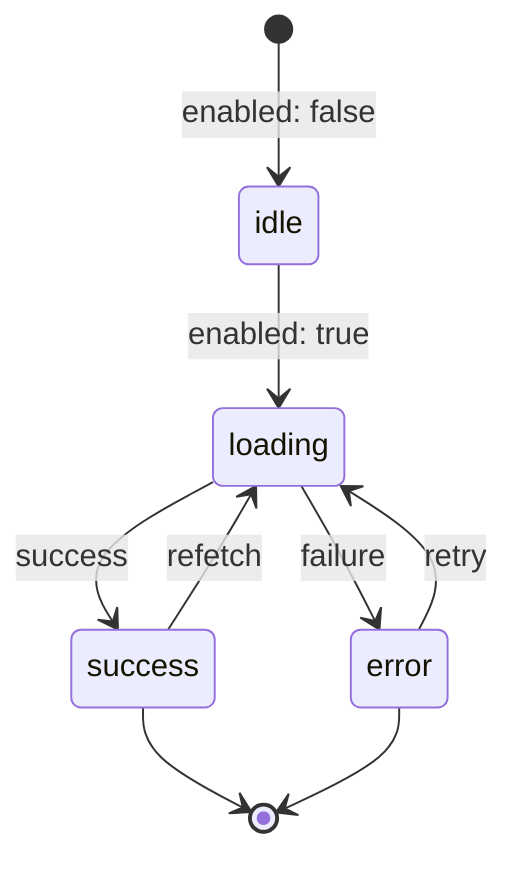
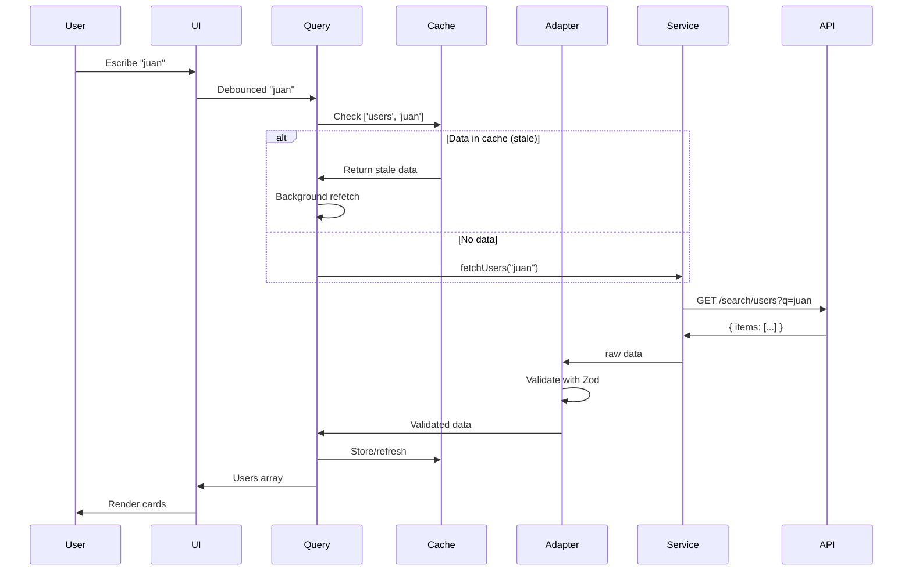
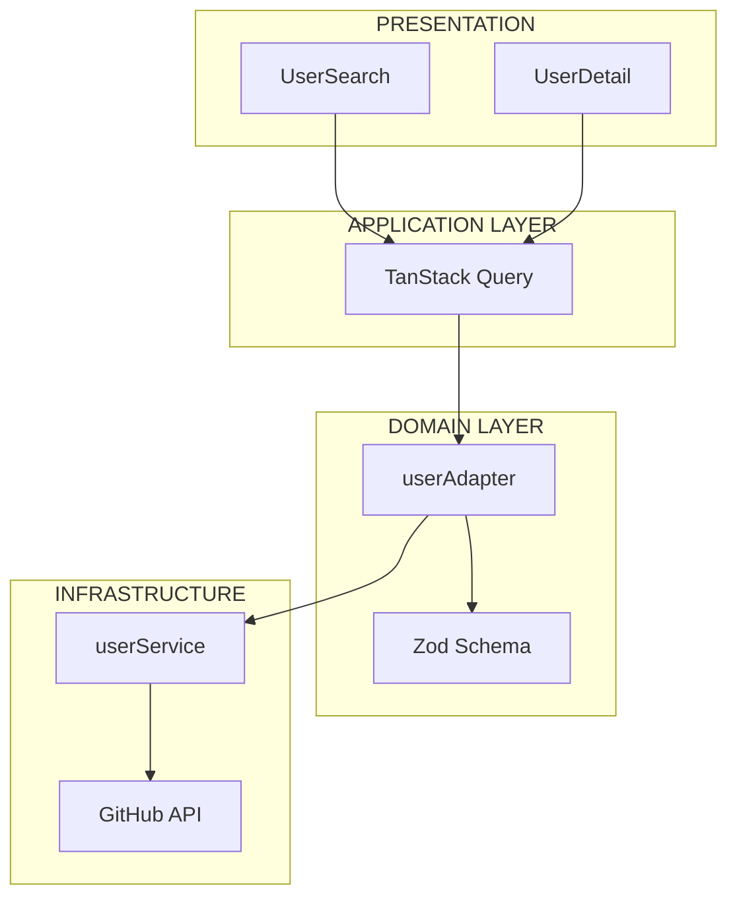

# 📚 EL LIBRO DE LA ARQUITECTURA: De Cero a Héroe en React + TanStack Query

> **Proyecto:** myprojectapi01 - Explorador de Perfiles GitHub
> **Metodología:** Cornell Notes System
> **Duración:** 8 semanas de estudio intensivo

---

## 📋 GLOSARIO COMPLETO DE TÉRMINOS

### A

- **Adapter (Patrón Adaptador):** Design pattern que convierte una interfaz incompatible en otra compatible. En este proyecto, transforma los datos crudos de GitHub API en nuestro modelo interno.

- **API (Application Programming Interface):** Conjunto de definiciones y protocolos para comunicar software. GitHub REST API permite consultar usuarios, repositorios, etc.

- **Arrow Function:** Sintaxis moderna de funciones en ES6 (`const suma = (a, b) => a + b`).

### B

- **Bundle:** Archivo único que contiene todo el código JavaScript de la app, generado por Vite.

- **Build:** Proceso de compilación que transforma código fuente en archivos optimizados para producción.

### C

- **Cache:** Almacenamiento temporal de datos para evitar descargas repetidas.

- **Callback:** Función pasada como argumento a otra función que se ejecuta después de un evento.

- **Closure:** Función que recuerda el ámbito léxico donde fue creada.

- **Component (Componente):** Bloque reutilizable de UI que encapsula su propio estado y renderizado.

- **Container Pattern:** Patrón donde un componente "inteligente" maneja lógica y pasa datos a componentes "tontos" (presentacionales).

- **Context API:** Mecanismo de React para compartir datos sin pasar props manualmente por cada nivel.

- **Concurrent Mode:** Característica de React 18 que permite múltiples estados de renderizado simultáneos.

### D

- **Debounce:** Técnica que retrasa la ejecución hasta que el usuario deja de interactuar. Evita demasiadas peticiones HTTP mientras escribe.

- **DOM (Document Object Model):** Representación en memoria del documento HTML que React manipula.

- **DRY (Don't Repeat Yourself):** Principio que busca evitar duplicación de código mediante abstracción y reuso.

### E

- **ESLint:** Herramienta que analiza código JavaScript para detectar errores y enforces normas de estilo.

- **Endpoint:** URL específica de una API que devuelve un recurso concreto.

- **Effect (useEffect):** Hook de React para ejecutar efectos secundarios en componentes.

### F

- **Facade (Patrón Fachada):** Interfaz simplificada que oculta complejidad interna. En nuestro proyecto, los hooks `useUserSearchFacade` ocultan la complejidad de TanStack Query.

- **Feature-Sliced Design (FSD):** Metodología de arquitectura que organiza código por funcionalidad de negocio en lugar de por tipo de archivo.

- **Framework:** Marco de trabajo que proporciona estructura y herramientas para desarrollar apps.

### G

- **Git:** Sistema de control de versiones para rastrear cambios en código.

- **GitHub Pages:** Servicio de hosting estático gratuito de GitHub.

### H

- **Hook:** Función especial de React que permite usar características del framework (estado, efectos, contexto).

- **HTTP:** Protocolo de transferencia de hipertexto para comunicación cliente-servidor.

### I

- **IIFE (Immediately Invoked Function Expression):** Función que se ejecuta inmediatamente después de definirse.

- **Imperative vs Declarative:**
  - Imperative = cómo hacer (step by step)
  - Declarative = qué hacer (resultado esperado)

- **Input:** Datos que entran al sistema (en este caso, el texto de búsqueda del usuario).

### J

- **JSX:** Extensión de sintaxis que permite escribir HTML dentro de JavaScript.

### L

- **Lazy Loading:** Técnica que carga componentes o recursos solo cuando se necesitan.

- **Lifecycle (Ciclo de Vida):** Fases por las que pasa un componente: mount → update → unmount.

### M

- **Mock:** Implementación falsa que simula el comportamiento de un componente real.

- **MSW (Mock Service Worker):** Biblioteca que intercepta peticiones HTTP en el navegador para retornar respuestas mock.

- **Middleware:** Software que actúa entre dos aplicaciones, modificando la comunicación.

### N

- **npm/pnpm:** Gestores de paquetes para Node.js. pnpm es más eficiente con el espacio.

### O

- **Observables:** Secuencias de datos que emit values over time.

### P

- **Promise:** Objeto que representa una operación asíncrona que puede completarse o fallar.

- **Props (Properties):** Datos que se pasan de un componente padre a un componente hijo.

- **Provider:** Componente que proporciona contexto a toda la jerarquía de componentes.

### R

- **React Query (TanStack Query):** Biblioteca que gestiona el estado del servidor (datos de APIs remotas).

- **Redux:** Biblioteca de gestión de estado global (ya no usamos en este proyecto).

- **Ref (useRef):** Hook que crea una referencia mutable que no causa re-render.

- **Router:** Sistema de navegación que permite cambiar vistas sin recargar la página.

### S

- **Schema:** Definición de estructura de datos. Zod usa esquemas para validación.

- **Side Effect:** Operación que afecta el mundo exterior (API, localStorage, console).

- **SPA (Single Page Application):** Aplicación web de página única que carga dinámicamente.

- **State (Estado):** Datos mutables dentro de un componente que determinan su renderizado.

- **Stale-While-Revalidate:** Estrategia de caché que sirve datos antiguos mientras obtiene nuevos en background.

### T

- **Tailwind CSS:** Framework CSS utilitario que usa clases en lugar de archivos CSS tradicionales.

- **TanStack Query:** Ver React Query.

- **Token:** Variable CSS que define un valor reutilizable (colores, espaciado, fuentes).

### U

- **useCallback:** Hook que memoriza una función para evitar recrearla en cada render.

- **useMemo:** Hook que memoriza un valor calculado para evitar recalcularlo.

- **useState:** Hook que añade estado local a un componente funcional.

### V

- **Vite:** Build tool moderna con servidor de desarrollo rápido.

- **Virtual DOM:** Representación lightweight del DOM real que React usa para optimizaciones.

### Z

- **Zod:** Biblioteca de validación de esquemas que verifica tipos en tiempo de ejecución.

---

# 🎓 CAPÍTULO 1: FUNDAMENTOS DE JAVASCRIPT MODERNO

## 1.1 ¿Por qué JavaScript?

JavaScript es el lenguaje de la web. Todos los navegadores lo ejecutan nativamente, y con Node.js también puede ejecutarse en servidores. Es el único lenguaje que puede ejecutarse en frontend y backend.

### Variables: var, let, y const

```javascript
// ❌ var (legacy, función scope, hoisting)
var name = "Juan";
name = "Pedro"; //mutable

// ✅ let (block scope, mutable)
let age = 25;
age = 26; // ✅ permitido

// ✅ const (block scope, referencia inmutable)
const API_URL = "https://api.github.com";
// API_URL = "otra"; // ❌ Error: no puedes reasignar
```

**¿Por qué evitar var?**
- `var` tiene comportamiento extraño con hoisting
- No tiene block scope, solo function scope
- Puede causar bugs difíciles de detectar

### Tipos de Datos Primitivos

```javascript
// Strings
const nombre = "Juan";
const mensaje = `Hola, ${nombre}`; // Template literals

// Numbers
const edad = 25;
const precio = 19.99;

// Booleans
const activo = true;
const pendiente = false;

// Null vs Undefined
const usuario = null;       // Intencionalmente vacío
let email;                  // No inicializado → undefined
```

---

## 1.2 Funciones: El Bloque Fundamental

Las funciones son "máquinas" que procesan inputs y retornan outputs.

### Function Declaration

```javascript
// Se hoista (puede llamarse antes de definirse)
function saludar(nombre) {
  return `Hola, ${nombre}`;
}

saludar("Juan"); // "Hola, Juan"
```

### Function Expression

```javascript
// No se hoista
const saludar = function(nombre) {
  return `Hola, ${nombre}`;
};
```

### Arrow Functions (Más comunes en React)

```javascript
// Sintaxis corta
const saludar = (nombre) => `Hola, ${nombre}`;

// Con cuerpo
const saludar = (nombre) => {
  const mensaje = `Hola, ${nombre}`;
  return mensaje;
};

// Múltiples parámetros
const sumar = (a, b) => a + b;
```

---

## 1.3 Arrays: Manipulación de Listas

Los arrays son listas ordenadas de valores.

```javascript
const usuarios = ["Juan", "Pedro", "Maria", "Ana"];

// map: transformar cada elemento
const upperCased = usuarios.map(u => u.toUpperCase());
// ["JUAN", "PEDRO", "MARIA", "ANA"]

// filter: seleccionar elementos
const filtrados = usuarios.filter(u => u.startsWith("J"));
// ["Juan"]

// reduce: acumular a un solo valor
const numeros = [1, 2, 3, 4];
const suma = numeros.reduce((acc, curr) => acc + curr, 0);
// 10

// find: buscar primer elemento
const encontrado = usuarios.find(u => u === "Juan");

// some/every: verificar condiciones
const tieneJ = usuarios.some(u => u.startsWith("J"));
const todosTienen4 = usuarios.every(u => u.length === 4);
```

---

## 1.4 Objetos: Datos Estructurados

Los objetos almacenan datos como pares clave-valor.

```javascript
const usuario = {
  nombre: "Juan",
  edad: 30,
  ciudad: "Madrid",
  esActivo: true,
  
  // Método
  saludar() {
    return `Hola, soy ${this.nombre}`;
  }
};

// Destructuring
const { nombre, edad } = usuario;

// Spread operator (copia superficial)
const usuarioActualizado = { ...usuario, edad: 31 };

// Object methods
Object.keys(usuario);   // ["nombre", "edad", "ciudad", "esActivo", "saludar"]
Object.values(usuario); // ["Juan", 30, "Madrid", true, f]
```

---

## 1.5 Módulos: Organizando Código

JavaScript moderno usa módulos para organizar código en archivos separados.

```javascript
// math.js - Exportar
export const suma = (a, b) => a + b;
export const resta = (a, b) => a - b;
export default class Calculadora { }

// main.js - Importar
import Calculadora, { suma, resta } from "./math.js";
```

---

## 1.6 Async/Await: Código Asíncrono

El código asíncrono no bloquea la ejecución. Esencial para llamadas API.

```javascript
// Promise: Representa una operación futura
const fetchUser = () => {
  return new Promise((resolve, reject) => {
    setTimeout(() => {
      resolve({ id: 1, nombre: "Juan" });
    }, 1000);
  });
};

// .then/.catch (más viejo)
fetchUser()
  .then(user => console.log(user))
  .catch(err => console.error(err));

// async/await (moderno y preferido)
const getUser = async () => {
  try {
    const user = await fetchUser();
    console.log(user);
    return user;
  } catch (err) {
    console.error("Error:", err);
  }
};
```

### Ejercicios del Capítulo 1

1. Crea una función que reciba un array de números y retorne la suma
2. Crea una función que filtre usuarios mayores de edad
3. Crea una función async que simulate una llamada API con delay
4. Experimenta con destructuring y spread operator

---

# 🎓 CAPÍTULO 2: REACT FUNDAMENTALS

## 2.1 ¿Qué es React?

React es una librería JavaScript para construir interfaces de usuario. Fue creada por Meta (Facebook) en 2011 y se usa en Facebook, Instagram, WhatsApp, Netflix, y miles de otras apps.

### Por qué React cambió todo

1. **Componentes:** Bloques reutilizables que encapsulan UI y lógica
2. **Virtual DOM:** Representación lightweight que optimiza actualizaciones
3. **Unidirectional Data Flow:** Datos fluyen en una dirección, fácil de seguir
4. **Ecosistema:** Gran comunidad, librerías, herramientas

### El Virtual DOM: La Magia behind the scenes

```javascript
// Imagina el DOM como un árbol
// <div>
//   <h1>Título</h1>
//   <p>Párrafo</p>
// </div>

// React crea una copia virtual en memoria
// Cuando cambia el estado, React compara
// el Virtual DOM anterior con el nuevo
// y actualiza SOLO lo que cambió en el DOM real
```

Esto es mucho más rápido que actualizar todo el DOM directamente.

---

## 2.2 JSX: HTML en JavaScript

JSX permite escribir UI como si fuera HTML, pero en realidad es JavaScript.

```jsx
// Este código parece HTML, pero es JavaScript
const elemento = <h1>Hola Mundo</h1>;

// Puedes usar expresiones JavaScript dentro de {}
const nombre = "Juan";
const elemento = <h1>Hola, {nombre}</h1>;

// Condicionales
const isLoggedIn = true;
const elemento = (
  <div>
    {isLoggedIn ? <Dashboard /> : <Login />}
  </div>
);

// Listas
const usuarios = [
  { id: 1, nombre: "Juan" },
  { id: 2, nombre: "Maria" }
];

const lista = (
  <ul>
    {usuarios.map(u => (
      <li key={u.id}>{u.nombre}</li>
    ))}
  </ul>
);
```

---

## 2.3 Componentes: Los Bloques de Construcción

### Componente Funcional (Recomendado)

```jsx
import PropTypes from "prop-types";

const UserCard = ({ name, avatar, onClick }) => {
  // Hooks van aquí dentro
  
  return (
    <div className="card" onClick={onClick}>
      
      <h3>{name}</h3>
    </div>
  );
};

// Validación de props
UserCard.propTypes = {
  name: PropTypes.string.isRequired,
  avatar: PropTypes.string,
  onClick: PropTypes.func,
};

UserCard.defaultProps = {
  avatar: "",
  onClick: () => {},
};

export default UserCard;
```

### ¿Por qué componentes?

- **Reusabilidad:** El mismo componente en múltiples lugares
- **Mantenimiento:** Cambios en un lugar afectan todos los usos
- **Testabilidad:** Puedes testar cada componente aisladamente
- **Organización:** Código más limpio y estructurado

---

## 2.4 useState: Estado Local

El estado es datos que cambian con el tiempo. useState permite añadir estado a componentes funcionales.

```jsx
import { useState } from "react";

const Contador = () => {
  // useState retorna un array con 2 elementos:
  // 1. El valor actual del estado
  // 2. Función para actualizar el estado
  const [contador, setContador] = useState(0);

  const incrementar = () => {
    setContador(contador + 1); // Actualiza el estado
    // React re-renderiza el componente automáticamente
  };

  const decrementar = () => {
    setContador(c => c - 1); // Forma funcional: usa el valor anterior
  };

  return (
    <div>
      <p>Contador: {contador}</p>
      <button onClick={incrementar}>+</button>
      <button onClick={decrementar}>-</button>
    </div>
  );
};
```

### Ejemplo más complejo: Input controlado

```jsx
const Buscador = () => {
  const [termino, setTermino] = useState("");
  const [resultados, setResultados] = useState([]);

  const buscar = async () => {
    const data = await fetch(`/api/buscar?q=${termino}`);
    const json = await data.json();
    setResultados(json);
  };

  return (
    <div>
      <input 
        value={termino}  // Input controlado por estado
        onChange={(e) => setTermino(e.target.value)}
      />
      <button onClick={buscar}>Buscar</button>
      <ul>
        {resultados.map(r => <li key={r.id}>{r.nombre}</li>)}
      </ul>
    </div>
  );
};
```

---

## 2.5 useEffect: Efectos Secundarios

useEffect ejecuta código cuando el componente monta, actualiza o desmonta.

```jsx
import { useEffect, useState } from "react";

const DatosUsuario = ({ userId }) => {
  const [usuario, setUsuario] = useState(null);
  const [cargando, setCargando] = useState(true);

  // Se ejecuta al montar Y cuando userId cambia
  useEffect(() => {
    setCargando(true);
    
    fetch(`/api/users/${userId}`)
      .then(res => res.json())
      .then(data => {
        setUsuario(data);
        setCargando(false);
      })
      .catch(err => {
        console.error(err);
        setCargando(false);
      });

    // Cleanup: se ejecuta al desmontar o antes de volver a ejecutar
    return () => {
      console.log("Limpiando...");
    };
  }, [userId]); // Array de dependencias

  // Solo al montar (una vez)
  useEffect(() => {
    console.log("Componente montado");
  }, []); // Empty array = solo mount

  if (cargando) return <p>Cargando...</p>;
  if (!usuario) return <p>Usuario no encontrado</p>;

  return (
    <div>
      <h2>{usuario.nombre}</h2>
      <p>{usuario.email}</p>
    </div>
  );
};
```

### Patrones comunes de useEffect

| Patrón | Código | Cuándo usarlo |
|--------|--------|---------------|
| Mount | `useEffect(() => {}, [])` | Inicializar datos |
| Update | `useEffect(() => {}, [dep])` | Cuando cambia algo |
| Cleanup | `return () => {}` | Cleanup al desmontar |

---

## 2.6 useRef: Referencias

useRef crea una referencia mutable que no causa re-render.

```jsx
import { useRef, useEffect } from "react";

const InputEnfocado = () => {
  const inputRef = useRef(null);

  useEffect(() => {
    // Enfocar el input al montar
    inputRef.current.focus();
  }, []);

  return <input ref={inputRef} type="text" />;
};
```

### Diferencia entre useState y useRef

| Característica | useState | useRef |
|----------------|----------|--------|
| Causa re-render | ✅ Sí | ❌ No |
| Persiste entre renders | ✅ Sí | ✅ Sí |
| Actualización async | ✅ Sí | ⚠️ Manual |

---

## 2.7 Context API: Datos Globales

Context permite compartir datos sin pasar props por cada nivel.

```jsx
import { createContext, useContext } from "react";

// 1. Crear el contexto
const ThemeContext = createContext("light");

// 2. Provider (envuelve la app)
const App = () => (
  <ThemeContext.Provider value="dark">
    <Header />
    <Main />
    <Footer />
  </ThemeContext.Provider>
);

// 3. Consumir el contexto
const Header = () => {
  const theme = useContext(ThemeContext);
  return <header className={theme}>Header</header>;
};
```

### Ejercicios del Capítulo 2

1. Crea un componente que muestre un contador con increment/decrement
2. Crea un input que muestre el texto en tiempo real
3. Crea un componente que cargue datos de una API fake
4. Implementa un ThemeToggle que cambie entre light/dark

---

# 🎓 CAPÍTULO 3: ARQUITECTURA Y PATRONES

## 3.1 Feature-Sliced Design (FSD)

FSD es una metodología de arquitectura que organiza código por funcionalidad de negocio. Es como organizar una cocina por platos (italiana, mexicana, japonesa) en lugar de por utensilios (cuchillos, sartenes, ollas).

### Estructura FSD del Proyecto

```
src/
├── app/                    # Configuración global
│   ├── providers.jsx       # Providers de React
│   └── logger.js          # Sistema de logging
├── components/            # Componentes reutilizables
│   ├── ui/                # UI atómica (Button, Input, Card)
│   └── layout/            # Layout (Header, Footer)
├── features/             # Módulos de negocio ★★★
│   ├── users/            # Feature: búsqueda de usuarios
│   │   ├── components/  # Componentes específicos
│   │   ├── hooks/       # Hooks específicos
│   │   └── users.jsx    # Entry point
│   └── user-detail/     # Feature: detalle de usuario
├── services/            # Capa de infraestructura
├── models/             # Capa de dominio
└── hooks/             # Hooks globales
```

### ¿Por qué FSD?

| Organización por tipo | Organización por feature |
|-----------------------|-------------------------|
| /components | /features/users |
| /hooks | /features/user-detail |
| /utils | /features/settings |
| Difícil de escalar | Cada feature es independiente |

### Beneficios de FSD

1. **Aislamiento:** Cada feature es independiente
2. **Escalabilidad:** Agregar features sin romper existentes
3. **Mantenimiento:** Código relacionado en un lugar
4. **Testabilidad:** Cada feature testeable independientemente

---

## 3.2 Patrón Adapter: Traductor de Datos

El Patrón Adapter traduce datos de un formato a otro. Imagina un enchufe americano en un tomacorriente europeo - necesitas un adaptador.

### El Problema: API Externas Cambian

```javascript
// GitHub API devuelve:
{
  "login": "octocat",
  "avatar_url": "https://avatars.githubusercontent.com/u/583231?v=4",
  "html_url": "https://github.com/octocat",
  "public_repos": 158,
  "followers": 8750,
  "following": 9
}

// Tu UI espera:
{
  "username": "octocat",
  "photo": "https://avatars.githubusercontent.com/u/583231?v=4",
  "profileUrl": "https://github.com/octocat",
  "repos": 158,
  "followers": 8750,
  "following": 9
}
```

Si GitHub cambia `login` a `username`, tu app falla. El Adapter protege tu UI de cambios externos.

### La Solución

```javascript
// src/models/adapters/userAdapter.js

/**
 * Transforma datos crudos de GitHub al modelo interno de la app
 * 
 * Este adapter protege la UI de cambios en la API de GitHub.
 * Si GitHub cambia sus nombres de campo, solo cambiamos aquí.
 * 
 * @param {Object} rawData - Datos crudos de GitHub API
 * @returns {Object} Modelo interno normalizado
 * @throws {ZodError} Si los datos no cumplen el esquema
 */
export const userAdapter = (rawData) => {
  if (!rawData) return null;

  return {
    username: rawData.login,
    photo: rawData.avatar_url,
    profileUrl: rawData.html_url,
    repos: rawData.public_repos,
    followers: rawData.followers,
    following: rawData.following,
    name: rawData.name || rawData.login,
    bio: rawData.bio,
    location: rawData.location,
    website: rawData.blog,
  };
};
```

---

## 3.3 Patrón Facade: Simplificando Interfaces

El patrón Facade proporciona una interfaz simple para sistemas complejos.

### El Problema: Componente Conoce Demasiado

```jsx
// ❌ Componente sabiendo demasiado
const UserSearch = () => {
  const [search, setSearch] = useState("");
  
  // El componente sabe too much about TanStack Query
  const { 
    data, 
    isLoading, 
    isError, 
    error, 
    refetch,
    isFetching 
  } = useQuery({
    queryKey: ['users', search],
    queryFn: () => fetchUsers(search),
    enabled: search.length > 0,
    staleTime: 5 * 60 * 1000,
    retry: 3,
    retryDelay: attemptIndex => Math.min(1000 * 2 ** attemptIndex, 30000),
    refetchOnWindowFocus: false,
    refetchOnMount: true,
    // ... 20+ opciones más
  });

  // Lógica de debounce también aquí
  // Manejo de errores duplicado
  // etc.
};
```

### La Solución: Facade Hook

```javascript
// src/features/users/hooks/useUserSearchFacade.js

/**
 * Hook fachada para búsqueda de usuarios
 * 
 * Oculta la complejidad de TanStack Query y proporciona
 * una interfaz simple y semántica para los componentes.
 * 
 * @param {string} searchTerm - Término de búsqueda
 * @returns {Object} Estado simplificado
 */
export const useUserSearchFacade = (searchTerm) => {
  // Aquí está toda la complejidad
  const { users, isSearching, searchError, refetch } = useUserSearchQuery(searchTerm);

  // El componente solo recibe lo que necesita
  return {
    users: users || [],
    isSearching,
    isEmpty: !isSearching && users?.length === 0,
    error: searchError,
    refetch,
  };
};
```

### Beneficios del Facade

1. **Separación de responsabilidades:** Componente solo renderiza, Hook maneja lógica
2. **Mantenibilidad:** Cambios en TanStack Query solo afectan al Facade
3. **Testabilidad:** Puedes testar el Facade independientemente
4. **Claridad:** El componente es más legible

---

## 3.4 Service Layer: Capa de Infraestructura

Los servicios manejan la comunicación con APIs externas.

```javascript
// src/services/userService.js

/**
 * Cliente HTTP base para GitHub API
 */
const API_BASE = "https://api.github.com";

/**
 * Busca usuarios en GitHub
 * 
 * @async
 * @param {string} searchTerm - Término de búsqueda
 * @param {AbortSignal} signal - Signal para cancelación
 * @returns {Promise<Object>} Respuesta de GitHub
 */
export const fetchUsersAPI = async (searchTerm, signal) => {
  const response = await fetch(
    `${API_BASE}/search/users?q=${encodeURIComponent(searchTerm)}`,
    {
      headers: {
        Accept: "application/vnd.github.v3+json",
      },
      signal, // Para cancelación
    }
  );

  if (!response.ok) {
    throw new Error(`GitHub API error: ${response.status}`);
  }

  return response.json();
};
```

### Ejercicios del Capítulo 3

1. Crea un nuevo Adapter para otra API
2. Crea un Facade para un caso de uso diferente
3. Implementa un Service que maneje errores específicos

---

# 🎓 CAPÍTULO 4: TANSTACK QUERY

## 4.1 ¿Por qué TanStack Query?

En aplicaciones React típicas, hay dos tipos de estado:

| Tipo | Descripción | Ejemplo | Herramienta |
|------|-------------|---------|-------------|
| **Cliente** | Datos locales que mutation el usuario | Tema, form data | useState, useReducer |
| **Servidor** | Datos de APIs remotas | Usuarios, posts | TanStack Query |

### El Problema del Fetch Manual

```jsx
// ❌ Fetch manual (mucho código repetitivo)
const [usuarios, setUsuarios] = useState([]);
const [loading, setLoading] = useState(false);
const [error, setError] = useState(null);

useEffect(() => {
  setLoading(true);
  fetch('/api/users')
    .then(res => {
      if (!res.ok) throw new Error('Error');
      return res.json();
    })
    .then(data => setUsuarios(data))
    .catch(err => setError(err.message))
    .finally(() => setLoading(false));
}, []);

if (loading) return <Spinner />;
if (error) return <Error error={error} />;
return <UserList users={usuarios} />;

// Y esto hay que hacerlo para CADA endpoint
```

### La Solución: TanStack Query

```jsx
// ✅ TanStack Query (declarativo)
const { data: usuarios, isLoading, error } = useQuery({
  queryKey: ['users'],
  queryFn: () => fetch('/api/users').then(res => res.json()),
});

if (isLoading) return <Spinner />;
if (error) return <Error error={error} />;
return <UserList users={usuarios} />;
```

### ¿Qué hace automáticamente TanStack Query?

| Feature | Descripción |
|---------|-------------|
| **Caching** | Guarda datos en caché por defecto |
| **Deduplication** | Evita múltiples peticiones iguales |
| **Background refetch** | Refresca datos stale automáticamente |
| **Retry** | Reintenta peticiones fallidas |
| **Cancellation** | Cancela peticiones cuando ya no se necesitan |
| **Optimistic updates** | Actualiza UI antes de confirmar servidor |

---

## 4.2 Configuración Global

```javascript
// src/app/providers.jsx
import { QueryClient, QueryClientProvider } from "@tanstack/react-query";

const queryClient = new QueryClient({
  defaultOptions: {
    queries: {
      // Tiempo antes de considerar datos stale (5 minutos)
      staleTime: 5 * 60 * 1000,
      
      // Tiempo antes de limpiar del caché (10 minutos)
      gcTime: 10 * 60 * 1000,
      
      // Reintentos automáticos (3)
      retry: 3,
      
      // Delay exponencial entre reintentos
      retryDelay: attemptIndex => 
        Math.min(1000 * 2 ** attemptIndex, 30000),
      
      // No refetch al recuperar foco de ventana
      refetchOnWindowFocus: false,
      
      // No refetch al montar si hay datos stale
      refetchOnMount: false,
    },
  },
});

export const AppProviders = ({ children }) => (
  <QueryClientProvider client={queryClient}>
    {children}
  </QueryClientProvider>
);
```

---

## 4.3 useQuery: Leyendo Datos

```javascript
import { useQuery } from "@tanstack/react-query";

const UserList = () => {
  const { 
    data,           // Datos retornados
    isLoading,     // Loading inicial
    isFetching,    // Cargando en background
    isError,       // Hay error
    error,         // El error
    isSuccess,     // Éxito
    refetch,       // Función para recargar
  } = useQuery({
    queryKey: ['users'],           // Identificador único
    queryFn: fetchUsers,           // Función que retorna Promise
    enabled: true,                 // Habilitar/deshabilitar
    staleTime: 5 * 60 * 1000,     // Tiempo stale
  });

  if (isLoading) return <Spinner />;
  if (isError) return <Error error={error} />;
  
  return <UserListComponent users={data} />;
};
```

### Estados de useQuery



### Query Keys: La Magia del Cache

```javascript
// La query key determina el caché
// Si la key cambia, se hace nueva petición

// Un solo valor
useQuery({ queryKey: ['user'], queryFn: ... });

// Con变量 - cada variable diferente = cache diferente
useQuery({ queryKey: ['user', userId], queryFn: ... });
useQuery({ queryKey: ['user', 'juan'], queryFn: ... }); // cache miss
useQuery({ queryKey: ['user', 'juan'], queryFn: ... }); // cache hit!

// Array
useQuery({ queryKey: ['users', 'juan', 'followers'], ... });
```

---

## 4.4 useMutation: Escribiendo Datos

```javascript
import { useMutation, useQueryClient } from "@tanstack/react-query";

const CreateUserForm = () => {
  const queryClient = useQueryClient();

  const mutation = useMutation({
    mutationFn: createUser,
    
    // Antes de ejecutar (optimistic update)
    onMutate: async (newUser) => {
      // Cancelar queries en curso
      await queryClient.cancelQueries({ queryKey: ['users'] });

      // Snapshot del estado anterior
      const previousUsers = queryClient.getQueryData(['users']);

      // Actualizar caché optimísticamente
      queryClient.setQueryData(['users'], (old) => [
        ...old,
        { id: Math.random(), ...newUser }
      ]);

      return { previousUsers };
    },
    
    // Si falla
    onError: (err, newUser, context) => {
      queryClient.setQueryData(['users'], context.previousUsers);
    },
    
    // Siempre después (refetch)
    onSettled: () => {
      queryClient.invalidateQueries({ queryKey: ['users'] });
    },
  });

  const handleSubmit = (data) => {
    mutation.mutate(data);
  };

  return (
    <form onSubmit={handleSubmit}>
      {mutation.isPending && "Creando..."}
      {mutation.isError && `Error: ${mutation.error.message}`}
      <button type="submit" disabled={mutation.isPending}>
        Crear
      </button>
    </form>
  );
};
```

---

## 4.5 Debounce: Evitar Peticiones Excessivas

```javascript
import { useState, useEffect } from "react";

/**
 * Hook que retarda la actualización de un valor
 * 
 * @param {any} value - Valor a debounce
 * @param {number} delay - Milisegundos de delay
 * @returns {any} Valor con delay
 */
const useDebouncedSearch = (value, delay = 300) => {
  const [debouncedValue, setDebouncedValue] = useState(value);

  useEffect(() => {
    const timer = setTimeout(() => {
      setDebouncedValue(value);
    }, delay);

    return () => clearTimeout(timer);
  }, [value, delay]);

  return debouncedValue;
};

// Uso
const Search = () => {
  const [term, setTerm] = useState("");
  const debouncedTerm = useDebouncedSearch(term, 300);

  const { data } = useQuery({
    queryKey: ['users', debouncedTerm],
    queryFn: () => searchUsers(debouncedTerm),
    enabled: debouncedTerm.length >= 3, // Solo buscar con 3+ caracteres
  });
};
```

### Ejercicios del Capítulo 4

1. Implementa useQuery con manejo de errores completo
2. Crea un useMutation con optimistic update
3. Implementa debounce desde cero

---

# 🎓 CAPÍTULO 5: TAILWIND CSS V4

## 5.1 Filosofía Utility-First

Tailwind CSS no tiene componentes predefinidos. En su lugar, proporciona clases utilitarias pequeñas que se combinan.

### CSS Tradicional vs Tailwind

```css
/* CSS tradicional */
.btn-primary {
  background-color: #0071e3;
  color: white;
  padding: 8px 16px;
  border-radius: 8px;
  font-weight: 500;
  transition: all 0.2s;
}

.btn-primary:hover {
  background-color: #005bb5;
}
```

```jsx
<!-- Tailwind CSS -->
<button className="bg-blue-600 text-white px-4 py-2 rounded-lg font-medium hover:bg-blue-700 transition-colors">
  Click me
</button>
```

### ¿Por qué utility-first?

1. **No más nombres de clases inventados:** `btn-primary`, `card-wrapper`, `header-container`
2. **Consistencia:** Mismos valores en todo el proyecto
3. **Tamaño:** Solo se incluye lo que usas
4. **Mantenimiento:** Sin archivos CSS gigante

---

## 5.2 Sistema de Tokens

Tailwind v4 usa CSS custom properties como tokens.

```css
/* src/index.css */
@theme {
  --color-app-bg: #ffffff;
  --color-app-surface: #f8f9fa;
  --color-app-text: #111111;
  --color-app-muted: #6b7280;
  --color-app-accent: #0071e3;
  --color-app-border: rgba(0, 0, 0, 0.08);
  
  --font-sans: "Inter", system-ui, sans-serif;
}
```

Ahora puedes usar estos tokens:

```html
<div className="bg-app-bg text-app-text">
  <h1 className="font-sans text-app-accent">Título</h1>
</div>
```

---

## 5.3 cn(): Combinar Classes Condicionalmente

```javascript
// src/lib/utils.js
import { clsx } from "clsx";
import { twMerge } from "tailwind-merge";

/**
 * Combina clases de Tailwind inteligentemente
 * 
 * @param {...(string|boolean|undefined)} args - Classes to combine
 * @returns {string} Combined classes
 */
export const cn = (...args) => twMerge(clsx(args));
```

### Uso

```jsx
import { cn } from "@/lib/utils";

const Button = ({ variant = "primary", className, children }) => (
  <button className={cn(
    "px-4 py-2 rounded-lg font-medium",
    // variant condicional
    variant === "primary" && "bg-blue-600 text-white",
    variant === "secondary" && "bg-gray-200 text-gray-800",
    // override externo
    className
  )}>
    {children}
  </button>
);
```

---

## 5.4 Ejemplos de Clases Comunes

```jsx
// Layout
<div className="flex flex-col gap-4 items-center justify-between">

// Espaciado
<div className="p-4 m-2 space-y-6">

// Tipografía
<h1 className="text-3xl font-bold tracking-tight">
<p className="text-base text-gray-600 leading-relaxed">

// Colores
<div className="bg-blue-500 text-white border border-gray-200">

// Responsive
<div className="grid grid-cols-1 md:grid-cols-2 lg:grid-cols-4">

// Estados
<button className="opacity-50 disabled:opacity-100 hover:bg-blue-700 focus:ring-2">
```

### Ejercicios del Capítulo 5

1. Crea un Card component con Tailwind
2. Implementa un sistema de variantes (primary, secondary, danger)
3. Crea un layout responsive con grid y flexbox

---

# 🎓 CAPÍTULO 6: ZOD - VALIDACIÓN EN RUNTIME

## 6.1 El Problema: APIs Externas Pueden Fallar

Las APIs externas no son confiables. Pueden:
- Cambiar nombres de campos
- Enviar tipos incorrectos
- Enviar campos opcionales donde esperas requeridos
- Enviarnos cualquier cosa

### Sin validación:

```javascript
// API retorna algo diferente
const data = await fetchUser("juan");
// { user: "juan" } en vez de { username: "juan" }

const username = data.username; // undefined!
// Tu UI muestra "undefined" silenciosamente
```

### Con TypeScript (build-time):

```typescript
// Typescript falla en build, no en runtime
interface User {
  username: string;
}

const user: User = data; // Error en build
```

### Con Zod (runtime):

```javascript
import { z } from "zod";

const UserSchema = z.object({
  username: z.string(),
});

// En runtime, esto LANZA un error si no es válido
const user = UserSchema.parse(data);
```

---

## 6.2 Definiendo Esquemas

```javascript
import { z } from "zod";

// Esquema básico
const UserSchema = z.object({
  username: z.string(),
  email: z.string().email(),
  age: z.number().optional(),
});

// Arrays
const UsersSchema = z.array(UserSchema);

// Con validación compleja
const AdvancedSchema = z.object({
  username: z.string().min(3).max(20),
  email: z.string().email(),
  role: z.enum(["admin", "user", "guest"]),
  settings: z.object({
    notifications: z.boolean(),
    theme: z.enum(["light", "dark"]),
  }),
});
```

### Validación con safeParse

```javascript
const result = UserSchema.safeParse(data);

if (!result.success) {
  // Manejar error
  console.error(result.error.issues);
  return;
}

const user = result.data; // Tipado correctamente
```

---

## 6.3 Integración con Adapter

```javascript
// src/models/adapters/userAdapter.js
import { z } from "zod";

// 1. Definir esquema
const GitHubUserSchema = z.object({
  login: z.string(),
  avatar_url: z.string().url(),
  html_url: z.string().url(),
  public_repos: z.number(),
  followers: z.number(),
  following: z.number(),
  name: z.string().optional(),
  bio: z.string().nullable().optional(),
  location: z.string().optional(),
});

// 2. Validar en el adapter
export const userAdapter = (rawData) => {
  // Valida antes de transformar
  const validated = GitHubUserSchema.parse(rawData);
  
  // Transforma al modelo interno
  return {
    username: validated.login,
    photo: validated.avatar_url,
    profileUrl: validated.html_url,
    repos: validated.public_repos,
    followers: validated.followers,
    following: validated.following,
  };
};
```

---

## 6.4 ¿Por qué Zod y no solo TypeScript?

| Aspecto | TypeScript | Zod |
|---------|-----------|-----|
| **Tiempo de ejecución** | ❌ No | ✅ Sí |
| **Errores visibles** | ❌ Build | ✅ Console/Runtime |
| **APIs externas** | ❌ No detecta | ✅ Detecta |
| **Validación compleja** | ⚠️ Limitado | ✅ Potente |

### Ejercicios del Capítulo 6

1. Crea un esquema Zod para un formulario de registro
2. Implementa validación anidada
3. Crea un adapter completo con Zod

---

# 🎓 CAPÍTULO 7: FLUJO COMPLETO DEL PROYECTO

## 7.1 El Flujo de Datos de extremo a extremo



---

## 7.2 Estructura de Archivos Explicada

```
src/
├── app/
│   ├── providers.jsx      # Config global de React Query
│   └── logger.js          # Sistema de logging
│
├── features/              # ★ FEATURES FSD ★
│   ├── users/
│   │   ├── components/
│   │   │   ├── UserSearch.jsx    # Componente principal de búsqueda
│   │   │   ├── UserCard.jsx      # Tarjeta individual de usuario
│   │   │   └── UserGrid.jsx      # Grid de tarjetas
│   │   ├── hooks/
│   │   │   ├── useUserSearchQuery.js    # Query hook interno
│   │   │   └── useUserSearchFacade.js   # Fachada pública
│   │   └── users.jsx           # Entry point del feature
│   │
│   └── user-detail/
│       ├── components/
│       │   ├── UserDetail.jsx   # Vista de detalle
│       │   └── StatsCard.jsx    # Tarjeta de estadísticas
│       ├── hooks/
│       │   ├── useUserDetailQuery.js
│       │   └── useUserDetailFacade.js
│       └── user-detail.jsx
│
├── services/              # Capa de infraestructura
│   └── userService.js     # Funciones que llaman a GitHub API
│
├── models/                # Capa de dominio
│   ├── adapters/
│   │   └── userAdapter.js # Transformador de datos
│   └── types/
│       └── schemas.js     # Esquemas Zod
│
├── components/            # Componentes reutilizables globales
│   ├── ui/
│   │   └── ThemeToggle.jsx
│   └── layout/
│       └── Header.jsx
│
└── hooks/                 # Hooks globales
    ├── useDebouncedSearch.js
    └── useTheme.js
```

---

## 7.3 Cada Archivo Explicado

### services/userService.js
```javascript
// Responsable: Llamar a APIs externas
// No conoce la UI, solo retorna datos crudos

export const fetchUsersAPI = async (term, signal) => {
  const res = await fetch(`https://api.github.com/search/users?q=${term}`, {
    headers: { Accept: "application/vnd.github.v3+json" },
    signal,
  });
  if (!res.ok) throw new Error("API Error");
  return res.json();
};
```

### models/adapters/userAdapter.js
```javascript
// Responsable: Transformar datos crudos a modelo interno
// Protege la UI de cambios en la API externa

export const userAdapter = (raw) => ({
  username: raw.login,
  photo: raw.avatar_url,
  // ...
});
```

### features/users/hooks/useUserSearchQuery.js
```javascript
// Responsable: Lógica de TanStack Query
// Configura caching, retries, etc.

export const useUserSearchQuery = (term) => {
  return useQuery({
    queryKey: ['users', term],
    queryFn: () => searchUsers(term),
    enabled: term.length >= 3,
  });
};
```

### features/users/hooks/useUserSearchFacade.js
```javascript
// Responsable: Interfaz simple para componentes
// Oculta complejidad de TanStack Query

export const useUserSearchFacade = (term) => {
  const query = useUserSearchQuery(term);
  
  return {
    users: query.data || [],
    isSearching: query.isLoading,
    error: query.error,
  };
};
```

### features/users/components/UserSearch.jsx
```javascript
// Responsable: Solo renderizado
// No sabe cómo se obtienen los datos

const UserSearch = () => {
  const { users, isSearching } = useUserSearchFacade(searchTerm);
  
  return (
    <div>
      {isSearching ? <Spinner /> : <UserGrid users={users} />}
    </div>
  );
};
```

---

## 7.4 ¿Por qué esta arquitectura?

| Problema | Solución | Beneficio |
|----------|----------|-----------|
| UI quebrándose si API cambia | Adapter + Zod | Protección |
| Componentes sabiendo demasiado | Facade Hooks | Limpieza |
| Fetch manual repetitivo | TanStack Query | Productividad |
| Código desorganizado | FSD | Escalabilidad |
| Datos inválidos silenciosos | Zod runtime validation | Confiabilidad |

---

# 🎓 CAPÍTULO 8: EJERCICIOS PRÁCTICOS

## Ejercicio 1: Crear un Feature Completo

Crea un feature para mostrar repositorios de un usuario.

### Pasos:
1. Crear `src/features/repos/`
2. Crear `src/services/repoService.js`
3. Crear schema Zod en `src/models/types/`
4. Crear adapter en `src/models/adapters/`
5. Crear hooks en `src/features/repos/hooks/`
6. Crear componentes en `src/features/repos/components/`
7. Crear entry point `src/features/repos/repos.jsx`

### repoService.js
```javascript
export const fetchUserRepos = async (username, signal) => {
  const res = await fetch(`https://api.github.com/users/${username}/repos`, {
    signal,
  });
  return res.json();
};
```

### repoAdapter.js
```javascript
export const repoAdapter = (repo) => ({
  name: repo.name,
  description: repo.description,
  stars: repo.stargazers_count,
  language: repo.language,
  url: repo.html_url,
});
```

---

## Ejercicio 2: Optimizar Performance

Agrega caching optimizado para evitarrate limits de GitHub.

```javascript
const { data } = useQuery({
  queryKey: ['user', username],
  queryFn: () => getUser(username),
  staleTime: 30 * 60 * 1000, // 30 minutos
  gcTime: 60 * 60 * 1000,   // 1 hora
});
```

---

## Ejercicio 3: Agregar Testing

### Instalación
```bash
pnpm add -D vitest @testing-library/react jsdom
```

### Test del Adapter
```javascript
import { describe, it, expect } from 'vitest';
import { userAdapter } from './userAdapter';

describe('userAdapter', () => {
  it('should transform GitHub user to internal model', () => {
    const raw = {
      login: 'octocat',
      avatar_url: 'https://example.com/avatar.png',
      html_url: 'https://github.com/octocat',
      public_repos: 10,
      followers: 100,
      following: 50,
    };
    
    const result = userAdapter(raw);
    
    expect(result.username).toBe('octocat');
    expect(result.photo).toBe('https://example.com/avatar.png');
    expect(result.repos).toBe(10);
  });
});
```

---

# 📝 PREGUNTAS DE REVISIÓN

## Nivel Básico
1. ¿Qué es JSX y cómo se diferencia de HTML?
2. ¿Cuál es la diferencia entre useState y useEffect?
3. ¿Por qué React usa un Virtual DOM?
4. ¿Qué son las props en React?

## Nivel Intermedio
5. ¿Cómo se comunican componentes padre-hijo?
6. ¿Qué es el Context API y cuándo usarlo?
7. ¿Por qué usar TanStack Query en lugar de fetch directo?
8. ¿Qué es el patrón Adapter y cuándo aplicarlo?

## Nivel Avanzado
9. ¿Cómo funciona el stale-while-revalidate de TanStack Query?
10. ¿Cómo protège Zod la integridad de datos?
11. ¿Qué es FSD y cuáles son sus beneficios?
12. ¿Cómo implementarías una nueva feature?

## Nivel Experto
13. ¿Qué decisiones arquitectónicas tomarías para escalar esta app?
14. ¿Cómo implementarías autenticación?
15. ¿Cómo optimizarías para rate limits?

---

# 🎯 RESUMEN: PUNTOS CLAVE

## Arquitectura del Proyecto



## Los 5 Principios del Arquitecto

1. **Separación de responsabilidades:** Cada capa tiene un propósito claro
2. **Validación en la puerta de entrada:** Zod captura errores antes de que lleguen a la UI
3. **Facade como contrato:** Los componentes no necesitan saber cómo se obtienen los datos
4. **Cache inteligente:** Deja que TanStack Query maneje la complejidad del caching
5. **Componentes pequeños:** Un componente = una responsabilidad

---

> **Fin del Libro**
> Este documento sigue la metodología Cornell: glosario, contenido por fases, y preguntas de revisión integradas.
> Duración estimada: 8 semanas con práctica.
> 
> Revisa los capítulos regularmente y completa los ejercicios para consolidar el aprendizaje.
