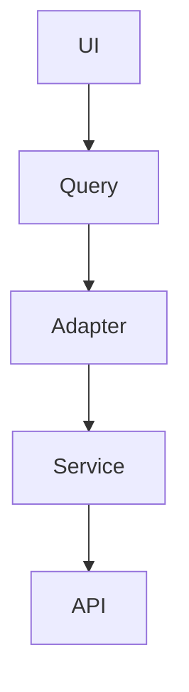

# 📝 Prompt: Generador de Documentación para Proyectos React

> Este prompt está diseñado para que una AI agent genere documentación profesional para proyectos React.
> **Versión:** 3.0 (Optimizada y Consolidada)

---

## 📋 Contexto del Proyecto

Tienes un proyecto React con la siguiente estructura de documentación en `src/docs/`:

```
src/docs/
├── 00-diagnostico-tecnico.md    # Estado actual del proyecto
├── 01-overview-del-sistema.md  # Filosofía y objetivos
├── 02-arquitectura.md           # Patrones técnicos (FSD, Adapter, Facade)
├── 03-casos-de-uso.md           # Casos de uso
├── 04-requerimientos.md         # RF y RNF
├── 05-flujo-de-datos.md         # Ciclo de datos
├── 06-guia-para-desarrolladores.md  # Setup, MSW, Zod, convenciones
├── 07-calidad-y-riesgos.md     # Deuda técnica y riesgos
├── 08-cierre-del-proyecto.md   # Hitos alcanzados
├── 09-auditoria-diseño.md      # Sistema de diseño Minimalist v3
├── GUIA_ESTUDIO.md             # 📚 Guía de estudio (formato libro)
├── PRUEBA_TECNICA.md           # 📝 Prueba técnica simulada
└── prompt-docs.md              # Este prompt
```

**Stack tecnológico del proyecto:**
- React 18.3 + Vite 5.4
- TanStack Query v5 (gestión de estado del servidor)
- Tailwind CSS v4 (estilos utility-first)
- Zod v4 (validación runtime)
- Feature-Sliced Design (FSD) - arquitectura
- Motion v12 (animaciones)
- MSW (Mock Service Worker)
- React Router v7

---

## 🎯 Objetivo

Generar dos documentos profesionales:

### A) GUIA_ESTUDIO.md
Guía de estudio estilo "Libro" desde cero hasta nivel avanzado. Debe ser tan completa que un estudiante pueda aprender React moderno solo con este documento.

### B) PRUEBA_TECNICA.md
Simulación de entrevista técnica para React Frontend Developer. Incluye preguntas teóricas y ejercicios prácticos.

---

## 📖 GUÍA DE ESTUDIO: Estructura Requerida

### 1. GLOSARIO COMPLETO (A-Z)

Glosario técnico exhaustivo de A-Z.

**Requisitos:**
- Mínimo 50 términos técnicos
- Definición clara y concisa
- Ejemplos donde aplique
- Organizado alfabéticamente

```
### A
- **Adapter:** Pattern que transforma datos de un formato a otro...

### B
- **Bundle:** Archivo compilado que contiene todo el código...
```

### 2. CAPÍTULOS DE APRENDIZAJE (8 capítulos)

Cada capítulo sigue el formato "libro educativo":

```markdown
## Número: Título del Capítulo

### Subtema
- Explicación teórica detallada
- "¿Por qué es importante?"
- Ejemplos de código funcionales
- "Código incorrecto vs correcto"
- Diagrama Mermaid cuando aplique

### Ejercicios del Capítulo
- Ejercicio 1: [descripción]
```

#### Contenido de capítulos:

| Capítulo | Tema |
|----------|------|
| **1** | Fundamentos de JavaScript Moderno |
| **2** | React Fundamentals |
| **3** | Arquitectura y Patrones (FSD, Adapter, Facade) |
| **4** | TanStack Query |
| **5** | Tailwind CSS v4 |
| **6** | Zod - Validación en Runtime |
| **7** | Flujo Completo del Proyecto |
| **8** | Ejercicios Prácticos |

### 3. PREGUNTAS DE REVISIÓN

Por nivel:
- Básico
- Intermedio
- Avanzado
- Experto

### 4. RESUMEN FINAL

- Diagrama de arquitectura (Mermaid)
- Los 5 principios del arquitecto

---

## 📝 PRUEBA TÉCNICA: Estructura Requerida

### SECCIÓN A: Preguntas Teóricas

| Tema | Preguntas |
|------|-----------|
| Fundamentos React | 5 preguntas |
| Arquitectura | 5 preguntas |
| Gestión de Estado | 5 preguntas |
| Estilos y UI | 5 preguntas |
| Performance | 5 preguntas |

Cada pregunta debe tener:
- Enunciado claro
- Código de ejemplo cuando aplique
- Respuesta esperada

### SECCIÓN B: Ejercicios Prácticos

| Ejercicio | Descripción |
|-----------|-------------|
| **B1** | Construir un componente completo (buscador, lista, formulario) |
| **B2** | Code Review - encontrar bugs |
| **B3** | Optimización de código lento |

### SECCIÓN C: Sistema de Evaluación

- Puntuación total: 100 puntos
- Escala de notas (Junior → Senior)

---

## 📝 Requisitos de Formato

### Diagramas Mermaid
Todos los diagramas deben usar **Mermaid** (no ASCII):



### Código
- Lenguaje correcto para los code blocks (javascript, jsx)
- Comments en español con "//"
- Ejemplos funcionales

### Longitud Objetivo
- GUIA_ESTUDIO: mínimo 1000 líneas
- PRUEBA_TECNICA: mínimo 500 líneas

---

## 🔧 Directrices para la AI

1. **Analiza los documentos existentes** en `src/docs/` para entender el contexto
2. **El formato debe ser "estilo libro"** - cada concepto: qué es, por qué importa, ejemplos
3. **Usa Mermaid para todos los diagramas** - nunca ASCII
4. **Cada capítulo/ejercicio debe tener ejercicios propuestos**
5. **La guía debe ser auto-contenida** - aprendizaje independiente
6. **Incluye "por qué"** - no solo qué, sino por qué

---

## ✅ Checklist de Calidad

### GUIA_ESTUDIO.md
- [ ] Glosario completo (mínimo 50 términos)
- [ ] 8 capítulos bien estructurados
- [ ] Cada concepto explica "qué es" y "por qué importa"
- [ ] Ejemplos de código funcionales
- [ ] Todos los diagramas en Mermaid
- [ ] Ejercicios propuestos en cada capítulo
- [ ] Preguntas de revisión por nivel
- [ ] Resumen con diagrama de arquitectura
- [ ] Longitud mínima de 1000 líneas

### PRUEBA_TECNICA.md
- [ ] 25 preguntas teóricas (5 por tema)
- [ ] 3 ejercicios prácticos
- [ ] Sistema de evaluación
- [ ] Respuestas completas
- [ ] Longitud mínima de 500 líneas
